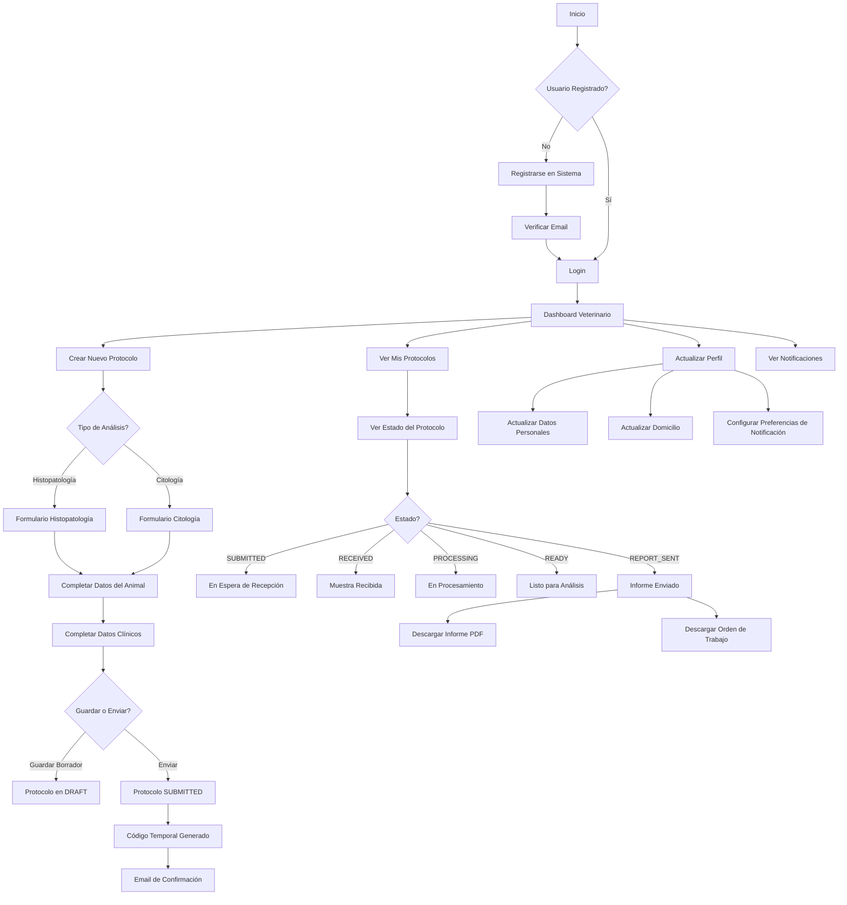
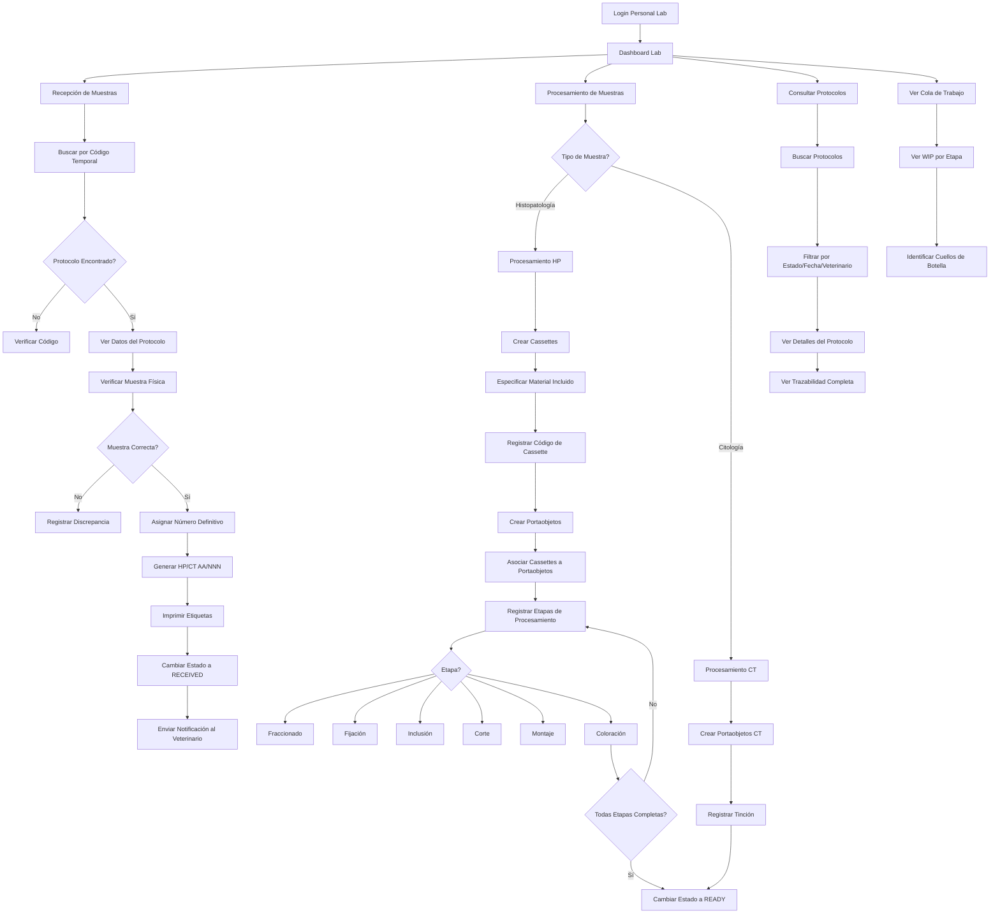
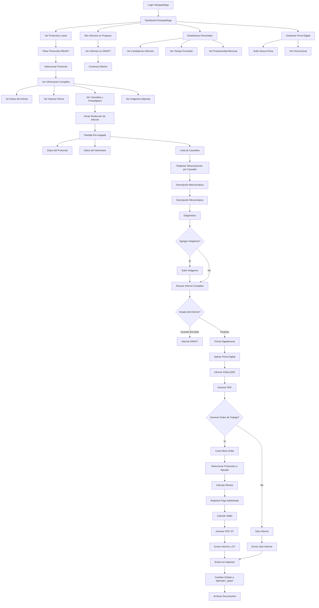
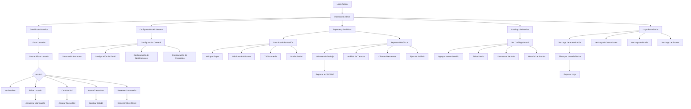
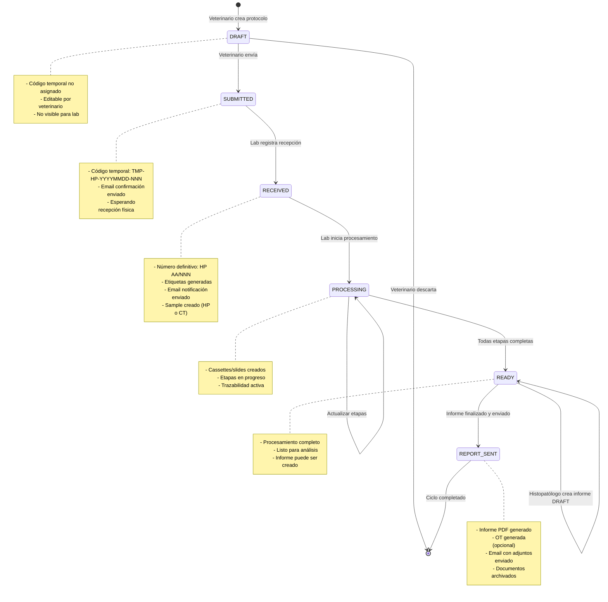
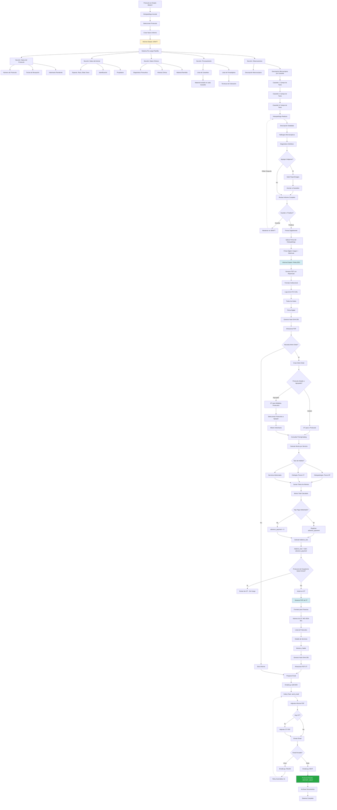
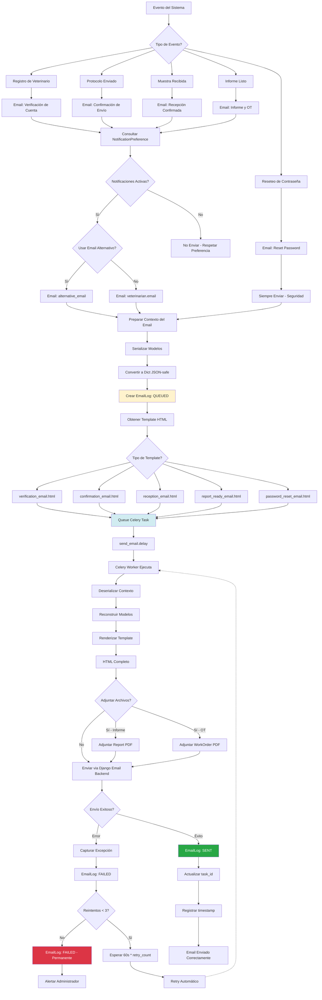

# Sistema de Gestión de Laboratorio - Diagramas de Flujo de Trabajo

Este documento contiene diagramas detallados de los flujos de trabajo del sistema usando Mermaid.

---

## Tabla de Contenidos

1. [Flujos de Trabajo por Rol de Usuario](#1-flujos-de-trabajo-por-rol-de-usuario)
2. [Ciclo de Vida Completo del Protocolo](#2-ciclo-de-vida-completo-del-protocolo)
3. [Estados del Protocolo](#3-estados-del-protocolo)
4. [Procesamiento de Muestras Histopatológicas](#4-procesamiento-de-muestras-histopatológicas)
5. [Procesamiento de Muestras Citológicas](#5-procesamiento-de-muestras-citológicas)
6. [Generación de Informes y Órdenes de Trabajo](#6-generación-de-informes-y-órdenes-de-trabajo)
7. [Sistema de Notificaciones por Email](#7-sistema-de-notificaciones-por-email)
8. [Flujo de Órdenes de Trabajo](#8-flujo-de-órdenes-de-trabajo)

---

## 1. Flujos de Trabajo por Rol de Usuario

### 1.1 Veterinario Cliente



---

### 1.2 Personal de Laboratorio



---

### 1.3 Histopatólogo



---

### 1.4 Administrador del Sistema



---

## 2. Ciclo de Vida Completo del Protocolo

```mermaid
flowchart TD
    A[Veterinario Crea Protocolo] --> B{Guardar o Enviar?}
    B -->|Guardar| C[Estado: DRAFT]
    B -->|Enviar| D[Estado: SUBMITTED]

    C -.Editar y Enviar.-> D

    D --> E[Sistema Genera Código Temporal]
    E --> F[TMP-HP-20241017-001]
    F --> G[Email Confirmación al Veterinario]

    G --> H[Muestra Llega al Laboratorio]
    H --> I[Personal Lab Busca Protocolo]
    I --> J[Verifica Muestra Física]

    J --> K{Muestra Correcta?}
    K -->|No| L[Registrar Discrepancia]
    L --> M[Contactar Veterinario]
    K -->|Sí| N[Estado: RECEIVED]

    N --> O[Sistema Asigna Número Definitivo]
    O --> P[HP 24/001 o CT 24/001]
    P --> Q[Genera Etiquetas]
    Q --> R[Email Notificación al Veterinario]

    R --> S{Tipo de Análisis?}
    S -->|Histopatología| T[Crear HistopathologySample]
    S -->|Citología| U[Crear CytologySample]

    T --> V[Estado: PROCESSING]
    U --> V

    V --> W[Personal Lab Procesa Muestra]
    W --> X{Tipo?}

    X -->|HP| Y[Crear Cassettes]
    Y --> Z[Registrar Material Incluido]
    Z --> AA[Crear Portaobjetos]
    AA --> AB[Asociar Cassettes-Portaobjetos]
    AB --> AC[Seguimiento de Etapas]

    X -->|CT| AD[Crear Portaobjetos]
    AD --> AE[Registrar Tinción]

    AC --> AF{Todas Etapas Completas?}
    AE --> AF

    AF -->|No| W
    AF -->|Sí| AG[Estado: READY]

    AG --> AH[Notificar Disponibilidad]
    AH --> AI[Histopatólogo Selecciona Protocolo]

    AI --> AJ[Ver Información Completa]
    AJ --> AK[Crear Informe: DRAFT]
    AK --> AL[Plantilla Pre-cargada]

    AL --> AM[Redactar Observaciones]
    AM --> AN{Finalizar?}
    AN -->|No| AM
    AN -->|Sí| AO[Firmar Digitalmente]

    AO --> AP[Informe: FINALIZED]
    AP --> AQ[Generar PDF]
    AQ --> AR[Calcular Hash SHA-256]

    AR --> AS{Crear Work Order?}
    AS -->|Sí| AT[Generar OT]
    AS -->|No| AU[Solo Informe]

    AT --> AV[Agrupar Protocolos]
    AV --> AW[Calcular Montos]
    AW --> AX[Generar PDF OT]
    AX --> AY[Enviar Email con Informe y OT]

    AU --> AZ[Enviar Email con Informe]

    AY --> BA[Estado: REPORT_SENT]
    AZ --> BA

    BA --> BB[Archivar Documentos]
    BB --> BC[EmailLog: SENT]
    BC --> BD[Protocolo Completado]

    BD --> BE[Veterinario Recibe Email]
    BE --> BF[Descarga Informe]
    BE --> BG[Descarga OT]

    style C fill:#fff3cd
    style D fill:#d1ecf1
    style N fill:#d1ecf1
    style V fill:#d1ecf1
    style AG fill:#d4edda
    style BA fill:#d4edda
    style BD fill:#28a745,color:#fff
```



---

## 3. Estados del Protocolo



---

## 4. Procesamiento de Muestras Histopatológicas

```mermaid
graph TD
    A[Protocolo en Estado RECEIVED] --> B[Crear HistopathologySample]
    B --> C[Cambiar Estado a PROCESSING]

    C --> D[Personal Lab Procesa Muestra]

    D --> E[Crear Cassette 1]
    E --> F[Asignar Código: HP24/001-C1]
    F --> G[Especificar Material Incluido]
    G --> H{Más Cassettes?}

    H -->|Sí| I[Crear Cassette 2, 3, ...]
    I --> J[Códigos: HP24/001-C2, C3...]
    J --> K
    H -->|No| K[Todos Cassettes Creados]

    K --> L[Crear Portaobjetos]

    L --> M[Crear Slide 1]
    M --> N[Asignar Código: S-001]
    N --> O[Asociar a Cassettes]

    O --> P{Tipo de Slide?}
    P -->|Normal| Q[Asociar a 1 Cassette]
    P -->|Multicorte| R[Asociar a Múltiples Cassettes]

    Q --> S{Más Slides?}
    R --> S

    S -->|Sí| T[Crear Slide 2, 3, ...]
    T --> U[Códigos: S-002, S-003...]
    U --> V
    S -->|No| V[Todos Slides Creados]

    V --> W[Registrar Etapas de Procesamiento]

    W --> X[1. Fraccionado]
    X --> Y[Marcar Fecha/Hora]
    Y --> Z[2. Identificación]
    Z --> AA[Marcar Fecha/Hora]
    AA --> AB[3. Fijación]
    AB --> AC[Marcar Fecha/Hora]
    AC --> AD[4. Inclusión Taco Parafina]
    AD --> AE[Marcar Fecha/Hora]
    AE --> AF[5. Corte con Micrótomo]
    AF --> AG[Marcar Fecha/Hora]
    AG --> AH[6. Montaje en Portaobjetos]
    AH --> AI[Marcar Fecha/Hora]
    AI --> AJ[7. Coloración]
    AJ --> AK[Marcar Fecha/Hora y Técnica]

    AK --> AL{Coloración Especial?}
    AL -->|Sí| AM[Marcar Cassette como Especial]
    AL -->|No| AN
    AM --> AN{Todas Etapas Completas?}

    AN -->|No| AO[Continuar Procesamiento]
    AO -.-> W
    AN -->|Sí| AP[Cambiar Estado a READY]

    AP --> AQ[Trazabilidad Completa Disponible]
    AQ --> AR[Muestra → Cassettes → Slides]
    AR --> AS[Listo para Análisis Microscópico]

    style E fill:#fff3cd
    style M fill:#d1ecf1
    style AJ fill:#d4edda
    style AP fill:#28a745,color:#fff
```



---

## 5. Procesamiento de Muestras Citológicas

```mermaid
graph TD
    A[Protocolo en Estado RECEIVED] --> B[Crear CytologySample]
    B --> C[Cambiar Estado a PROCESSING]

    C --> D[Personal Lab Procesa Muestra]

    D --> E{Muestra Ya Viene en Portaobjetos?}
    E -->|Sí| F[Registrar Portaobjetos Existentes]
    E -->|No| G[Preparar Portaobjetos]

    F --> H[Crear Slide 1]
    G --> H

    H --> I[Asignar Código: S-CT-001]
    I --> J[Asociar Directamente a CytologySample]

    J --> K[No Requiere Cassettes]
    K --> L[Registro Simplificado]

    L --> M{Más Portaobjetos?}
    M -->|Sí| N[Crear Slide 2, 3, ...]
    N --> O[Códigos: S-CT-002, 003...]
    O --> P
    M -->|No| P[Todos Slides Registrados]

    P --> Q[Registrar Técnica de Tinción]

    Q --> R{Tipo de Tinción?}
    R --> S[Diff-Quick]
    R --> T[Giemsa]
    R --> U[Papanicolaou]
    R --> V[Otras Técnicas]

    S --> W[Registrar Tinción en Slide]
    T --> W
    U --> W
    V --> W

    W --> X[Marcar Fecha/Hora de Tinción]
    X --> Y{Tinción Completa?}

    Y -->|No| Z[Continuar Proceso]
    Z -.-> Q
    Y -->|Sí| AA[Cambiar Estado a READY]

    AA --> AB[Trazabilidad Completa Disponible]
    AB --> AC[Muestra → Slides → Técnica]
    AC --> AD[Listo para Análisis Microscópico]

    style B fill:#fff3cd
    style H fill:#d1ecf1
    style Q fill:#d4edda
    style AA fill:#28a745,color:#fff

    note right of K
        Citología es más simple:
        - Sin cassettes
        - Sin etapas múltiples
        - Solo tinción
    end note
```

---

## 6. Generación de Informes y Órdenes de Trabajo



---

## 7. Sistema de Notificaciones por Email



---

## 8. Flujo de Órdenes de Trabajo

```mermaid
graph TD
    A[Informe Finalizado] --> B{Crear Work Order?}
    B -->|No| C[Solo Informe al Veterinario]
    B -->|Sí| D[Iniciar Creación de OT]

    D --> E{Estrategia de Agrupación?}
    E --> F[OT Individual - 1 Protocolo]
    E --> G[OT Agrupada - Múltiples Protocolos]

    F --> H[Seleccionar Protocolo Actual]
    G --> I[Seleccionar Protocolos del Mismo Veterinario]

    I --> J[Filtrar por Estado READY]
    J --> K[Veterinario debe ser el mismo]
    K --> L{Protocolos Encontrados?}
    L -->|No| M[Solo Protocolo Actual]
    L -->|Sí| N[Listar Protocolos Disponibles]
    N --> O[Permitir Selección Manual]
    O --> P[Confirmar Selección]

    H --> Q[Crear Work Order]
    M --> Q
    P --> Q

    Q --> R[Generar Número de OT]
    R --> S[Formato: WO-YYYY-NNN]
    S --> T[Ejemplo: WO-2024-001]

    T --> U[Calcular Servicios y Montos]

    U --> V[Por cada Protocolo en OT]
    V --> W{Protocolo del HSA?}

    W -->|Sí| X[Hospital de Salud Animal]
    X --> Y[Marcar como Sin Cargo]
    Y --> Z[No incluir en monto]

    W -->|No| AA[Cliente Externo]
    AA --> AB[Consultar PricingCatalog]

    AB --> AC{Tipo de Análisis?}
    AC --> AD[Histopatología]
    AC --> AE[Citología]

    AD --> AF[Obtener Precio HP Vigente]
    AE --> AG[Obtener Precio CT Vigente]

    AF --> AH[price_per_sample]
    AG --> AH

    AH --> AI{Servicios Adicionales?}
    AI -->|Sí| AJ[Coloraciones Especiales]
    AJ --> AK[Técnicas Especiales]
    AK --> AL[Consultas Adicionales]
    AL --> AM[Sumar Precio Adicional]
    AI -->|No| AN

    AM --> AN[Monto del Protocolo]

    AN --> AO{Más Protocolos?}
    AO -->|Sí| V
    AO -->|No| AP[Sumar Todos los Montos]

    AP --> AQ[Monto Total de la OT]
    AQ --> AR{Hay Pago Adelantado?}

    AR -->|Sí| AS[Registrar advance_payment]
    AS --> AT[Monto Ingresado]
    AT --> AU[payment_date: Fecha del Pago]
    AU --> AV[Calcular Saldo]

    AR -->|No| AW[advance_payment = 0]
    AW --> AV

    AV --> AX[balance_due = total - advance_payment]

    AX --> AY{Saldo Pendiente?}
    AY -->|balance_due > 0| AZ[payment_status: PARTIAL]
    AY -->|balance_due = 0| BA[payment_status: PAID]
    AY -->|advance_payment = 0| BB[payment_status: PENDING]

    AZ --> BC[Generar PDF de OT]
    BA --> BC
    BB --> BC

    BC --> BD[Template de Work Order]
    BD --> BE[Datos del Laboratorio]
    BE --> BF[Logo FCV-UNL]
    BF --> BG[Número de OT]
    BG --> BH[Fecha de Emisión]

    BH --> BI[Datos del Veterinario]
    BI --> BJ[Nombre, Matrícula, Domicilio]

    BJ --> BK[Tabla de Servicios]
    BK --> BL[Por cada Protocolo]
    BL --> BM[Número de Protocolo]
    BM --> BN[Tipo de Análisis]
    BN --> BO[Descripción del Servicio]
    BO --> BP[Monto Individual]

    BP --> BQ{Más Protocolos?}
    BQ -->|Sí| BL
    BQ -->|No| BR[Subtotal]

    BR --> BS[Resumen Financiero]
    BS --> BT[Monto Total]
    BT --> BU[Pago Adelantado]
    BU --> BV[Saldo Pendiente]

    BV --> BW[Datos de Pago]
    BW --> BX[Cuenta Bancaria del Laboratorio]
    BX --> BY[Referencias de Pago]

    BY --> BZ[Generar PDF con ReportLab]
    BZ --> CA[Formato para Finanzas UNL]
    CA --> CB[PDF Profesional]

    CB --> CC[Calcular Hash SHA-256]
    CC --> CD[work_order.pdf_hash]
    CD --> CE[Almacenar PDF]

    CE --> CF[Asociar Protocolos a OT]
    CF --> CG[Por cada Protocolo]
    CG --> CH[protocol.work_order_id = OT]
    CH --> CI[Crear Vínculo]

    CI --> CJ{Más Protocolos?}
    CJ -->|Sí| CG
    CJ -->|No| CK[Asociación Completa]

    CK --> CL[Preparar para Envío]
    CL --> CM[Email con Informe + OT]
    CM --> CN[Veterinario Recibe Ambos]

    CN --> CO[OT Lista para Finanzas]
    CO --> CP[Seguimiento de Pagos]

    CP --> CQ{Veterinario Paga?}
    CQ -->|Sí| CR[Actualizar payment_status]
    CR --> CS[Registrar advance_payment]
    CS --> CT[Recalcular balance_due]
    CT --> CU{Saldo = 0?}
    CU -->|Sí| CV[payment_status: PAID]
    CU -->|No| CW[payment_status: PARTIAL]

    CQ -->|No| CX[Mantener PENDING]

    CV --> CY[OT Completada]
    CW --> CY
    CX --> CY

    style Q fill:#fff3cd
    style AQ fill:#d1ecf1
    style CB fill:#d4edda
    style CV fill:#28a745,color:#fff
```



---

## Leyenda de Colores

En los diagramas:

- 🟡 **Amarillo** (#fff3cd): Estados iniciales o en creación
- 🔵 **Azul** (#d1ecf1): Procesamiento o en progreso
- 🟢 **Verde claro** (#d4edda): Completado o listo
- 🟢 **Verde oscuro** (#28a745): Finalizado exitosamente
- 🔴 **Rojo** (#dc3545): Error o fallo

---

## Notas Técnicas

### Contadores Atómicos

Todos los números secuenciales (protocol_number, temporary_code, work_order_number) usan contadores atómicos con `select_for_update()` para prevenir condiciones de carrera:

```python
with transaction.atomic():
    counter = Counter.objects.select_for_update().get_or_create(...)
    counter.last_number += 1
    counter.save()
```

### Sistema de Notificaciones

- Todas las notificaciones por email son asíncronas via Celery
- Sistema de reintentos: 3 intentos con backoff exponencial (60s, 120s, 240s)
- Los modelos se serializan a JSON antes de enviar a Celery (no se pueden serializar directamente)

### Trazabilidad

La trazabilidad completa se mantiene mediante:
- `Protocol` → `Sample` (HP o CT)
- `HistopathologySample` → `Cassette` → `CassetteSlide` → `Slide`
- `CytologySample` → `Slide` (directo, sin cassettes)

### Work Orders

- Múltiples protocolos pueden agruparse en una Work Order
- Los precios se toman del `PricingCatalog` vigente a la fecha
- Protocolos del Hospital de Salud Animal (HSA) se marcan como sin cargo
- El sistema calcula automáticamente: total, advance_payment, balance_due

---

**Documento elaborado:** Octubre 2024
**Versión:** 1.0
**Última actualización:** Compatible con el estado actual del sistema
