# Sistema de Gestión de Laboratorio - Diagramas de Flujo de Trabajo

Este documento contiene diagramas detallados de los flujos de trabajo del sistema usando Mermaid.

---

## Tabla de Contenidos

1. [Flujos de Trabajo por Rol de Usuario](#1-flujos-de-trabajo-por-rol-de-usuario)
2. [Ciclo de Vida Completo del Protocolo](#2-ciclo-de-vida-completo-del-protocolo)
3. [Estados del Protocolo](#3-estados-del-protocolo)
4. [Procesamiento de Muestras Histopatológicas](#4-procesamiento-de-muestras-histopatológicas)
5. [Procesamiento de Muestras Citológicas](#5-procesamiento-de-muestras-citológicas)
6. [Generación de Informes y Órdenes de Trabajo](#6-generación-de-informes-y-órdenes-de-trabajo)
7. [Sistema de Notificaciones por Email](#7-sistema-de-notificaciones-por-email)
8. [Flujo de Órdenes de Trabajo](#8-flujo-de-órdenes-de-trabajo)

---

## 1. Flujos de Trabajo por Rol de Usuario

### 1.1 Veterinario Cliente

```mermaid
graph TD
    A[Inicio] --> B{Usuario Registrado?}
    B -->|No| C[Registrarse en Sistema]
    C --> D[Verificar Email]
    D --> E[Login]
    B -->|Sí| E

    E --> F[Dashboard Veterinario]

    F --> G[Crear Nuevo Protocolo]
    F --> H[Ver Mis Protocolos]
    F --> I[Actualizar Perfil]
    F --> J[Ver Notificaciones]

    G --> K{Tipo de Análisis?}
    K -->|Histopatología| L[Formulario Histopatología]
    K -->|Citología| M[Formulario Citología]

    L --> N[Completar Datos del Animal]
    M --> N
    N --> O[Completar Datos Clínicos]
    O --> P{Guardar o Enviar?}

    P -->|Guardar Borrador| Q[Protocolo en DRAFT]
    P -->|Enviar| R[Protocolo SUBMITTED]

    R --> S[Código Temporal Generado]
    S --> T[Email de Confirmación]

    H --> U[Ver Estado del Protocolo]
    U --> V{Estado?}
    V -->|SUBMITTED| W[En Espera de Recepción]
    V -->|RECEIVED| X[Muestra Recibida]
    V -->|PROCESSING| Y[En Procesamiento]
    V -->|READY| Z[Listo para Análisis]
    V -->|REPORT_SENT| AA[Informe Enviado]

    AA --> AB[Descargar Informe PDF]
    AA --> AC[Descargar Orden de Trabajo]

    I --> AD[Actualizar Datos Personales]
    I --> AE[Actualizar Domicilio]
    I --> AF[Configurar Preferencias de Notificación]
```



---

### 1.2 Personal de Laboratorio

```mermaid
graph TD
    A[Login Personal Lab] --> B[Dashboard Lab]

    B --> C[Recepción de Muestras]
    B --> D[Procesamiento de Muestras]
    B --> E[Consultar Protocolos]
    B --> F[Ver Cola de Trabajo]

    C --> G[Buscar por Código Temporal]
    G --> H{Protocolo Encontrado?}
    H -->|No| I[Verificar Código]
    H -->|Sí| J[Ver Datos del Protocolo]

    J --> K[Verificar Muestra Física]
    K --> L{Muestra Correcta?}
    L -->|No| M[Registrar Discrepancia]
    L -->|Sí| N[Asignar Número Definitivo]

    N --> O[Generar HP/CT AA/NNN]
    O --> P[Imprimir Etiquetas]
    P --> Q[Cambiar Estado a RECEIVED]
    Q --> R[Enviar Notificación al Veterinario]

    D --> S{Tipo de Muestra?}
    S -->|Histopatología| T[Procesamiento HP]
    S -->|Citología| U[Procesamiento CT]

    T --> V[Crear Cassettes]
    V --> W[Especificar Material Incluido]
    W --> X[Registrar Código de Cassette]
    X --> Y[Crear Portaobjetos]
    Y --> Z[Asociar Cassettes a Portaobjetos]
    Z --> AA[Registrar Etapas de Procesamiento]

    AA --> AB{Etapa?}
    AB --> AC[Fraccionado]
    AB --> AD[Fijación]
    AB --> AE[Inclusión]
    AB --> AF[Corte]
    AB --> AG[Montaje]
    AB --> AH[Coloración]

    AH --> AI{Todas Etapas Completas?}
    AI -->|No| AA
    AI -->|Sí| AJ[Cambiar Estado a READY]

    U --> AK[Crear Portaobjetos CT]
    AK --> AL[Registrar Tinción]
    AL --> AJ

    E --> AM[Buscar Protocolos]
    AM --> AN[Filtrar por Estado/Fecha/Veterinario]
    AN --> AO[Ver Detalles del Protocolo]
    AO --> AP[Ver Trazabilidad Completa]

    F --> AQ[Ver WIP por Etapa]
    AQ --> AR[Identificar Cuellos de Botella]
```



---

### 1.3 Histopatólogo

```mermaid
graph TD
    A[Login Histopatólogo] --> B[Dashboard Histopatólogo]

    B --> C[Ver Protocolos Listos]
    B --> D[Mis Informes en Progreso]
    B --> E[Estadísticas Personales]
    B --> F[Gestionar Firma Digital]

    C --> G[Filtrar Protocolos READY]
    G --> H[Seleccionar Protocolo]
    H --> I[Ver Información Completa]

    I --> J[Ver Datos del Animal]
    I --> K[Ver Historia Clínica]
    I --> L[Ver Cassettes y Portaobjetos]
    I --> M[Ver Imágenes Adjuntas]

    L --> N[Iniciar Redacción de Informe]
    N --> O[Plantilla Pre-cargada]
    O --> P[Datos del Protocolo]
    O --> Q[Datos del Veterinario]
    O --> R[Lista de Cassettes]

    R --> S[Redactar Observaciones por Cassette]
    S --> T[Descripción Macroscópica]
    T --> U[Descripción Microscópica]
    U --> V[Diagnóstico]

    V --> W{Agregar Imágenes?}
    W -->|Sí| X[Subir Imágenes]
    X --> Y
    W -->|No| Y[Revisar Informe Completo]

    Y --> Z{Estado del Informe?}
    Z -->|Guardar Borrador| AA[Informe DRAFT]
    Z -->|Finalizar| AB[Firmar Digitalmente]

    AB --> AC[Aplicar Firma Digital]
    AC --> AD[Informe FINALIZED]
    AD --> AE[Generar PDF]

    AE --> AF{Generar Orden de Trabajo?}
    AF -->|Sí| AG[Crear Work Order]
    AF -->|No| AH[Solo Informe]

    AG --> AI[Seleccionar Protocolos a Agrupar]
    AI --> AJ[Calcular Montos]
    AJ --> AK[Registrar Pago Adelantado]
    AK --> AL[Calcular Saldo]
    AL --> AM[Generar PDF OT]

    AM --> AN[Enviar Informe y OT]
    AH --> AO[Enviar Solo Informe]

    AN --> AP[Email con Adjuntos]
    AO --> AP

    AP --> AQ[Cambiar Estado a REPORT_SENT]
    AQ --> AR[Archivar Documentos]

    D --> AS[Ver Informes en DRAFT]
    AS --> AT[Continuar Edición]

    E --> AU[Ver Cantidad de Informes]
    E --> AV[Ver Tiempo Promedio]
    E --> AW[Ver Productividad Mensual]

    F --> AX[Subir Nueva Firma]
    F --> AY[Ver Firma Actual]
```



---

### 1.4 Administrador del Sistema

```mermaid
graph TD
    A[Login Admin] --> B[Dashboard Admin]

    B --> C[Gestión de Usuarios]
    B --> D[Configuración del Sistema]
    B --> E[Reportes y Analíticas]
    B --> F[Catálogo de Precios]
    B --> G[Logs de Auditoría]

    C --> H[Listar Usuarios]
    H --> I[Buscar/Filtrar Usuario]
    I --> J{Acción?}

    J --> K[Ver Detalles]
    J --> L[Editar Usuario]
    J --> M[Cambiar Rol]
    J --> N[Activar/Desactivar]
    J --> O[Resetear Contraseña]

    L --> P[Actualizar Información]
    M --> Q[Asignar Nuevo Rol]
    N --> R[Cambiar Estado]
    O --> S[Generar Token Reset]

    D --> T[Configuración General]
    T --> U[Datos del Laboratorio]
    T --> V[Configuración de Email]
    T --> W[Configuración de Notificaciones]
    T --> X[Configuración de Respaldos]

    E --> Y[Dashboard de Gestión]
    Y --> Z[WIP por Etapa]
    Y --> AA[Métricas de Volumen]
    Y --> AB[TAT Promedio]
    Y --> AC[Productividad]

    E --> AD[Reportes Históricos]
    AD --> AE[Volumen de Trabajo]
    AD --> AF[Análisis de Tiempos]
    AD --> AG[Clientes Frecuentes]
    AD --> AH[Tipos de Análisis]

    AE --> AI[Exportar a CSV/PDF]

    F --> AJ[Ver Catálogo Actual]
    AJ --> AK[Agregar Nuevo Servicio]
    AJ --> AL[Editar Precio]
    AJ --> AM[Desactivar Servicio]
    AJ --> AN[Historial de Precios]

    G --> AO[Ver Logs de Autenticación]
    G --> AP[Ver Logs de Operaciones]
    G --> AQ[Ver Logs de Emails]
    G --> AR[Ver Logs de Errores]

    AO --> AS[Filtrar por Usuario/Fecha]
    AS --> AT[Exportar Logs]
```



---

## 2. Ciclo de Vida Completo del Protocolo

```mermaid
flowchart TD
    A[Veterinario Crea Protocolo] --> B{Guardar o Enviar?}
    B -->|Guardar| C[Estado: DRAFT]
    B -->|Enviar| D[Estado: SUBMITTED]

    C -.Editar y Enviar.-> D

    D --> E[Sistema Genera Código Temporal]
    E --> F[TMP-HP-20241017-001]
    F --> G[Email Confirmación al Veterinario]

    G --> H[Muestra Llega al Laboratorio]
    H --> I[Personal Lab Busca Protocolo]
    I --> J[Verifica Muestra Física]

    J --> K{Muestra Correcta?}
    K -->|No| L[Registrar Discrepancia]
    L --> M[Contactar Veterinario]
    K -->|Sí| N[Estado: RECEIVED]

    N --> O[Sistema Asigna Número Definitivo]
    O --> P[HP 24/001 o CT 24/001]
    P --> Q[Genera Etiquetas]
    Q --> R[Email Notificación al Veterinario]

    R --> S{Tipo de Análisis?}
    S -->|Histopatología| T[Crear HistopathologySample]
    S -->|Citología| U[Crear CytologySample]

    T --> V[Estado: PROCESSING]
    U --> V

    V --> W[Personal Lab Procesa Muestra]
    W --> X{Tipo?}

    X -->|HP| Y[Crear Cassettes]
    Y --> Z[Registrar Material Incluido]
    Z --> AA[Crear Portaobjetos]
    AA --> AB[Asociar Cassettes-Portaobjetos]
    AB --> AC[Seguimiento de Etapas]

    X -->|CT| AD[Crear Portaobjetos]
    AD --> AE[Registrar Tinción]

    AC --> AF{Todas Etapas Completas?}
    AE --> AF

    AF -->|No| W
    AF -->|Sí| AG[Estado: READY]

    AG --> AH[Notificar Disponibilidad]
    AH --> AI[Histopatólogo Selecciona Protocolo]

    AI --> AJ[Ver Información Completa]
    AJ --> AK[Crear Informe: DRAFT]
    AK --> AL[Plantilla Pre-cargada]

    AL --> AM[Redactar Observaciones]
    AM --> AN{Finalizar?}
    AN -->|No| AM
    AN -->|Sí| AO[Firmar Digitalmente]

    AO --> AP[Informe: FINALIZED]
    AP --> AQ[Generar PDF]
    AQ --> AR[Calcular Hash SHA-256]

    AR --> AS{Crear Work Order?}
    AS -->|Sí| AT[Generar OT]
    AS -->|No| AU[Solo Informe]

    AT --> AV[Agrupar Protocolos]
    AV --> AW[Calcular Montos]
    AW --> AX[Generar PDF OT]
    AX --> AY[Enviar Email con Informe y OT]

    AU --> AZ[Enviar Email con Informe]

    AY --> BA[Estado: REPORT_SENT]
    AZ --> BA

    BA --> BB[Archivar Documentos]
    BB --> BC[EmailLog: SENT]
    BC --> BD[Protocolo Completado]

    BD --> BE[Veterinario Recibe Email]
    BE --> BF[Descarga Informe]
    BE --> BG[Descarga OT]

    style C fill:#fff3cd
    style D fill:#d1ecf1
    style N fill:#d1ecf1
    style V fill:#d1ecf1
    style AG fill:#d4edda
    style BA fill:#d4edda
    style BD fill:#28a745,color:#fff
```



---

## 3. Estados del Protocolo


---

## 4. Procesamiento de Muestras Histopatológicas

```mermaid
graph TD
    A[Protocolo en Estado RECEIVED] --> B[Crear HistopathologySample]
    B --> C[Cambiar Estado a PROCESSING]

    C --> D[Personal Lab Procesa Muestra]

    D --> E[Crear Cassette 1]
    E --> F[Asignar Código: HP24/001-C1]
    F --> G[Especificar Material Incluido]
    G --> H{Más Cassettes?}

    H -->|Sí| I[Crear Cassette 2, 3, ...]
    I --> J[Códigos: HP24/001-C2, C3...]
    J --> K
    H -->|No| K[Todos Cassettes Creados]

    K --> L[Crear Portaobjetos]

    L --> M[Crear Slide 1]
    M --> N[Asignar Código: S-001]
    N --> O[Asociar a Cassettes]

    O --> P{Tipo de Slide?}
    P -->|Normal| Q[Asociar a 1 Cassette]
    P -->|Multicorte| R[Asociar a Múltiples Cassettes]

    Q --> S{Más Slides?}
    R --> S

    S -->|Sí| T[Crear Slide 2, 3, ...]
    T --> U[Códigos: S-002, S-003...]
    U --> V
    S -->|No| V[Todos Slides Creados]

    V --> W[Registrar Etapas de Procesamiento]

    W --> X[1. Fraccionado]
    X --> Y[Marcar Fecha/Hora]
    Y --> Z[2. Identificación]
    Z --> AA[Marcar Fecha/Hora]
    AA --> AB[3. Fijación]
    AB --> AC[Marcar Fecha/Hora]
    AC --> AD[4. Inclusión Taco Parafina]
    AD --> AE[Marcar Fecha/Hora]
    AE --> AF[5. Corte con Micrótomo]
    AF --> AG[Marcar Fecha/Hora]
    AG --> AH[6. Montaje en Portaobjetos]
    AH --> AI[Marcar Fecha/Hora]
    AI --> AJ[7. Coloración]
    AJ --> AK[Marcar Fecha/Hora y Técnica]

    AK --> AL{Coloración Especial?}
    AL -->|Sí| AM[Marcar Cassette como Especial]
    AL -->|No| AN
    AM --> AN{Todas Etapas Completas?}

    AN -->|No| AO[Continuar Procesamiento]
    AO -.-> W
    AN -->|Sí| AP[Cambiar Estado a READY]

    AP --> AQ[Trazabilidad Completa Disponible]
    AQ --> AR[Muestra → Cassettes → Slides]
    AR --> AS[Listo para Análisis Microscópico]

    style E fill:#fff3cd
    style M fill:#d1ecf1
    style AJ fill:#d4edda
    style AP fill:#28a745,color:#fff
```



---

## 5. Procesamiento de Muestras Citológicas

```mermaid
graph TD
    A[Protocolo en Estado RECEIVED] --> B[Crear CytologySample]
    B --> C[Cambiar Estado a PROCESSING]

    C --> D[Personal Lab Procesa Muestra]

    D --> E{Muestra Ya Viene en Portaobjetos?}
    E -->|Sí| F[Registrar Portaobjetos Existentes]
    E -->|No| G[Preparar Portaobjetos]

    F --> H[Crear Slide 1]
    G --> H

    H --> I[Asignar Código: S-CT-001]
    I --> J[Asociar Directamente a CytologySample]

    J --> K[No Requiere Cassettes]
    K --> L[Registro Simplificado]

    L --> M{Más Portaobjetos?}
    M -->|Sí| N[Crear Slide 2, 3, ...]
    N --> O[Códigos: S-CT-002, 003...]
    O --> P
    M -->|No| P[Todos Slides Registrados]

    P --> Q[Registrar Técnica de Tinción]

    Q --> R{Tipo de Tinción?}
    R --> S[Diff-Quick]
    R --> T[Giemsa]
    R --> U[Papanicolaou]
    R --> V[Otras Técnicas]

    S --> W[Registrar Tinción en Slide]
    T --> W
    U --> W
    V --> W

    W --> X[Marcar Fecha/Hora de Tinción]
    X --> Y{Tinción Completa?}

    Y -->|No| Z[Continuar Proceso]
    Z -.-> Q
    Y -->|Sí| AA[Cambiar Estado a READY]

    AA --> AB[Trazabilidad Completa Disponible]
    AB --> AC[Muestra → Slides → Técnica]
    AC --> AD[Listo para Análisis Microscópico]

    style B fill:#fff3cd
    style H fill:#d1ecf1
    style Q fill:#d4edda
    style AA fill:#28a745,color:#fff

    note right of K
        Citología es más simple:
        - Sin cassettes
        - Sin etapas múltiples
        - Solo tinción
    end note
```

---

## 6. Generación de Informes y Órdenes de Trabajo

```mermaid
graph TD
    A[Protocolo en Estado READY] --> B[Histopatólogo Accede]
    B --> C[Seleccionar Protocolo]

    C --> D[Crear Nuevo Informe]
    D --> E[Informe Estado: DRAFT]

    E --> F[Sistema Pre-carga Plantilla]

    F --> G[Sección: Datos del Protocolo]
    G --> H[Número de Protocolo]
    G --> I[Fecha de Recepción]
    G --> J[Veterinario Remitente]

    F --> K[Sección: Datos del Animal]
    K --> L[Especie, Raza, Edad, Sexo]
    K --> M[Identificación]
    K --> N[Propietario]

    F --> O[Sección: Datos Clínicos]
    O --> P[Diagnóstico Presuntivo]
    O --> Q[Historia Clínica]
    O --> R[Material Remitido]

    F --> S[Sección: Procesamiento]
    S --> T[Lista de Cassettes]
    T --> U[Material Incluido en cada Cassette]
    S --> V[Lista de Portaobjetos]
    V --> W[Técnicas de Coloración]

    F --> X[Sección: Observaciones]
    X --> Y[Descripción Macroscópica]
    X --> Z[Descripción Microscópica por Cassette]

    Z --> AA[Cassette 1: Campo de Texto]
    AA --> AB[Cassette 2: Campo de Texto]
    AB --> AC[Cassette N: Campo de Texto]

    AC --> AD[Histopatólogo Redacta]
    AD --> AE[Descripción Detallada]
    AE --> AF[Hallazgos Microscópicos]
    AF --> AG[Diagnóstico Definitivo]

    AG --> AH{Agregar Imágenes?}
    AH -->|Sí| AI[Subir ReportImages]
    AI --> AJ[Asociar a Cassettes]
    AJ --> AK
    AH -->|No| AK[Revisar Informe Completo]

    AK --> AL{Guardar o Finalizar?}
    AL -->|Guardar| AM[Mantener en DRAFT]
    AM -.Editar Después.-> AD
    AL -->|Finalizar| AN[Firmar Digitalmente]

    AN --> AO[Aplicar Firma del Histopatólogo]
    AO --> AP[Firma Digital: Imagen + Matrícula]
    AP --> AQ[Informe Estado: FINALIZED]

    AQ --> AR[Generar PDF con ReportLab]
    AR --> AS[Formato Institucional]
    AS --> AT[Logo de la FCV-UNL]
    AT --> AU[Todos los Datos]
    AU --> AV[Firma Digital]
    AV --> AW[Generar Hash SHA-256]
    AW --> AX[Almacenar PDF]

    AX --> AY{Necesita Work Order?}
    AY -->|No| AZ[Solo Informe]
    AY -->|Sí| BA[Crear Work Order]

    BA --> BB{Protocolo Aislado o Agrupado?}
    BB -->|Aislado| BC[OT para 1 Protocolo]
    BB -->|Agrupado| BD[OT para Múltiples Protocolos]

    BD --> BE[Seleccionar Protocolos a Agrupar]
    BE --> BF[Mismo Veterinario]

    BC --> BG[Consultar PricingCatalog]
    BF --> BG

    BG --> BH[Calcular Monto por Servicio]
    BH --> BI{Tipo de Análisis?}
    BI --> BJ[Histopatología: Precio HP]
    BI --> BK[Citología: Precio CT]
    BI --> BL[Servicios Adicionales]

    BJ --> BM[Sumar Todos los Montos]
    BK --> BM
    BL --> BM

    BM --> BN[Monto Total Calculado]
    BN --> BO{Hay Pago Adelantado?}
    BO -->|Sí| BP[Registrar advance_payment]
    BO -->|No| BQ[advance_payment = 0]

    BP --> BR[Calcular balance_due]
    BQ --> BR
    BR --> BS[balance_due = total - advance_payment]

    BS --> BT{Protocolo del Hospital de Salud Animal?}
    BT -->|Sí| BU[Excluir de OT - Sin Cargo]
    BT -->|No| BV[Incluir en OT]

    BV --> BW[Generar PDF de OT]
    BW --> BX[Formato para Finanzas]
    BX --> BY[Número de OT: WO-2024-001]
    BY --> BZ[Lista de Protocolos]
    BZ --> CA[Detalle de Servicios]
    CA --> CB[Montos y Saldo]
    CB --> CC[Generar Hash SHA-256]
    CC --> CD[Almacenar PDF OT]

    CD --> CE[Preparar Email]
    AZ --> CE

    CE --> CF[EmailLog: QUEUED]
    CF --> CG[Celery Task: send_email]
    CG --> CH[Adjuntar Informe PDF]
    CH --> CI{Hay OT?}
    CI -->|Sí| CJ[Adjuntar OT PDF]
    CI -->|No| CK
    CJ --> CK[Enviar Email]

    CK --> CL{Email Enviado?}
    CL -->|Error| CM[EmailLog: FAILED]
    CM --> CN[Retry Automático 3x]
    CN -.-> CG
    CL -->|Éxito| CO[EmailLog: SENT]

    CO --> CP[Protocolo Estado: REPORT_SENT]
    CP --> CQ[Archivar Documentos]
    CQ --> CR[Sistema Completo]

    style E fill:#fff3cd
    style AQ fill:#d1ecf1
    style BW fill:#d1ecf1
    style CP fill:#28a745,color:#fff
```



---

## 7. Sistema de Notificaciones por Email

```mermaid
graph TD
    A[Evento del Sistema] --> B{Tipo de Evento?}

    B --> C[Registro de Veterinario]
    B --> D[Protocolo Enviado]
    B --> E[Muestra Recibida]
    B --> F[Informe Listo]
    B --> G[Reseteo de Contraseña]

    C --> H[Email: Verificación de Cuenta]
    D --> I[Email: Confirmación de Envío]
    E --> J[Email: Recepción Confirmada]
    F --> K[Email: Informe y OT]
    G --> L[Email: Reset Password]

    H --> M[Consultar NotificationPreference]
    I --> M
    J --> M
    K --> M
    L --> N[Siempre Enviar - Seguridad]

    M --> O{Notificaciones Activas?}
    O -->|No| P[No Enviar - Respetar Preferencia]
    O -->|Sí| Q{Usar Email Alternativo?}

    Q -->|Sí| R[Email: alternative_email]
    Q -->|No| S[Email: veterinarian.email]

    R --> T[Preparar Contexto del Email]
    S --> T
    N --> T

    T --> U[Serializar Modelos]
    U --> V[Convertir a Dict JSON-safe]
    V --> W[Crear EmailLog: QUEUED]

    W --> X[Obtener Template HTML]
    X --> Y{Tipo de Template?}

    Y --> Z[verification_email.html]
    Y --> AA[confirmation_email.html]
    Y --> AB[reception_email.html]
    Y --> AC[report_ready_email.html]
    Y --> AD[password_reset_email.html]

    Z --> AE[Queue Celery Task]
    AA --> AE
    AB --> AE
    AC --> AE
    AD --> AE

    AE --> AF[send_email.delay]
    AF --> AG[Celery Worker Ejecuta]

    AG --> AH[Deserializar Contexto]
    AH --> AI[Reconstruir Modelos]
    AI --> AJ[Renderizar Template]
    AJ --> AK[HTML Completo]

    AK --> AL{Adjuntar Archivos?}
    AL -->|Sí - Informe| AM[Adjuntar Report PDF]
    AL -->|Sí - OT| AN[Adjuntar WorkOrder PDF]
    AL -->|No| AO

    AM --> AO[Enviar via Django Email Backend]
    AN --> AO

    AO --> AP{Envío Exitoso?}
    AP -->|Error| AQ[Capturar Excepción]
    AQ --> AR[EmailLog: FAILED]
    AR --> AS{Reintentos < 3?}
    AS -->|Sí| AT[Esperar 60s * retry_count]
    AT --> AU[Retry Automático]
    AU -.-> AG
    AS -->|No| AV[EmailLog: FAILED - Permanente]
    AV --> AW[Alertar Administrador]

    AP -->|Éxito| AX[EmailLog: SENT]
    AX --> AY[Actualizar task_id]
    AY --> AZ[Registrar timestamp]
    AZ --> BA[Email Enviado Correctamente]

    style W fill:#fff3cd
    style AE fill:#d1ecf1
    style AX fill:#28a745,color:#fff
    style AV fill:#dc3545,color:#fff
```



---

## 8. Flujo de Órdenes de Trabajo

```mermaid
graph TD
    A[Informe Finalizado] --> B{Crear Work Order?}
    B -->|No| C[Solo Informe al Veterinario]
    B -->|Sí| D[Iniciar Creación de OT]

    D --> E{Estrategia de Agrupación?}
    E --> F[OT Individual - 1 Protocolo]
    E --> G[OT Agrupada - Múltiples Protocolos]

    F --> H[Seleccionar Protocolo Actual]
    G --> I[Seleccionar Protocolos del Mismo Veterinario]

    I --> J[Filtrar por Estado READY]
    J --> K[Veterinario debe ser el mismo]
    K --> L{Protocolos Encontrados?}
    L -->|No| M[Solo Protocolo Actual]
    L -->|Sí| N[Listar Protocolos Disponibles]
    N --> O[Permitir Selección Manual]
    O --> P[Confirmar Selección]

    H --> Q[Crear Work Order]
    M --> Q
    P --> Q

    Q --> R[Generar Número de OT]
    R --> S[Formato: WO-YYYY-NNN]
    S --> T[Ejemplo: WO-2024-001]

    T --> U[Calcular Servicios y Montos]

    U --> V[Por cada Protocolo en OT]
    V --> W{Protocolo del HSA?}

    W -->|Sí| X[Hospital de Salud Animal]
    X --> Y[Marcar como Sin Cargo]
    Y --> Z[No incluir en monto]

    W -->|No| AA[Cliente Externo]
    AA --> AB[Consultar PricingCatalog]

    AB --> AC{Tipo de Análisis?}
    AC --> AD[Histopatología]
    AC --> AE[Citología]

    AD --> AF[Obtener Precio HP Vigente]
    AE --> AG[Obtener Precio CT Vigente]

    AF --> AH[price_per_sample]
    AG --> AH

    AH --> AI{Servicios Adicionales?}
    AI -->|Sí| AJ[Coloraciones Especiales]
    AJ --> AK[Técnicas Especiales]
    AK --> AL[Consultas Adicionales]
    AL --> AM[Sumar Precio Adicional]
    AI -->|No| AN

    AM --> AN[Monto del Protocolo]

    AN --> AO{Más Protocolos?}
    AO -->|Sí| V
    AO -->|No| AP[Sumar Todos los Montos]

    AP --> AQ[Monto Total de la OT]
    AQ --> AR{Hay Pago Adelantado?}

    AR -->|Sí| AS[Registrar advance_payment]
    AS --> AT[Monto Ingresado]
    AT --> AU[payment_date: Fecha del Pago]
    AU --> AV[Calcular Saldo]

    AR -->|No| AW[advance_payment = 0]
    AW --> AV

    AV --> AX[balance_due = total - advance_payment]

    AX --> AY{Saldo Pendiente?}
    AY -->|balance_due > 0| AZ[payment_status: PARTIAL]
    AY -->|balance_due = 0| BA[payment_status: PAID]
    AY -->|advance_payment = 0| BB[payment_status: PENDING]

    AZ --> BC[Generar PDF de OT]
    BA --> BC
    BB --> BC

    BC --> BD[Template de Work Order]
    BD --> BE[Datos del Laboratorio]
    BE --> BF[Logo FCV-UNL]
    BF --> BG[Número de OT]
    BG --> BH[Fecha de Emisión]

    BH --> BI[Datos del Veterinario]
    BI --> BJ[Nombre, Matrícula, Domicilio]

    BJ --> BK[Tabla de Servicios]
    BK --> BL[Por cada Protocolo]
    BL --> BM[Número de Protocolo]
    BM --> BN[Tipo de Análisis]
    BN --> BO[Descripción del Servicio]
    BO --> BP[Monto Individual]

    BP --> BQ{Más Protocolos?}
    BQ -->|Sí| BL
    BQ -->|No| BR[Subtotal]

    BR --> BS[Resumen Financiero]
    BS --> BT[Monto Total]
    BT --> BU[Pago Adelantado]
    BU --> BV[Saldo Pendiente]

    BV --> BW[Datos de Pago]
    BW --> BX[Cuenta Bancaria del Laboratorio]
    BX --> BY[Referencias de Pago]

    BY --> BZ[Generar PDF con ReportLab]
    BZ --> CA[Formato para Finanzas UNL]
    CA --> CB[PDF Profesional]

    CB --> CC[Calcular Hash SHA-256]
    CC --> CD[work_order.pdf_hash]
    CD --> CE[Almacenar PDF]

    CE --> CF[Asociar Protocolos a OT]
    CF --> CG[Por cada Protocolo]
    CG --> CH[protocol.work_order_id = OT]
    CH --> CI[Crear Vínculo]

    CI --> CJ{Más Protocolos?}
    CJ -->|Sí| CG
    CJ -->|No| CK[Asociación Completa]

    CK --> CL[Preparar para Envío]
    CL --> CM[Email con Informe + OT]
    CM --> CN[Veterinario Recibe Ambos]

    CN --> CO[OT Lista para Finanzas]
    CO --> CP[Seguimiento de Pagos]

    CP --> CQ{Veterinario Paga?}
    CQ -->|Sí| CR[Actualizar payment_status]
    CR --> CS[Registrar advance_payment]
    CS --> CT[Recalcular balance_due]
    CT --> CU{Saldo = 0?}
    CU -->|Sí| CV[payment_status: PAID]
    CU -->|No| CW[payment_status: PARTIAL]

    CQ -->|No| CX[Mantener PENDING]

    CV --> CY[OT Completada]
    CW --> CY
    CX --> CY

    style Q fill:#fff3cd
    style AQ fill:#d1ecf1
    style CB fill:#d4edda
    style CV fill:#28a745,color:#fff
```



---

## Leyenda de Colores

En los diagramas:

- 🟡 **Amarillo** (#fff3cd): Estados iniciales o en creación
- 🔵 **Azul** (#d1ecf1): Procesamiento o en progreso
- 🟢 **Verde claro** (#d4edda): Completado o listo
- 🟢 **Verde oscuro** (#28a745): Finalizado exitosamente
- 🔴 **Rojo** (#dc3545): Error o fallo

---

## Notas Técnicas

### Contadores Atómicos

Todos los números secuenciales (protocol_number, temporary_code, work_order_number) usan contadores atómicos con `select_for_update()` para prevenir condiciones de carrera:

```python
with transaction.atomic():
    counter = Counter.objects.select_for_update().get_or_create(...)
    counter.last_number += 1
    counter.save()
```

### Sistema de Notificaciones

- Todas las notificaciones por email son asíncronas via Celery
- Sistema de reintentos: 3 intentos con backoff exponencial (60s, 120s, 240s)
- Los modelos se serializan a JSON antes de enviar a Celery (no se pueden serializar directamente)

### Trazabilidad

La trazabilidad completa se mantiene mediante:
- `Protocol` → `Sample` (HP o CT)
- `HistopathologySample` → `Cassette` → `CassetteSlide` → `Slide`
- `CytologySample` → `Slide` (directo, sin cassettes)

### Work Orders

- Múltiples protocolos pueden agruparse en una Work Order
- Los precios se toman del `PricingCatalog` vigente a la fecha
- Protocolos del Hospital de Salud Animal (HSA) se marcan como sin cargo
- El sistema calcula automáticamente: total, advance_payment, balance_due

---

**Documento elaborado:** Octubre 2024
**Versión:** 1.0
**Última actualización:** Compatible con el estado actual del sistema
