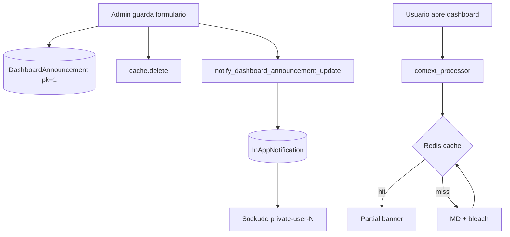

# Aviso general en dashboards (banner de comunicación)

Guía para administradores y desarrolladores del banner administrable que se muestra al inicio de todos los dashboards de la app `pages`.

**Relacionado con:** Step 09 (dashboards), Step 21 (notificaciones in-app).  
**Commit de referencia:** `feat[step-09]: Add cached admin dashboard announcement banner`

---

## Resumen

| Aspecto | Detalle |
|---------|---------|
| **Quién edita** | Solo usuarios con rol `ADMIN` (`is_admin_user`) |
| **Dónde se ve** | Parte superior de los dashboards de `pages` (veterinario, lab, admin, gestión, default) |
| **Dónde no se ve** | Resto de la app (recepción, protocolos, etc.) ni dashboard de procesamiento en `protocols` |
| **Formato** | Markdown → HTML sanitizado (`markdown` + `bleach`) |
| **Rendimiento** | Caché Redis, clave `dashboard_announcement:active`, invalidación al guardar |
| **Notificación** | In-app + Sockudo (si está habilitado). **Sin email** |

---

## Uso para administradores

### Acceso

1. Iniciar sesión como administrador.
2. Ir al **Panel de Administración**: `/dashboard/admin/`
3. En **Acciones rápidas**, abrir **Aviso general**  
   URL directa: `/dashboard/admin/announcement/`

### Publicar un aviso

1. Escribir el mensaje en el cuadro de texto (Markdown).
2. Marcar **Mostrar aviso en los dashboards** si debe verse y notificarse.
3. Opcional: **Vista previa** para revisar el formato sin guardar.
4. **Guardar aviso**.

### Formato Markdown (guía rápida)

| Escribís | Resultado |
|----------|-----------|
| `**texto**` | **negrita** |
| `*texto*` | *cursiva* |
| `[enlace](https://ejemplo.com)` | Enlace clickeable |
| `- ítem` | Lista con viñetas |
| Línea en blanco | Nuevo párrafo |

Límite: **4000 caracteres** en el mensaje.

### Comportamiento al guardar

| Situación | Banner visible | Notificación in-app |
|-----------|----------------|---------------------|
| Activo + mensaje con contenido **nuevo** | Sí | Sí (todos los usuarios activos) |
| Activo + mismo contenido que antes | Sí | No |
| Inactivo o mensaje vacío | No | No |

Título de la notificación: **«Nuevo aviso del laboratorio»**.  
Enlace: dashboard principal del usuario (`/dashboard/`).

---

## Arquitectura técnica



### Modelo

- **App:** `pages`
- **Modelo:** `DashboardAnnouncement` (singleton `pk=1`)
- **Campos:** `message`, `is_active`, `content_hash`, `updated_by`, `updated_at`
- **Migración:** `pages/migrations/0002_dashboard_announcement.py`

El `content_hash` es SHA-256 de `is_active` + mensaje normalizado; evita re-notificar si el admin guarda sin cambios reales.

### Servicio y caché

- **Archivo:** `src/pages/services/dashboard_announcement_service.py`
- **Clave Redis:** `dashboard_announcement:active`
- **TTL:** 86400 s (red de seguridad; la invalidación explícita al guardar es la fuente de verdad)
- **Payload cacheado:** `{ is_active, html, updated_at }` o `{}` si no hay aviso activo

Funciones principales:

- `render_message_safe()` — Markdown + whitelist HTML
- `get_cached_banner()` — lectura con cache-aside
- `warm_banner_cache()` — invalidar y repoblar tras guardar
- `invalidate_banner_cache()` — `cache.delete(CACHE_KEY)`

### UI

| Componente | Ruta |
|------------|------|
| Vista admin | `DashboardAnnouncementEditView` — `src/pages/views.py` |
| Formulario | `src/pages/forms.py` |
| Template edición | `src/pages/templates/pages/dashboard_announcement_edit.html` |
| Base dashboards | `src/pages/templates/pages/dashboard_base.html` |
| Partial banner | `src/templates/components/ui/dashboard_announcement.html` |
| Context processor | `config.context_processors.dashboard_announcement` |

URLs de dashboard donde se inyecta el contexto (`DASHBOARD_URL_NAMES`):

- `dashboard`
- `dashboard_veterinarian`
- `dashboard_lab_staff`
- `dashboard_admin`
- `dashboard_management`

### Notificaciones (Step 21)

- **Tipo:** `InAppNotification.NotificationType.ANNOUNCEMENT`
- **Migración:** `protocols/migrations/0017_inapp_notification_announcement_type.py`
- **Servicio:** `NotificationService.create_for_dashboard_announcement()`
- **Tarea Celery:** `pages.tasks.notify_dashboard_announcement_update`  
  Procesa usuarios activos en lotes de 100.

Requisitos en producción:

- Worker Celery en ejecución (misma cola que el resto de tareas).
- Para push en tiempo real: `SOCKUDO_ENABLED=true` (ver [STEP_21_PRODUCTION_DEPLOYMENT.md](STEP_21_PRODUCTION_DEPLOYMENT.md)).

No se usa `protocols/emails.py` ni `send_mail`.

### Dependencias Python

En `pyproject.toml`:

- `markdown>=3.10.0`
- `bleach>=6.2.0`

Tras actualizar dependencias, reconstruir imagen Docker:

```bash
docker compose build web worker
```

---

## Despliegue

### Migraciones

```bash
make manage ARGS="migrate"
# o en producción:
./bin/deploy-production.sh
```

Aplica:

- `pages.0002_dashboard_announcement`
- `protocols.0017_inapp_notification_announcement_type`

### Verificación manual

1. Login como admin → `/dashboard/admin/announcement/`
2. Publicar aviso de prueba con **Activo** marcado.
3. Login como otro rol → abrir su dashboard y ver la franja ámbar arriba.
4. Abrir campana de notificaciones → debe aparecer «Nuevo aviso del laboratorio».
5. Guardar de nuevo **sin cambiar texto** → no debe duplicar notificaciones masivas.

### Tests automatizados

```bash
make test-with-sqlite ARGS="pages.tests_dashboard_announcement"
```

Cubre: permisos admin, XSS, caché, visibilidad del banner, encolado Celery condicional y ausencia de email.

---

## Seguridad

- El HTML del banner solo sale de `render_message_safe()` (bleach con tags limitados).
- En plantilla se usa `|safe` **solo** sobre ese HTML ya sanitizado.
- No se acepta HTML crudo en el formulario del admin.

Tags permitidos: `p`, `strong`, `em`, `a`, `ul`, `ol`, `li`, `br`.  
Enlaces: `nofollow` vía `bleach.linkify`.

---

## Troubleshooting

| Problema | Causa probable | Acción |
|----------|----------------|--------|
| Banner no aparece | `is_active` desmarcado o mensaje vacío | Revisar formulario y guardar de nuevo |
| Banner viejo tras editar | Caché Redis desactualizada (raro) | Guardar otra vez; o `cache.delete('dashboard_announcement:active')` en shell |
| Sin notificación | Contenido sin cambios (`content_hash` igual) | Cambiar texto o desactivar/reactivar con mensaje distinto |
| Notificación sin tiempo real | Sockudo deshabilitado | Normal: la notificación está en BD; se ve al abrir la campana |
| Error al renderizar | Dependencias no instaladas en contenedor | `docker compose build web` tras pull |
| 403 en edición | Usuario no es `ADMIN` | Usar cuenta `admin@adlab.local` o rol ADMIN |

---

## Referencias de código

```
src/pages/models.py                          # DashboardAnnouncement
src/pages/services/dashboard_announcement_service.py
src/pages/views.py                           # DashboardAnnouncementEditView
src/pages/tasks.py                           # notify_dashboard_announcement_update
src/config/context_processors.py             # dashboard_announcement
src/protocols/services/notification_service.py
src/pages/tests_dashboard_announcement.py
```
