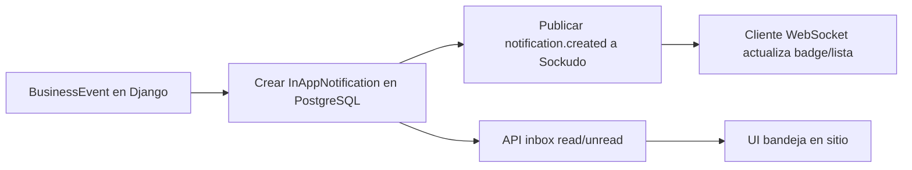

# Step 21: In-App Notifications (Bandeja + Realtime con Sockudo)

## Problem Statement

Los usuarios han indicado que no quieren recibir demasiados emails (spam). El sistema actual (Step 08) envía notificaciones por email en eventos clave (recepción, informe listo, orden de trabajo, etc.). Se necesita un sistema de notificaciones **dentro del sitio** que:

- Permita ver notificaciones en una bandeja de entrada (leídas/no leídas).
- Entregue avisos en tiempo real cuando llegue una nueva notificación (sin recargar la página).
- Reduzca la dependencia del email como canal principal; el email puede seguir siendo opcional según preferencias.

Sockudo (servidor Pusher-compatible, self-hosted) se usará solo como **canal de transporte realtime**; la persistencia y la bandeja viven en Django/PostgreSQL.

## Requirements

### Functional Requirements

- **Persistencia (Django/PostgreSQL):**
  - Modelo `InAppNotification` con recipient, tipo, título, cuerpo, link, leído/no leído, timestamps.
  - Bandeja con filtros (todas, no leídas, leídas).
  - Marcar como leída (una o todas).

- **Realtime (Sockudo):**
  - Publicar evento `notification.created` cuando se crea una notificación.
  - El cliente se suscribe a canal privado `private-user-{user_id}`.
  - Payload mínimo: `{"type": "notification.created", "id": 123}`; el detalle se obtiene por API.

- **Integración:**
  - Crear notificación in-app en los mismos puntos donde hoy se envía email (recepción, informe listo, orden de trabajo, etc.).
  - Mantener `NotificationPreference` para email; la notificación in-app no depende del opt-in de email.

- **Interfaz de prueba:**
  - Admin action "Enviar notificación de prueba" para validar el flujo completo sin depender de flujos de negocio.

### Non-Functional Requirements

- **Seguridad:** Canales privados obligatorios; endpoint de auth que valide estrictamente `channel_name == private-user-{request.user.id}`.
- **Auditoría:** Log de suscripciones a canales y de publicaciones de eventos.
- **Resiliencia:** Si Sockudo falla, la notificación persiste en DB; solo se degrada el realtime.
- **Rendimiento:** Índices en `recipient`, `is_read`, `created_at` para consultas de bandeja.

## Data Model

### InAppNotification

```python
class InAppNotification(models.Model):
    class NotificationType(models.TextChoices):
        SUBMITTED = "submitted", _("Protocolo enviado")
        RECEPTION = "reception", _("Muestra recibida")
        REJECTION = "rejection", _("Muestra rechazada")
        DISCREPANCY = "discrepancy", _("Discrepancias en recepción")
        READY = "ready", _("Muestra lista para diagnóstico")
        REPORT_READY = "report_ready", _("Informe disponible")
        WORK_ORDER = "work_order", _("Orden de trabajo")
        CUSTOM = "custom", _("Notificación personalizada")

    recipient = models.ForeignKey(User, on_delete=models.CASCADE, related_name="in_app_notifications")
    notification_type = models.CharField(max_length=30, choices=NotificationType.choices)
    title = models.CharField(max_length=255)
    body = models.TextField(blank=True)
    link_url = models.URLField(blank=True)
    is_read = models.BooleanField(default=False)
    read_at = models.DateTimeField(null=True, blank=True)
    created_at = models.DateTimeField(auto_now_add=True)
    protocol = models.ForeignKey(Protocol, null=True, blank=True, on_delete=models.SET_NULL)
    work_order = models.ForeignKey(WorkOrder, null=True, blank=True, on_delete=models.SET_NULL)

    class Meta:
        ordering = ["-created_at"]
        indexes = [
            models.Index(fields=["recipient", "is_read", "-created_at"]),
            models.Index(fields=["recipient", "-created_at"]),
        ]
```

## Architecture



- **Source of truth:** PostgreSQL (InAppNotification).
- **Realtime transport:** Sockudo (Pusher protocol); solo avisa "hay nueva notificación".
- **Regla:** Primero persistir, luego publicar; si Sockudo falla, la notificación sigue en la bandeja.

## Security (Central Requirements)

### Private Channels (Mandatory)

- Siempre canales privados: `private-user-{user_id}`.
- Endpoint `POST /api/notifications/realtime-auth/` que recibe `socket_id`, `channel_name` y devuelve firma HMAC-SHA256 solo si `channel_name == f"private-user-{request.user.id}"`.
- Nunca firmar canales arbitrarios.

### Audit and Logging

- Log de suscripciones: `user_id`, `channel_name`, `timestamp`, `ip_address`.
- Log de publicaciones: `recipient_id`, `notification_id`, `channel`, `timestamp`, `success/failure`.

### Other

- `APP_SECRET` solo en backend; en frontend solo `APP_ID` y `APP_KEY`.
- Payload realtime mínimo (solo ID); detalle vía API.
- Sockudo detrás de Nginx en producción; no exponer directamente.

## API Endpoints

- `GET /api/notifications/` — Lista de notificaciones (filtro: all/unread/read).
- `POST /api/notifications/<id>/read/` — Marcar una como leída.
- `POST /api/notifications/read-all/` — Marcar todas como leídas.
- `GET /api/notifications/unread-count/` — Contador para badge.
- `POST /api/notifications/realtime-auth/` — Auth para canales privados (Pusher format).

## Integration Points

Mismos puntos que Step 08 (email):

- ProtocolSubmitView (envío de protocolo)
- ReceptionConfirmView (recepción, rechazo, discrepancias)
- ReportSendView (informe listo)
- WorkOrderSendView (orden enviada)
- Admin: mark_as_received, mark_as_ready, WorkOrderAdmin.mark_as_issued

## Acceptance Criteria

- Cada evento de negocio crea registro persistente en bandeja.
- Usuario ve contador de no leídas correcto en navbar.
- Marcar leída/leer todas funciona y persiste.
- Si Sockudo cae, no se pierde notificación.
- Solo canales privados; auth valida estrictamente.
- Existe logging/auditoría de suscripciones y publicaciones.
- Admin action "Enviar notificación de prueba" permite validar flujo end-to-end.

## Dependencies

- Step 08 (Email Notifications) — integración en mismos puntos.
- Redis (ya existe para Celery) — opcional para Sockudo si se escala.
- Nginx (producción) — proxy para WebSocket.

## References

- Plan de implementación: `.cursor/plans/in-app_realtime_notifications_*.plan.md`
- Sockudo: https://sockudo.io/
- Pusher auth: https://sockudo.io/getting-started/authentication
