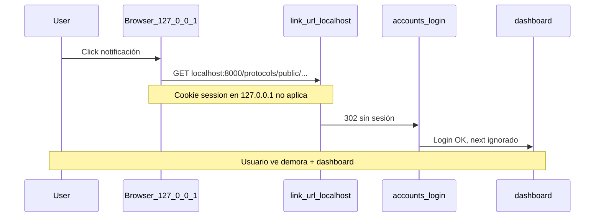

# Resultados — Diagnóstico local de notificaciones (Punto 1.2)

**Estado:** Fixes implementados y re-validados  
**Última re-validación:** 28 de junio de 2026 (~23:58 UTC)  
**Entorno:** Docker local (`adlab-web-1`, puerto `127.0.0.1:8000`)  
**Usuario de prueba:** `dr.garcia@veterinaria.com`  
**Protocolo:** `56134257-d724-415b-ad37-75f2a0f03041`  
**Notificaciones de esta corrida:** ID 19 (campana), ID 20 (bandeja)

> **Nota:** Las pruebas con `curl` usan contraseña temporal `DiagNotif123!` en
> `dr.garcia@veterinaria.com` (la de test-credentials no coincide con la BD local).

---

## Re-validación post-fix (28 jun 2026)

Misma batería que el diagnóstico inicial (curl + Django shell). Stack healthy: `/up/` 200 en ~34 ms.

### Configuración observada

| Variable | Valor |
|----------|-------|
| `SITE_URL` (Django) | `http://localhost:8000` (default DEBUG; no en `.env`) |
| `link_url` en BD (nueva notif.) | `/protocols/public/56134257-d724-415b-ad37-75f2a0f03041/` (path relativo) |
| API `href` en listado | `/notifications/20/go/` |

### Resumen PASS/FAIL (estado actual)

| # | Hipótesis | Resultado | Evidencia |
|---|-----------|-----------|-----------|
| 1.3 | Redirect a login **con** `?next=` | **PASS** | `Location: /accounts/login/?next=/protocols/public/.../` |
| 1.4 | Login con `?next=` → protocolo | **PASS** | POST login → `Location: /protocols/public/.../` |
| 1.5 | APIs lentas (> 200 ms) | **PASS (descartado)** | list ~35 ms, unread ~22 ms, read ~26 ms |
| 1.6 | Navegación cross-host por `link_url` absoluto | **PASS** | Paths relativos; go view en `127.0.0.1` → protocolo 200 |
| 1.6b | Cookies `127.0.0.1` vs `localhost` (control) | **Esperado** | GET protocolo en `localhost` con cookie `127.0.0.1` → 302 login (comportamiento del browser; ya no se dispara desde notificaciones) |
| 1.7 | Bandeja marca leída | **PASS** | GET `/notifications/20/go/` → `is_read`: False → True, final = protocolo 200 |
| 1.7 | Campana marca leída (API) | **PASS** | POST `/api/notifications/19/read/` → `is_read`: False → True |

**Conclusión:** Todos los bugs funcionales corregidos. Las APIs siguen en ~20–35 ms. El flujo bandeja/campana llega al protocolo y marca leída. El split de cookies entre `localhost` y `127.0.0.1` persiste a nivel browser, pero las notificaciones ya no fuerzan un host distinto al tab actual.

---

### Detalle por prueba (re-validación)

#### 1.3 Redirect sin sesión

```http
GET http://127.0.0.1:8000/protocols/public/56134257-d724-415b-ad37-75f2a0f03041/
→ 302 Found
→ Location: /accounts/login/?next=/protocols/public/56134257-d724-415b-ad37-75f2a0f03041/
```

#### 1.4 Login con `?next=`

```http
POST http://127.0.0.1:8000/accounts/login/?next=/protocols/public/56134257-.../
→ 302 Found
→ Location: /protocols/public/56134257-d724-415b-ad37-75f2a0f03041/
```

#### 1.5 Tiempos de API (autenticado, `127.0.0.1`)

| Endpoint | Tiempo | Status |
|----------|--------|--------|
| `GET /api/notifications/` | ~35 ms | 200 |
| `GET /api/notifications/unread-count/` | ~22 ms | 200 |
| `POST /api/notifications/19/read/` | ~26 ms | 200 |

Campo `href` en JSON de listado: `/notifications/20/go/`.

#### 1.6 Host / same-site paths

| Escenario | HTTP | Tiempo |
|-----------|------|--------|
| Sesión en `127.0.0.1`, GET protocolo en `127.0.0.1` | 200 | ~51 ms |
| Sesión en `127.0.0.1`, GET protocolo en `localhost:8000` | 302 → login | ~11 ms |
| Sesión en `127.0.0.1`, GET `/notifications/20/go/` | 302 → protocolo 200 | ~226 ms |

#### 1.7 Bandeja vs campana — `is_read`

| Acción | Antes | Después |
|--------|-------|---------|
| GET `/notifications/20/go/` (bandeja) | `False` | `True` |
| POST `/api/notifications/19/read/` (campana) | `False` | `True` |

---

## Histórico — diagnóstico pre-fix (28 jun 2026, primera corrida)

Primera corrida **antes** de los fixes. Notificaciones: ID 16, 17.

| Hipótesis | Resultado | Evidencia |
|-----------|-----------|-----------|
| Redirect a login **sin** `?next=` | **FAIL** | `Location: /accounts/login/` |
| Login con `?next=` → dashboard | **FAIL** | POST login → `Location: /dashboard/` |
| `link_url` host ≠ browser | **FAIL** | Cookie `127.0.0.1`, URL `localhost` → 302 login |
| Bandeja no marca leída | **FAIL** | GET protocolo: `is_read` False → False |
| Campana API read | **PASS** | POST read → `is_read` True |
| APIs lentas | **PASS** | list ~30 ms, read ~43 ms |

`link_url` en BD (pre-fix): `http://localhost:8000/protocols/public/56134257-.../`

### Flujo problemático (pre-fix)



---

## Fixes aplicados

1. `redirect_to_login()` con `?next=` en `ProtocolPublicDetailView`
2. `AuthenticationService` respeta `next` seguro (`accounts/redirect_utils.py`)
3. `link_url` como path relativo + migración `0019_notification_link_url_charfield`
4. Vista `/notifications/<id>/go/` en bandeja y campana (`NotificationGoView`)
5. Login form preserva `next` (query + hidden field)

Archivos: `accounts/redirect_utils.py`, `protocols/notification_utils.py`, `notification_views.py`, `assets/js/app.js`, `inbox.html`.

---

## Comandos para repetir el diagnóstico

Stack levantado:

```bash
docker compose --profile web up -d
curl -s -o /dev/null -w "health=%{http_code} time=%{time_total}s\n" http://127.0.0.1:8000/up/
```

Crear notificaciones de prueba:

```bash
docker compose exec -T web python manage.py shell <<'PYEOF'
from django.contrib.auth import get_user_model
from protocols.models import Protocol, InAppNotification
from protocols.services.notification_service import NotificationService, _build_protocol_url
User = get_user_model()
user = User.objects.get(email='dr.garcia@veterinaria.com')
protocol = Protocol.objects.filter(veterinarian__user=user).first()
path = _build_protocol_url(protocol)
for title in ('Revalid campana', 'Revalid bandeja'):
    n = NotificationService().create_notification(
        recipient=user,
        notification_type=InAppNotification.NotificationType.CUSTOM,
        title=title,
        body='Diag re-run',
        link_url=path,
        protocol=protocol,
    )
    print(n.id, path)
PYEOF
```

Redirect sin sesión:

```bash
curl -s -I "http://127.0.0.1:8000/protocols/public/<external_id>/" | grep -i Location
```

Login con next (reemplazar credenciales):

```bash
curl -s -c /tmp/cookies.txt "http://127.0.0.1:8000/accounts/login/?next=/protocols/public/<external_id>/" -o /tmp/login.html
CSRF=$(grep -o 'name="csrfmiddlewaretoken" value="[^"]*"' /tmp/login.html | sed 's/.*value="\([^"]*\)".*/\1/')
curl -s -b /tmp/cookies.txt -c /tmp/cookies.txt -D - -o /dev/null \
  -X POST "http://127.0.0.1:8000/accounts/login/?next=/protocols/public/<external_id>/" \
  -d "csrfmiddlewaretoken=${CSRF}&username=...&password=...&next=/protocols/public/<external_id>/" \
  | grep -i Location
```

Bandeja (go view):

```bash
curl -s -b /tmp/cookies.txt -L -w "final=%{url_effective} code=%{http_code}\n" -o /dev/null \
  "http://127.0.0.1:8000/notifications/<id>/go/"
```
