# KLEIN Sol - Informe final - FINAL

*Converted from PDF - 113 pages*

---

## Page 1

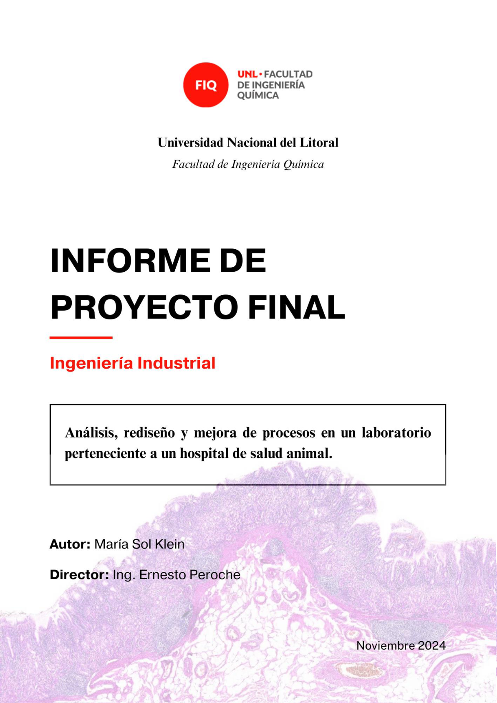

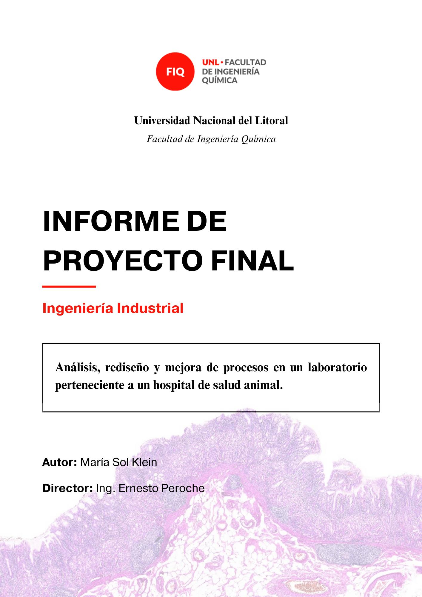

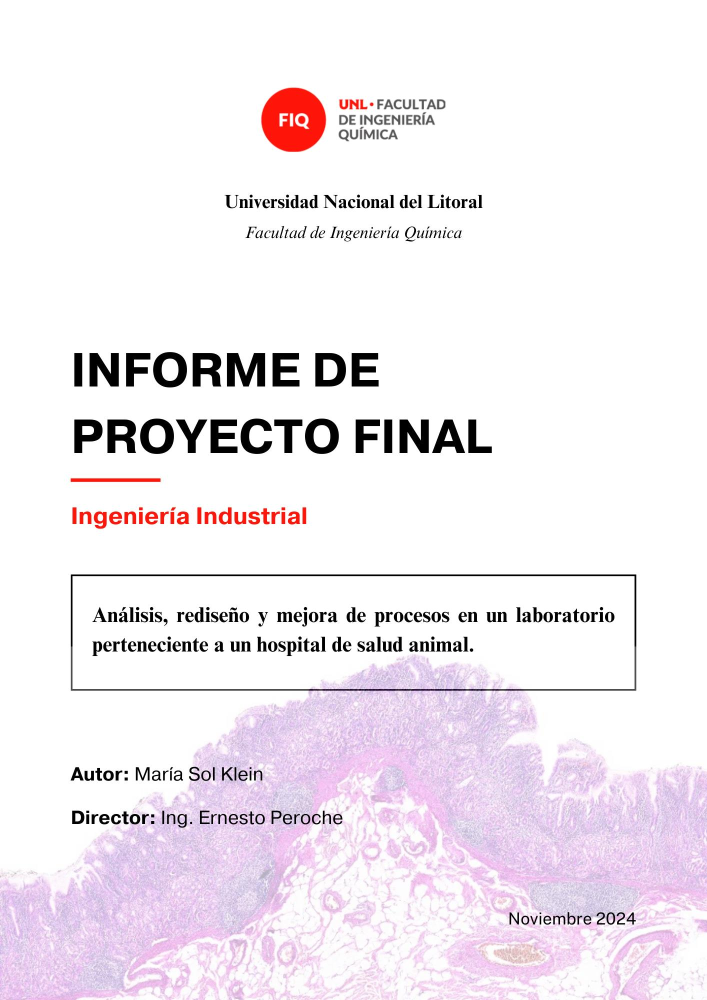

---

## Page 2

Proyecto Final de Ingeniería Industrial 
 
MARÍA SOL KLEIN 
1 
 
Agradecimientos 
A Ernesto, por ser mi director y ayudarme a convertir una idea inicial en un proyecto realizable, 
brindándome herramientas e ideas para enriquecerlo. 
A quienes forman parte del Laboratorio de Anatomía Patológica de la FCV UNL, objeto de 
estudio de este trabajo, por abrirme las puertas y por su enorme disposición para explicarme el 
funcionamiento del laboratorio y resolver todas mis dudas. Muchas gracias a Ana, Alejo, 
Josefina, Matías, Sol y a Rocío, mi mamá.  
A mi familia, por acompañarme en cada paso, motivarme y ser un apoyo incondicional, 
celebrando conmigo cada logro y ayudándome a transitar todos los desafíos y cambios que se 
presentaron a lo largo de esta etapa que se extendió mucho más de lo planeado. 
A Moni, que no va a leer esto, pero me acompaña desde el primer día del ingreso. 
¡Gracias! 
 
 
 

---

## Page 3

Proyecto Final de Ingeniería Industrial 
 
MARÍA SOL KLEIN 
2 
 
Resumen 
Este proyecto final de carrera se lleva a cabo en un laboratorio de anatomía patológica 
veterinaria, perteneciente a la Facultad de Ciencias Veterinarias de una universidad. La 
finalidad principal de este trabajo es identificar oportunidades de mejora que permitan una 
operación más eficiente. 
En primer lugar se estudia la situación actual del laboratorio. Se encuentra que la capacidad de 
la etapa cuello de botella está constantemente comprometida por tareas redundantes que no 
aportan valor para el cliente. Se identifica que la causa principal de los problemas es un manejo 
de la información ineficiente y altamente manual. 
A partir de los hallazgos en el estudio de la situación inicial se realizan propuestas de mejora, 
incluyendo la aplicación del método 5S, la modificación de algunas tareas en el flujo de trabajo 
y la implementación de un sistema informático adaptado a las necesidades del laboratorio. 
En otro apartado se especifican los requerimientos del sistema informático a desarrollar 
mediante algunas de las herramientas del Lenguaje Unificado de Modelado: especificación de 
casos de uso, diagrama de entidad-relación y su traducción a un esquema relacional de la base 
de datos para el laboratorio. 
Se detalla el impacto esperado de la aplicación de las mejoras propuestas en tres aspectos: el 
incremento de la capacidad de atención de la demanda, el aumento en la calidad del servicio 
ofrecido y la mejora del ambiente laboral. 
Finalmente, se lleva a cabo un análisis de factibilidad económica para evaluar la viabilidad del 
proyecto, considerando los recursos financieros requeridos para implementar las mejoras 
propuestas y los beneficios esperados. 
 

---

## Page 4

Proyecto Final de Ingeniería Industrial 
 
MARÍA SOL KLEIN 
3 
 
Índice 
Agradecimientos ....................................................................................................................... 1 
Resumen .................................................................................................................................... 2 
Índice.......................................................................................................................................... 3 
Capítulo I: Introducción .......................................................................................................... 7 
I.1 Introducción .................................................................................................................... 7 
I.2 La organización ............................................................................................................... 7 
I.2.1 Facultad de Ciencias Veterinarias .......................................................................... 7 
I.2.2 Hospital de Salud Animal ...................................................................................... 7 
I.2.3 Laboratorio de Anatomía Patológica ...................................................................... 9 
I.3 Servicios ofrecidos por el laboratorio ........................................................................... 11 
I.3.1 Análisis citopatológico ......................................................................................... 11 
I.3.2 Análisis histopatológico ....................................................................................... 12 
I.4 Terminología ................................................................................................................. 12 
I.4.1 Protocolo .............................................................................................................. 12 
I.4.2 Orden de trabajo ................................................................................................... 14 
I.4.3 Informe de Resultados .......................................................................................... 15 
I.4.4 Cassette................................................................................................................. 15 
I.4.5 Taco de Parafina ................................................................................................... 15 
I.5 Problemáticas a abordar ................................................................................................ 16 
I.6 Conclusión ..................................................................................................................... 17 
Capítulo II: Situación actual ................................................................................................. 19 
II.1 Introducción ................................................................................................................. 19 
II.2 Resultados de las encuestas ......................................................................................... 19 
II.2.1 Encuesta a los clientes del laboratorio ................................................................ 19 
II.2.2 Encuesta al personal del laboratorio ................................................................... 23 
II.3 Recursos humanos ....................................................................................................... 27 
II.4 Volumen de trabajo ...................................................................................................... 28 
II.5 Layout .......................................................................................................................... 30 
II.6 Sistemas de información .............................................................................................. 33 
II.6.1 Software .............................................................................................................. 33 
II.6.2 Planilla de ingreso de muestras al laboratorio .................................................... 34 
II.6.2 Planilla de procesamiento de muestras ............................................................... 35 
II.6.3 Carpeta de protocolos ......................................................................................... 35 
II.6.4 Informes de resultados ........................................................................................ 36 
II.7 Orden y limpieza .......................................................................................................... 37 
II.8 Equipamiento y conectividad ....................................................................................... 37 
II.9 Procesos y flujo de trabajo - Modelo “AS IS” ............................................................. 39 
II.9.1: Inicio del proceso ............................................................................................... 39 

---

## Page 5

Proyecto Final de Ingeniería Industrial 
 
MARÍA SOL KLEIN 
4 
 
II.9.2: Recepción de muestra ........................................................................................ 40 
II.9.3: Procesamiento de muestras ................................................................................ 40 
II.9.4: Observación al microscopio y diagnóstico ........................................................ 44 
II.9.5: Redacción del informe de resultados ................................................................. 44 
II.9.6: Digitalización del informe de resultados ........................................................... 44 
II.9.7: Elaboración de la Orden de Trabajo .................................................................. 46 
II.9.8: Envío del informe de resultados y Órden de Trabajo ........................................ 46 
II.10 Conclusión ................................................................................................................. 46 
Capítulo III: Propuestas de mejora ...................................................................................... 49 
III.1: Introducción ............................................................................................................... 49 
III.2: 5S ............................................................................................................................... 49 
III.2.1 Seiri (clasificación) ............................................................................................ 49 
III.2.2 Seiton (orden) .................................................................................................... 50 
III.2.3 Seiso (limpieza) ................................................................................................. 52 
III.2.3 Seiketsu (sistematización) ................................................................................. 52 
III.2.3 Shitsuke (estandarización) ................................................................................. 53 
III.3: Estandarización del proceso de recepción de muestras y protocolo de remisión ...... 53 
III.4: Implementación del encassettado de especímenes muy pequeños ............................ 54 
III.5: Rediseño del layout ................................................................................................... 55 
III.6: Rediseño del sistema de información ........................................................................ 59 
III.7 Equipamiento y conectividad ..................................................................................... 59 
III.8 Nuevo flujo de trabajo propuesto - Modelo “To Be” ................................................. 60 
III.8.1: Inicio del proceso ............................................................................................. 60 
III.8.2: Registro de protocolo y recepción de muestra ................................................. 60 
III.8.3: Procesamiento de muestra ................................................................................ 61 
III.8.4: Observación al microscopio y diagnóstico ....................................................... 62 
III.8.5: Redacción y envío de informe de resultados y OT ........................................... 62 
III.9 Tablero de gestión visual ............................................................................................ 62 
III.10 Conclusión ................................................................................................................ 63 
Capítulo IV: Estructuración de la información ................................................................... 67 
IV.1 Introducción................................................................................................................ 67 
IV.2 Diagrama de casos de uso .......................................................................................... 68 
IV.3 Diagrama entidad relación .......................................................................................... 69 
IV.3.1 Entidades del modelo ........................................................................................ 70 
IV.3.2 Relaciones del modelo ....................................................................................... 74 
IV.3.3 Decisiones de diseño ......................................................................................... 74 
IV.4 Pasaje al esquema relacional ...................................................................................... 75 
IV.5 Conclusiones .............................................................................................................. 76 
Capítulo V: Impacto de las soluciones propuestas .............................................................. 78 
V.1 Introducción ................................................................................................................. 78 
V.2 Aumento del la capacidad de atención de demanda .................................................... 78 

---

## Page 6

Proyecto Final de Ingeniería Industrial 
 
MARÍA SOL KLEIN 
5 
 
V.3 Aumento en la calidad del servicio .............................................................................. 79 
V.4 Mejora del ambiente laboral ........................................................................................ 80 
V.5 Conclusión ................................................................................................................... 80 
Capítulo VI: Estudio económico ........................................................................................... 83 
VI.1 Introducción................................................................................................................ 83 
VI.2 Inversiones.................................................................................................................. 83 
VI.3 Costos ......................................................................................................................... 84 
VI.4 Beneficios del proyecto .............................................................................................. 84 
VI.5 Flujo de caja del proyecto .......................................................................................... 86 
VI.6 Tasa de descuento ....................................................................................................... 87 
VI.7 Métodos de evaluación ............................................................................................... 87 
VI.7.1 Valor Actual Neto (VAN) ................................................................................. 87 
VI.7.2 Tasa Interna de Retorno (TIR) .......................................................................... 88 
VI.8 Conclusión .................................................................................................................. 88 
Capítulo VII: Conclusiones.................................................................................................... 90 
Anexo I: Vistas del sistema .................................................................................................... 92 
A1.1 Página de inicio y login clientes .......................................................................... 94 
A1.2 Formulario de registro en el Sistema Informático ............................................... 96 
A1.3 Formulario de registro de protocolo de remisión de muestra .............................. 97 
A1.4 Consulta listado de protocolos remitidos ............................................................. 98 
A1.5 Login patólogos y personal del laboratorio ......................................................... 98 
A1.6 Consulta datos de protocolo ................................................................................. 99 
A1.7 Registrar datos de procesamiento ...................................................................... 100 
A1.8 Formulario de redacción de informe de resultados ............................................ 101 
Anexo II: Especificación de casos de uso ............................................................................ 102 
A2.1 Registrarse en el sistema .................................................................................... 104 
A2.2 Ingresar protocolo de remisión de muestra ........................................................ 105 
A2.3 Consultar estado de protocolos remitidos .......................................................... 106 
A2.4 Registrar recepción de muestra .......................................................................... 107 
A2.5 Ingresar datos de procesamiento ........................................................................ 108 
A2.6 Consultar protocolo ........................................................................................... 109 
A2.7 Redactar Informe de Resultados ........................................................................ 110 
Bibliografía ............................................................................................................................ 111 
 
 
 

---

## Page 7

Proyecto Final de Ingeniería Industrial 
 
MARÍA SOL KLEIN 
6 
 
Capítulo I 
Introducción 
 

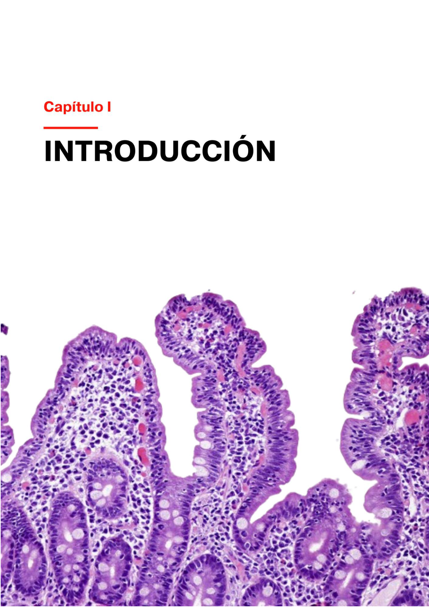

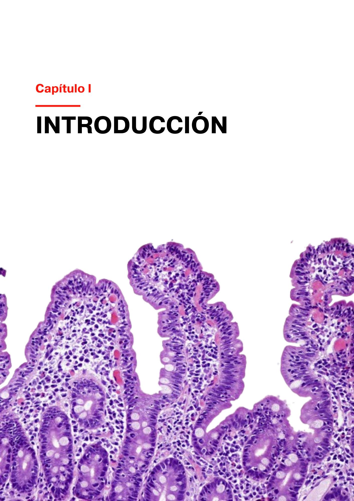

---

## Page 8

Proyecto Final de Ingeniería Industrial 
 
MARÍA SOL KLEIN 
7 
 
Capítulo I: Introducción 
I.1 Introducción 
Este capítulo está dedicado a describir la organización donde se desarrolla el proyecto y la 
problemática que lo motiva. Se busca que el lector comprenda el contexto de la organización, 
su función, los servicios que ofrece y su importancia en la región. 
I.2 La organización 
I.2.1 Facultad de Ciencias Veterinarias 
La Facultad de Ciencias Veterinarias de la Universidad Nacional del Litoral fue fundada en 
1961 y se encuentra situada en la ciudad de Esperanza, provincia de Santa Fe, compartiendo el 
denominado Campus FAVE con la Facultad de Ciencias Agrarias. 
La propuesta educativa de la facultad incluye carreras de pregrado (tecnicaturas), grado 
(medicina veterinaria) y posgrado (especializaciones, maestrías y doctorados). 
I.2.2 Hospital de Salud Animal 
El plan de estudios de Medicina Veterinaria incluye dos asignaturas obligatorias de práctica 
pre-profesional: Práctica Hospitalaria de Pequeños Animales y Práctica Hospitalaria de 
Grandes Animales. Ambas materias se desarrollan en el Hospital de Salud Animal (HSA) de la 
facultad, el cual brinda servicios de atención veterinaria al público y forma a los alumnos del 
Departamento Clínicas. Los pacientes del hospital aportan la casuística necesaria para la 
formación de los alumnos, quienes atienden los casos clínicos que se presentan bajo la 
supervisión de los docentes. 
En el hospital también se llevan a cabo tareas de investigación, publicando aquellos casos que 
resulten de interés académico, y tareas de extensión: colaboración con asociaciones protectoras 
de animales, control masivo de la población canina y felina a través de castraciones para 
personas de bajos recursos, ejecución de campañas de vacunación antirrábica, entre otras. 
El hospital posee dos divisiones correspondientes a las dos asignaturas de práctica hospitalaria: 
Grandes Animales (HSA-GA) y Pequeños Animales (HSA-PA). Ambas divisiones brindan una 
amplia gama de servicios veterinarios, incluyendo atención de casos clínicos, internación, 

---

## Page 9

Proyecto Final de Ingeniería Industrial 
 
MARÍA SOL KLEIN 
8 
 
cirugías, ecografías y radiografías. Los destinatarios de estos servicios son tanto los animales 
que acuden directamente al hospital como aquellos derivados por profesionales de la actividad 
privada. 
Fig. 1.1. A la derecha del árbol azul: división pequeños animales. A la izquierda: división grandes 
animales y laboratorio de anatomía patológica. 
El hospital cuenta con una dirección ejecutiva que reporta directamente al decanato de la 
universidad, como se observa en el organigrama de la figura 1.2. 

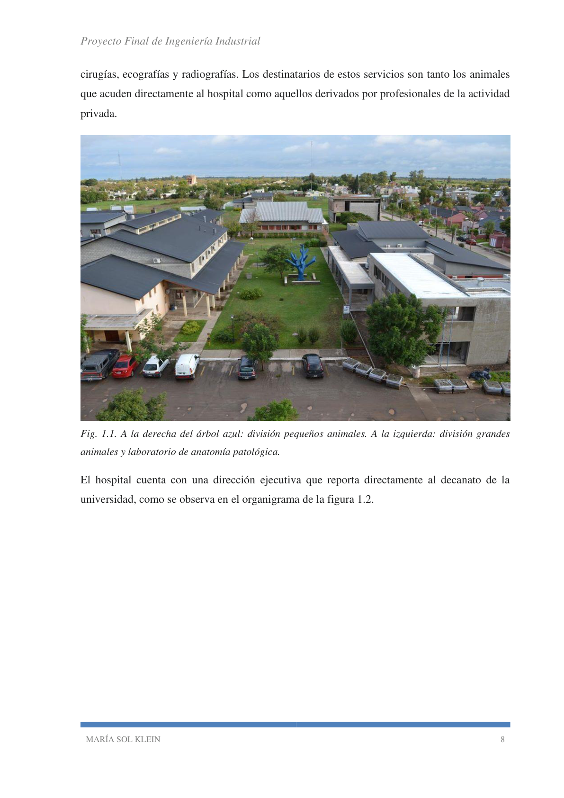

---

## Page 10

Proyecto Final de Ingeniería Industrial 
 
MARÍA SOL KLEIN 
9 
 
Fig. 1.2 Organigrama. Estructura organizativa de la Facultad de Ciencias Veterinarias. 
I.2.3 Laboratorio de Anatomía Patológica 
La anatomía patológica es la rama de la medicina que se encarga del estudio de los cambios 
que las enfermedades provocan en los tejidos y órganos. Su objetivo principal es analizar y 
diagnosticar las alteraciones morfológicas y celulares que se presentan en los tejidos y ayudar 
en la comprensión de las enfermedades, su origen, evolución y consecuencias. 
Los profesionales de la anatomía patológica llevan a cabo un análisis minucioso de muestras de 
tejidos y fluidos corporales obtenidos a través de biopsias, cirugías y autopsias (necropsias, en 
el caso de la medicina veterinaria). Estas muestras se preparan para poder ser examinadas 
microscópicamente, pudiendo observar su estructura celular, la organización tisular, la 
presencia de inflamación, la presencia de tumores, entre otros. A través de su análisis, los 
anatomopatólogos pueden identificar enfermedades infecciosas, inflamatorias, autoinmunes, 
degenerativas y neoplásicas, entre otras. También pueden evaluar la respuesta del organismo a 
tratamientos médicos y quirúrgicos. 

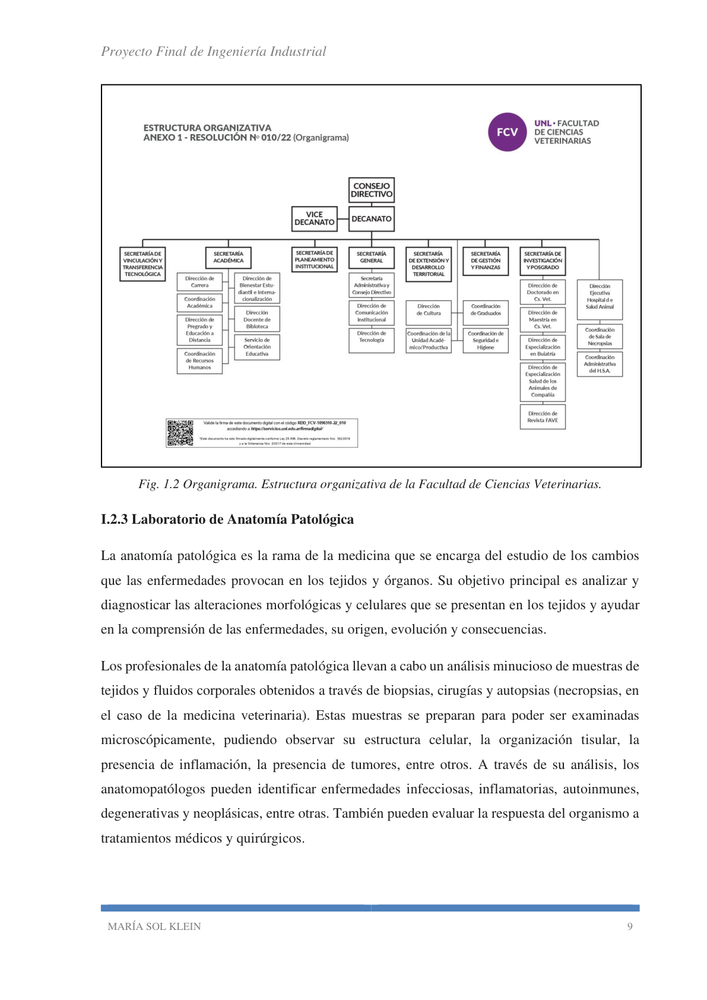

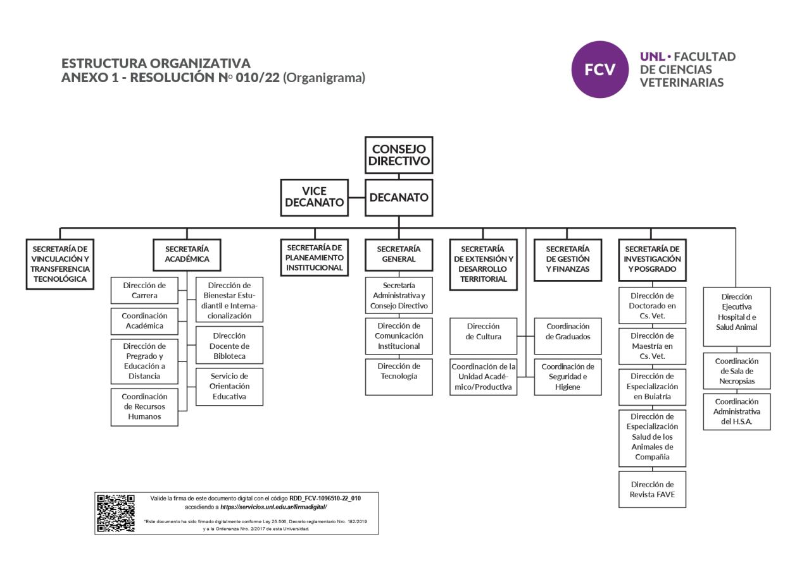

---

## Page 11

Proyecto Final de Ingeniería Industrial 
 
MARÍA SOL KLEIN 
10 
 
La información proporcionada por la anatomía patológica es esencial para que los profesionales 
de la medicina tomen decisiones clínicas, como la elección del tratamiento más adecuado para 
el paciente o la implementación de medidas profilácticas (en caso de grupos de animales). 
También es utilizada en la investigación médica y en el desarrollo de nuevas terapias, ya que 
brinda conocimientos detallados sobre los mecanismos patológicos subyacentes y la progresión 
de las enfermedades. 
A través de la observación microscópica y el análisis detallado de las muestras, los 
anatomopatólogos desempeñan un papel crucial en el diagnóstico, tratamiento y comprensión 
de las enfermedades, contribuyendo así al avance de la medicina y al cuidado de los pacientes. 
El Laboratorio de Anatomía Patológica forma parte del Hospital de Salud Animal de la Facultad 
de Ciencias Veterinarias, UNL. Cuenta con más de 35 años de experiencia en el diagnóstico 
histopatológico, y es un referente en Sanidad Animal a nivel nacional. 
Su unidad ejecutora es la Cátedra de Patología Veterinaria de la facultad, asignatura obligatoria 
de tercer año del plan de estudios vigente. El equipo de personas que trabajan en el laboratorio 
es reducido y está compuesto por algunos de los docentes de la cátedra y un técnico 
histotecnólogo, con la eventual incorporación de estudiantes adscriptos o becarios. 
La autoridad máxima dentro del laboratorio es el responsable de la unidad ejecutora, es decir, 
el Jefe de la Cátedra de Patología Veterinaria. El responsable del laboratorio responde a la 
Dirección Ejecutiva del Hospital de Salud Animal, como se identifica en el organigrama de la 
Figura 1.3. 
 
Fig. 1.3. Organigrama del Laboratorio de Anatomía Patológica. 

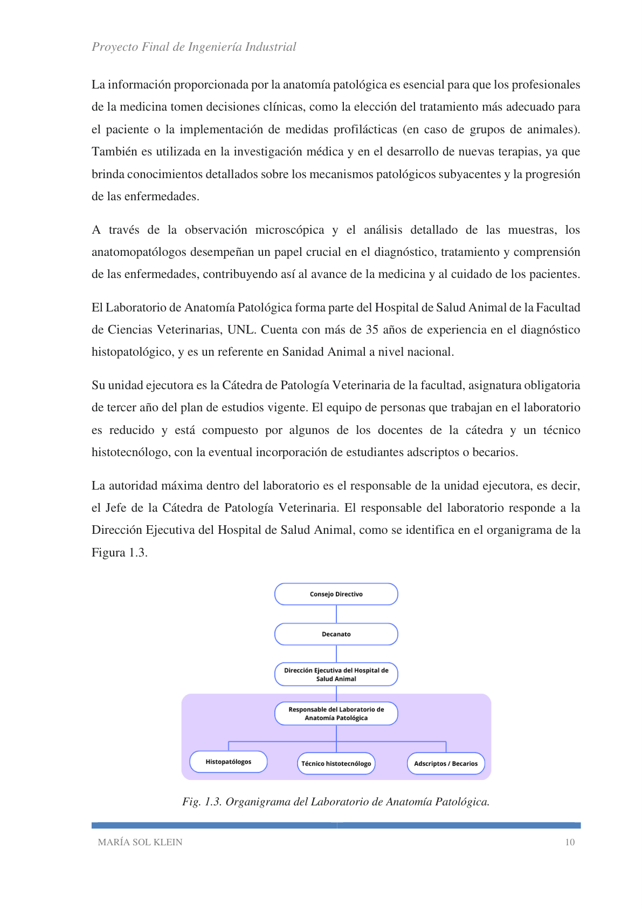

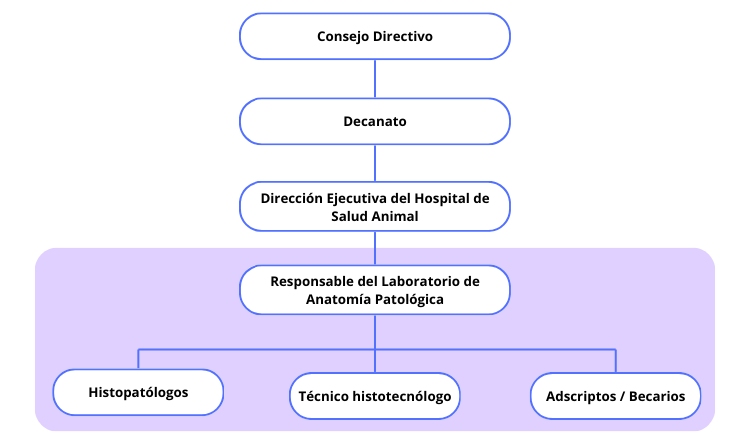

---

## Page 12

Proyecto Final de Ingeniería Industrial 
 
MARÍA SOL KLEIN 
11 
 
La actividad principal del laboratorio es procesar muestras y analizarlas. Los resultados de los 
análisis -en conjunto con la examinación, la historia clínica del paciente y otros métodos 
complementarios utilizados- permiten al médico veterinario clínico elaborar el diagnóstico de 
la patología presente en un animal de compañía o en un rodeo o lote de animales de producción, 
para tomar medidas terapéuticas y/o profilácticas. 
Fig. 1.4. Laboratorio de Anatomía Patológica Veterinaria. 
I.3 Servicios ofrecidos por el laboratorio 
El laboratorio ofrece dos servicios principales: el análisis citopatológico y el análisis 
histopatológico. También existen dentro de su oferta otros servicios que amplían el alcance de 
estos, por ejemplo, la realización de necropsia completa en pequeños animales y toma de 
muestras para análisis. 
I.3.1 Análisis citopatológico 
Consiste en la observación de células. En este tipo de análisis, la muestra recibida es un 
portaobjetos (lámina de vidrio que se coloca bajo el microscopio) con un extendido de células 
obtenido a través de una punción, hisopado, raspado, entre otras técnicas. Para poder visualizar 
las células, sólo es necesario someter la muestra a un proceso sencillo de coloración. 

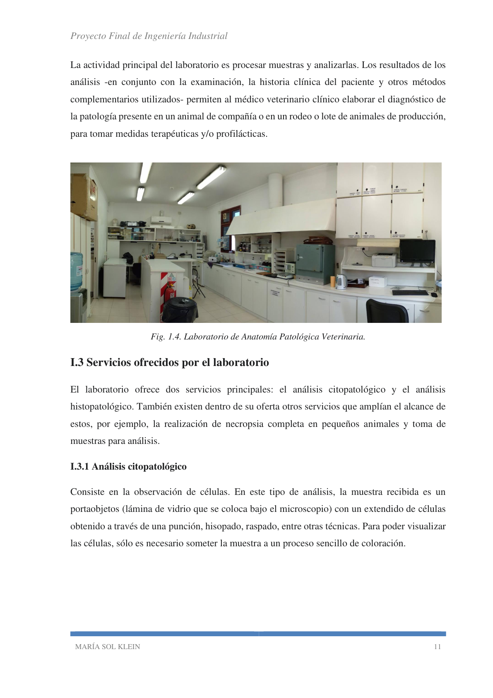

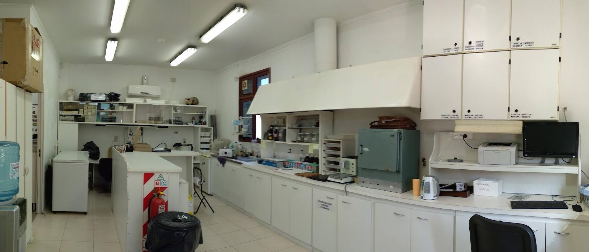

---

## Page 13

Proyecto Final de Ingeniería Industrial 
 
MARÍA SOL KLEIN 
12 
 
 
Fig. 1.5. Muestras para análisis citológico, recibidas en portaobjetos. 
I.3.2 Análisis histopatológico 
Estudia tejidos bajo el microscopio. Las muestras para realizar este tipo de estudios son 
porciones de órganos y tejidos que llegan al laboratorio en frascos de formol al 10%. El 
procesamiento de estas muestras tiene numerosas etapas que permiten la adecuada visualización 
del tejido bajo el microscopio. 
 
Fig. 1.6. Muestras para análisis histopatológico, recibidas en frascos de formol. 
I.4 Terminología 
En esta sección se definen términos y conceptos fundamentales para explicar el funcionamiento 
del laboratorio. 
I.4.1 Protocolo 
En el laboratorio bajo estudio, al hablar de protocolo se hace referencia a dos conceptos 
asociados: el Protocolo de Remisión de Muestra y el número de protocolo asignado por el 

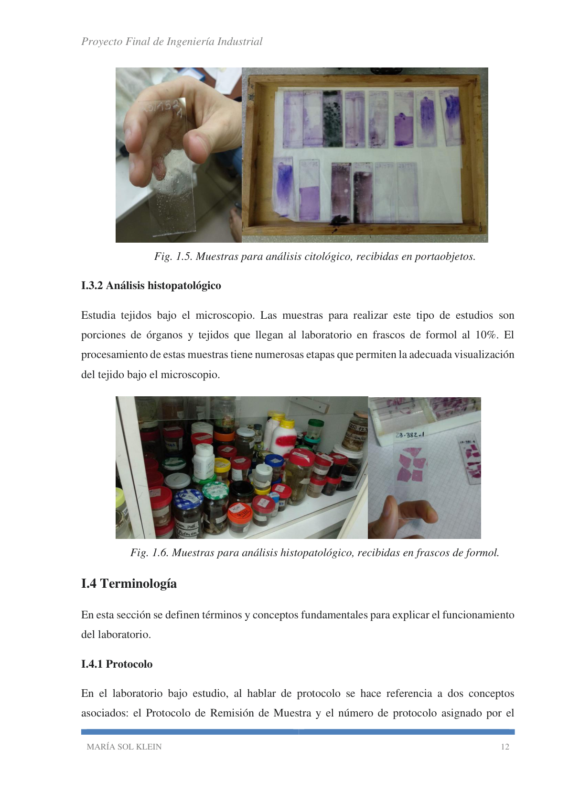

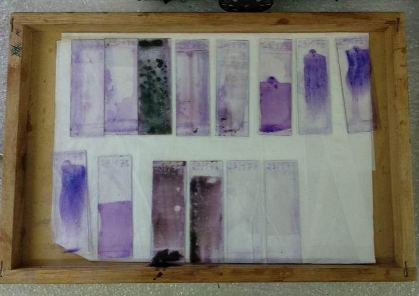

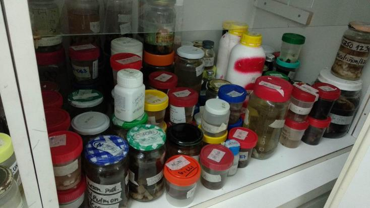

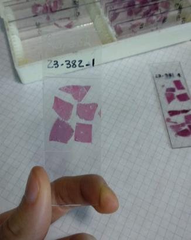

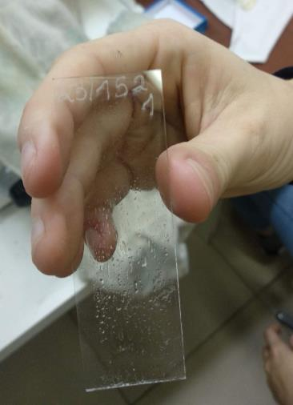

---

## Page 14

Proyecto Final de Ingeniería Industrial 
 
MARÍA SOL KLEIN 
13 
 
laboratorio a una muestra dada. Toda muestra debe ingresar al laboratorio acompañada por un 
Protocolo de Remisión de Muestra. Este protocolo es un documento en donde el veterinario que 
envía la muestra registra los datos de la misma: identifica al animal del cual se la extrajo, tipo 
de tejido que se envía, diagnóstico presuntivo, etc. Existen tres modelos de Protocolo de 
Remisión de Muestra elaborados por el laboratorio: uno para clientes externos, y dos para el 
Hospital de Salud Animal (uno para cada área: Pequeños animales y Grandes Animales). 
La mayoría de los clientes externos no utilizan el protocolo modelo. En las figuras 1.8 a 1.10 
se presentan los modelos de protocolo elaborados por el laboratorio y algunos ejemplos de 
protocolos recibidos. 
En el caso de que un veterinario solicite varios análisis para un mismo animal, a cada uno se le 
asigna un número particular de protocolo (aunque existen excepciones). 
Un Protocolo de Remisión de Muestra completo es necesario para poder realizar correctamente 
el análisis. 
 
Fig.1.7. Modelo de Protocolo de Remisión 
de Muestras establecido por el laboratorio. 
Fig.1.8. Modelo de protocolo para el Hospital 
de Salud Animal de la facultad. 
 

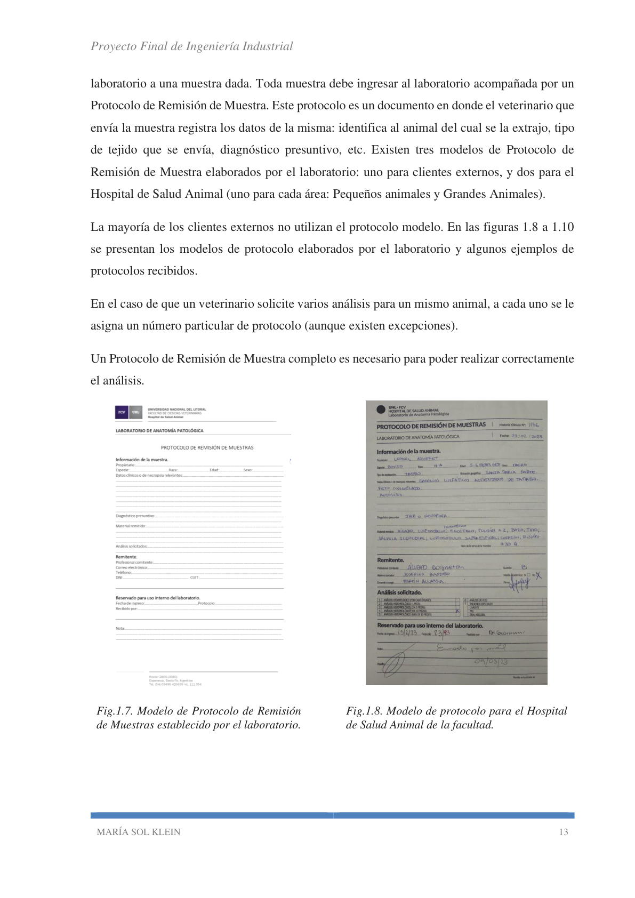

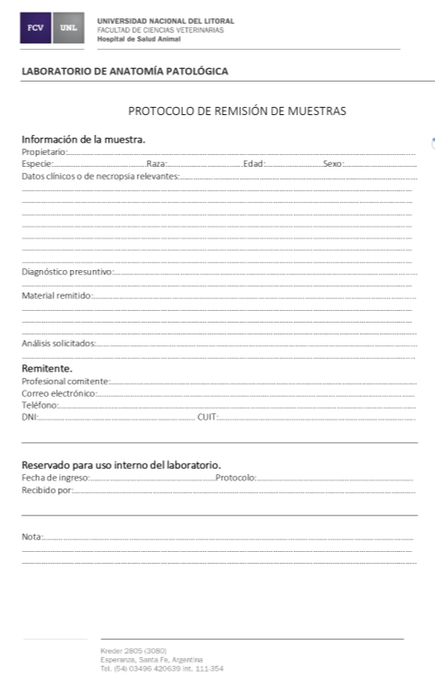

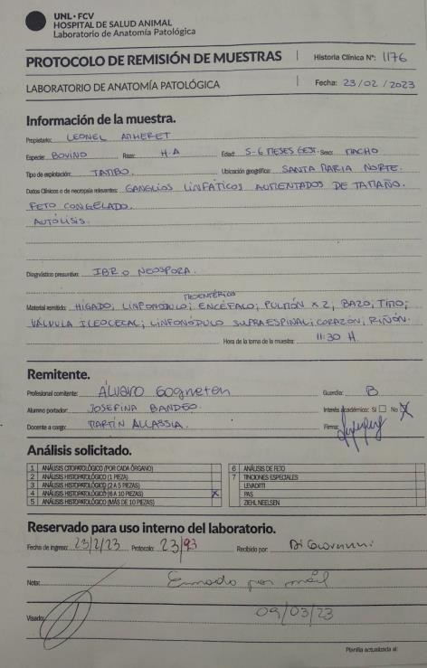

---

## Page 15

Proyecto Final de Ingeniería Industrial 
 
MARÍA SOL KLEIN 
14 
 
 
 
Fig.1.9. 
Protocolo 
de 
remisión 
ad-hoc 
elaborado por un laboratorio que terceriza el 
análisis histo y citopatológico. 
Fig.1.10. Protocolo de remisión ad-hoc 
elaborado por un veterinario en el papel de 
recetario (“Rp.”). 
 
 
El número de protocolo asignado es la identificación interna que se da a una muestra dentro del 
laboratorio. Este número de protocolo tiene el formato HP AA/NRO para histopatología y CT 
AA/NRO para citología. AA es la identificación del año en el cual ingresó la muestra al 
laboratorio, y NRO el número que se le asigna a los protocolos según órden de llegada, por 
ejemplo: HP 23/120 corresponde al protocolo para histología número 120 ingresado en el año 
2023. 
I.4.2 Orden de trabajo 
La órden de trabajo (OT) es el documento que explicita el monto a cobrar por los servicios 
ofrecidos. El laboratorio genera órdenes de trabajo que se envían a la oficina de Finanzas de la 
facultad, la cual se encarga de cobrar el servicio al cliente y generar la factura. En la OT pueden 
incluirse varios servicios solicitados por el mismo profesional en el mismo día, siempre y 
cuando no haya aclaraciones particulares para los datos de facturación de algún servicio 
específico. 

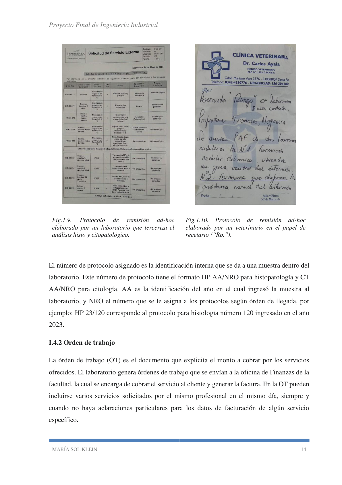

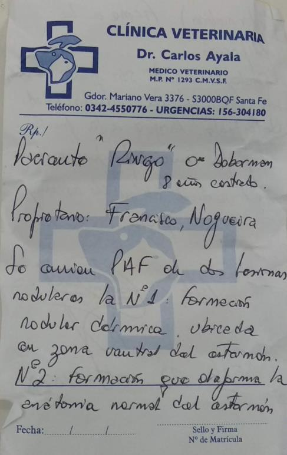

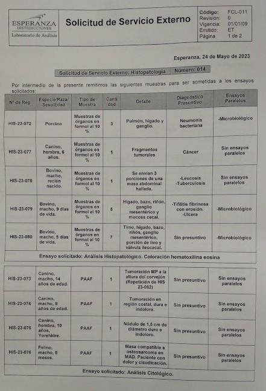

---

## Page 16

Proyecto Final de Ingeniería Industrial 
 
MARÍA SOL KLEIN 
15 
 
En el caso de los protocolos provenientes del Hospital de Salud Animal de la facultad, el 
laboratorio no se encarga de confeccionar la órden de trabajo. Esta tarea queda a cargo del 
personal administrativo del Hospital, que unifica todos los servicios que se hayan realizado a 
los pacientes. El modelo de protocolo diseñado para el hospital tiene en cuenta este detalle. 
I.4.3 Informe de Resultados 
En el informe de resultados, el histopatólogo describe lo observado microscópicamente en la 
muestra de tejido y realiza un diagnóstico de la patología presente teniendo en cuenta los datos 
del paciente. 
I.4.4 Cassette 
Es un contenedor pequeño de plástico en donde se colocan fragmentos de las muestras para 
histopatología remitidas por el veterinario. Tiene rendijas que permiten que al sumergirlo en un 
medio líquido el mismo ingrese dentro del mismo, y actúe sobre los tejidos. 
El cassette se rotula con el número de protocolo correspondiente cuando se colocan las piezas 
dentro del mismo. El cassette permite la trazabilidad de la muestra durante el procesamiento. 
 
Fig. 1.11. Cassette para inclusión de tejidos. 
I.4.5 Taco de Parafina 
En una etapa siguiente del proceso de preparación de las muestras para su observación en el 
microscopio, el cassette se convierte en un taco de parafina. El taco es un bloque de parafina 
que tiene en su seno fragmentos de las piezas de la muestra. El entacado se realiza para poder 

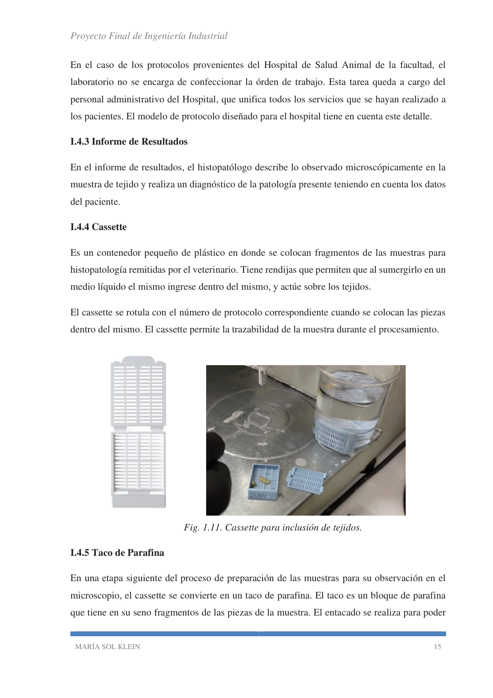

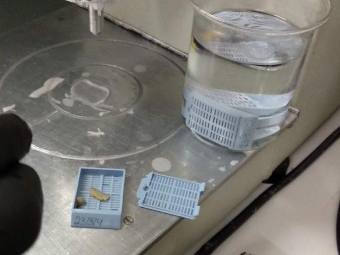

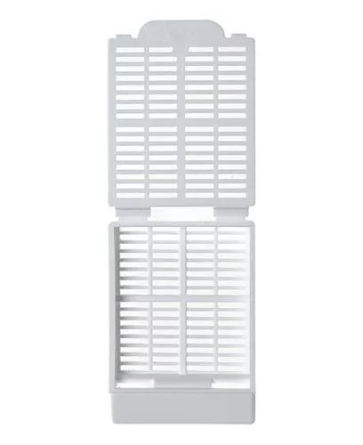

---

## Page 17

Proyecto Final de Ingeniería Industrial 
 
MARÍA SOL KLEIN 
16 
 
obtener láminas de tejido de un espesor adecuado para su observación al microscopio utilizando 
un micrótomo. 
En el taco se mantiene la base del cassette que contenía la muestra, en donde figura su número 
de protocolo. 
 
Fig. 1.12. Entacado. Conversión de un cassette en un taco de parafina. 
I.5 Problemáticas a abordar 
El laboratorio enfrenta dificultades para entregar los informes de resultados a los clientes a 
tiempo. Las muestras pasan una gran cantidad de tiempo esperando que los recursos se liberen, 
por lo cual un gran porcentaje del tiempo de respuesta del laboratorio no corresponde a un 
agregado de valor para el cliente. 
El laboratorio presenta un cuello de botella claro: la etapa de observación y diagnóstico. En esta 
el tiempo de procesamiento de las muestras es extremadamente variable, ya que algunos casos 
presentan lesiones claras que se diagnostican con facilidad y otros requieren investigación, 
consultas bibliográficas y revisión en equipo. A su vez, esta etapa es la de mayor importancia 
desde el punto de vista de la cadena de valor.  
Actualmente la etapa cuello de botella presenta ineficiencias que reducen su capacidad. A su 
vez, las etapas anteriores y posteriores no están subordinadas al cuello de botella, generando 
demoras adicionales. Estimar la capacidad actual de esta etapa presenta obstáculos: horas extra 
no registradas, desconocimiento del tiempo dedicado al laboratorio por cada miembro del 
equipo, variabilidad muy amplia en el tiempo que se necesita para procesar una muestra, entre 
otras. 

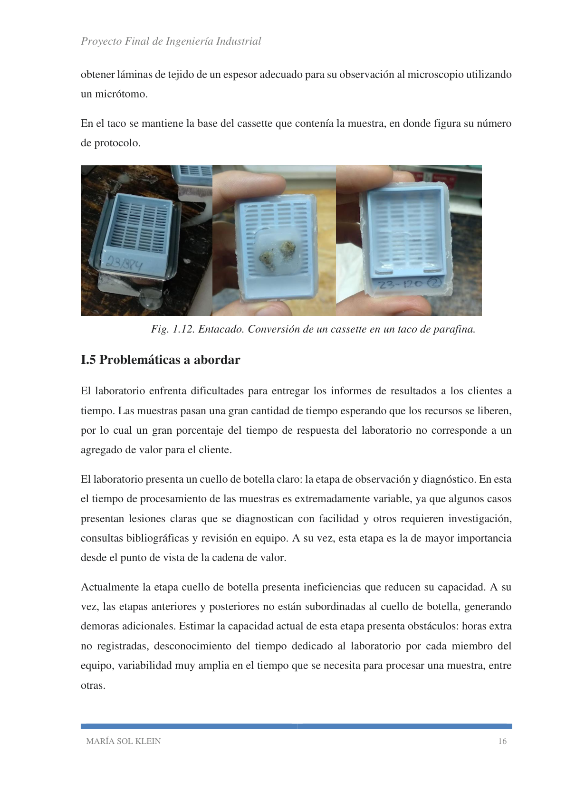

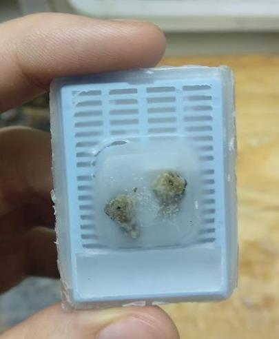

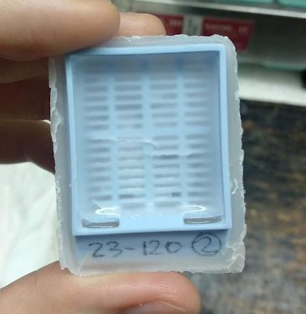

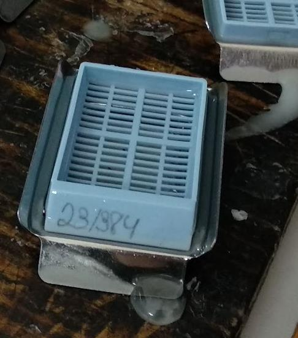

---

## Page 18

Proyecto Final de Ingeniería Industrial 
 
MARÍA SOL KLEIN 
17 
 
En el presente trabajo se exploran las ineficiencias que comprometen la capacidad general del 
laboratorio y se realiza una revisión integral de los procesos. Se proponen mejoras orientadas a 
aprovechar al máximo la capacidad del cuello de botella y mejorar el flujo de trabajo en el 
laboratorio. 
I.6 Conclusión 
El laboratorio de anatomía patológica donde se lleva a cabo este trabajo es de gran relevancia 
para la región, ya que cubre la demanda de una gran cantidad de profesionales para el 
diagnóstico complementario de patologías en animales de compañía y ganadería. 
El laboratorio ofrece servicios que son esenciales para la toma de decisiones en relación a 
enfermedades zoonóticas, es decir, aquellas que pueden transmitirse de animales a humanos. 
Gracias a sus análisis y diagnósticos, se pueden tomar medidas adecuadas para proteger la salud 
tanto de las personas como de los animales, lo que hace que el laboratorio desempeñe un papel 
crucial en la prevención y control de estas enfermedades. 
Mejorar los métodos de trabajo del laboratorio, rediseñar los procesos, aplicar metodologías de 
lean management (gestión esbelta) e implementar soluciones tecnológicas permite una 
operación con menor cantidad de etapas e iteraciones, aumentando la capacidad y reduciendo 
el tiempo respuesta o turnaround time (TAT), uno de los mejores indicadores para medir la 
eficiencia en laboratorios (Dawande, 2022). Esto beneficiará a los empleados de la organización 
y a sus clientes directos e indirectos, logrando un mejor ambiente laboral, mayor cantidad de 
muestras procesadas y menor tiempo de espera de los resultados. 
 

---

## Page 19

Proyecto Final de Ingeniería Industrial 
 
MARÍA SOL KLEIN 
18 
 
Capítulo II 
Situación actual 
 

---

## Page 20

Proyecto Final de Ingeniería Industrial 
 
MARÍA SOL KLEIN 
19 
 
Capítulo II: Situación actual 
II.1 Introducción 
Para obtener información sobre la situación actual del laboratorio se lleva a cabo un proceso de 
relevamiento. Las técnicas utilizadas en el presente proyecto son la observación in situ, 
entrevistas semi-estructuradas o híbridas con el personal del laboratorio, análisis de 
documentación y dos encuestas: una dirigida al personal del laboratorio y otra a los clientes del 
mismo. 
El uso combinado de técnicas de relevamiento permite obtener una visión holística del 
funcionamiento actual del laboratorio, identificar oportunidades de mejora y recopilar datos 
relevantes para el análisis posterior. En este capítulo se detallan los puntos claves obtenidos 
mediante el relevamiento y se describe la situación actual del laboratorio. 
II.2 Resultados de las encuestas 
El objetivo principal de ambas encuestas es conocer la percepción que empleados y clientes 
tienen del funcionamiento actual del laboratorio, midiendo el nivel de satisfacción con el 
servicio brindado o recibido. También se recopila información sobre la disposición para utilizar 
herramientas tecnológicas. 
II.2.1 Encuesta a los clientes del laboratorio 
La encuesta realizada a clientes consiste en 10 preguntas: 2 abiertas de tipo no obligatorio y 8 
cerradas (de opción múltiple) obligatorias. Es online (via formulario de Google), anónima y se 
distribuye a través del email institucional del laboratorio. Las respuestas representan el 42% del 
total de clientes. 
En la figura 2.1 se presentan las preguntas de la encuesta realizada a los clientes. 
 

---

## Page 21

Proyecto Final de Ingeniería Industrial 
 
MARÍA SOL KLEIN 
20 
 
 
Fig.2.1. Estructura del cuestionario para los clientes. 
Las preguntas relacionadas con el nivel de satisfacción de los clientes para con el laboratorio y 
sus servicios proporcionan respuestas mayoritariamente positivas: 
➛ El 98% de los clientes reportan estar “satisfechos” (21%) o “muy satisfechos” (77%) con 
el laboratorio. El 2% restante se manifiesta “neutral”. 
➛ La mayoría de los clientes reportan solicitar los servicios del laboratorio con frecuencia 
trimestral (40,9%) o mensual (29,5%). 

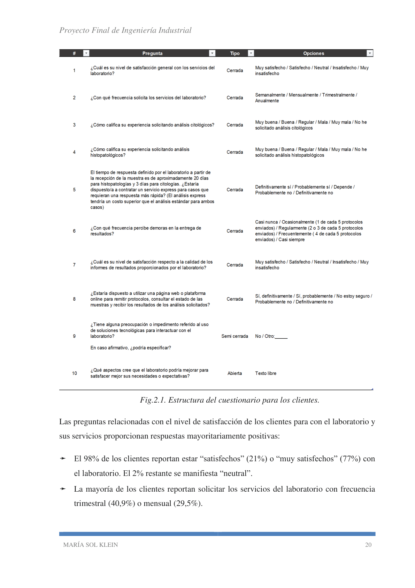

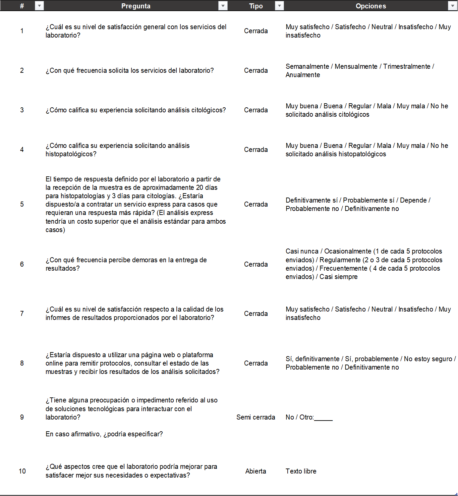

---

## Page 22

Proyecto Final de Ingeniería Industrial 
 
MARÍA SOL KLEIN 
21 
 
➛ Un 27,3% de los clientes manifiesta no haber solicitado análisis citológicos al laboratorio. 
De los restantes, el 81% califican su experiencia como “muy buena” y el 19% como 
“buena”. 
➛ La experiencia de los clientes solicitando análisis histopatológicos se divide en “muy 
buena” (89%), “buena” (9%) y “regular” (2%). 
 
Fig.2.2. Resultados de la encuesta a clientes. Calificación de la experiencia y nivel de 
satisfacción. 
➛ El 89% de los clientes manifiestan estar dispuestos a contratar un servicio express para 
casos que requieran una respuesta rápida (46% “definitivamente sí” y 43% “probablemente 
sí”). Para un 7% la respuesta fue “depende” y para el 5% restante “probablemente no”. 
➛ Respecto a la demora en la entrega de resultados, la mayoría (61%) manifiesta “casi nunca” 
percibir demoras, seguida por un 32% que percibe demoras “ocasionalmente” (Figura 2.3). 

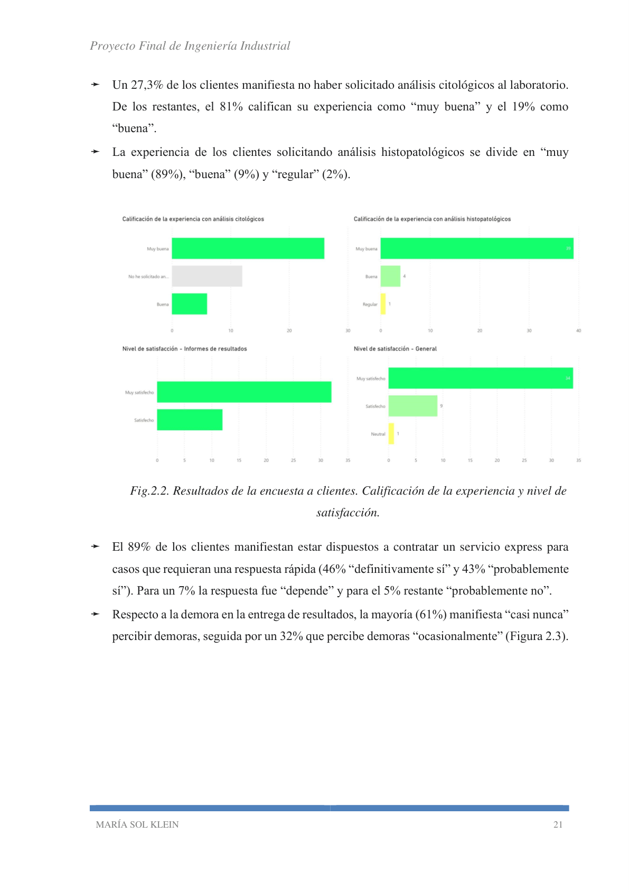

---

## Page 23

Proyecto Final de Ingeniería Industrial 
 
MARÍA SOL KLEIN 
22 
 
Fig.2.3. Resultados de la encuesta a clientes. Respuestas a la pregunta “¿Con qué frecuencia 
percibe demoras en la entrega de resultados?” 
Cerca de la mitad de los encuestados (49%) están "Sí, Definitivamente" dispuestos a utilizar 
una plataforma online para remitir protocolos y recibir resultados de análisis. Esto indica un 
interés considerable en adoptar soluciones tecnológicas para mejorar la comunicación y 
accesibilidad a los servicios del laboratorio. 
Los resultados de la encuesta reflejan una alta satisfacción general de los clientes con los 
servicios proporcionados por el Laboratorio de Anatomía Patológica. La mayoría de los clientes 
están contentos con la calidad de los análisis, la eficiencia en la entrega de resultados y la 
disposición hacia opciones más rápidas cuando sea necesario. 
Sin embargo, también hay áreas de mejora identificadas, como la optimización de los tiempos 
de entrega de resultados y la implementación de soluciones tecnológicas para mejorar la 
accesibilidad y la comunicación con los clientes. 
Algunas de las sugerencias realizadas por los clientes fueron: 
➛ Reducción del tiempo de entrega de resultados, especialmente en histopatologías. 
➛ Mayor disponibilidad durante períodos de vacaciones y períodos de vacaciones más cortos. 

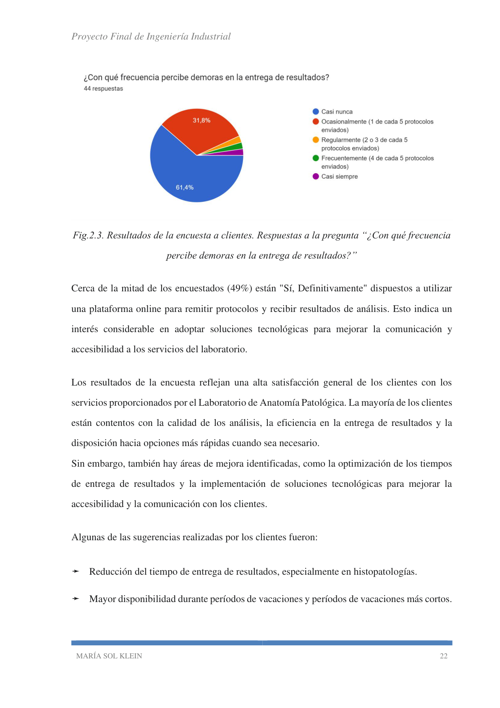

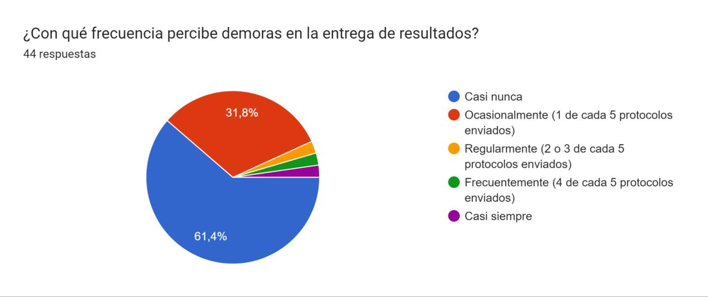

---

## Page 24

Proyecto Final de Ingeniería Industrial 
 
MARÍA SOL KLEIN 
23 
 
➛ Mejoras en la logística de recepción de muestras, especialmente para clientes ubicados a 
distancia. 
➛ Posibilidad de comunicación directa con el laboratorio a través de una plataforma online. 
➛ Incorporación de servicios especializados, como estudios de Inmunohistoquímica y otros 
marcadores especiales. 
II.2.2 Encuesta al personal del laboratorio 
La encuesta al personal consiste análogamente en 10 preguntas, 2 abiertas de tipo no obligatorio 
y 8 cerradas (de opción múltiple) obligatorias. En la figura 2.4 se presentan las preguntas y sus 
respectivas opciones de respuesta. 

---

## Page 25

Proyecto Final de Ingeniería Industrial 
 
MARÍA SOL KLEIN 
24 
 
 
Fig.2.4. Estructura del cuestionario para el personal de laboratorio. 
Las respuestas obtenidas brindan una visión integral de la percepción del equipo respecto al 
funcionamiento del laboratorio. En general, la mayoría de las respuestas fueron positivas, 
aunque se identificaron áreas específicas que requieren mejoras. 

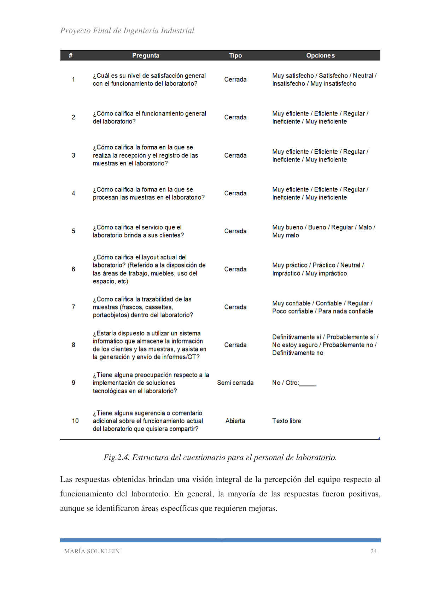

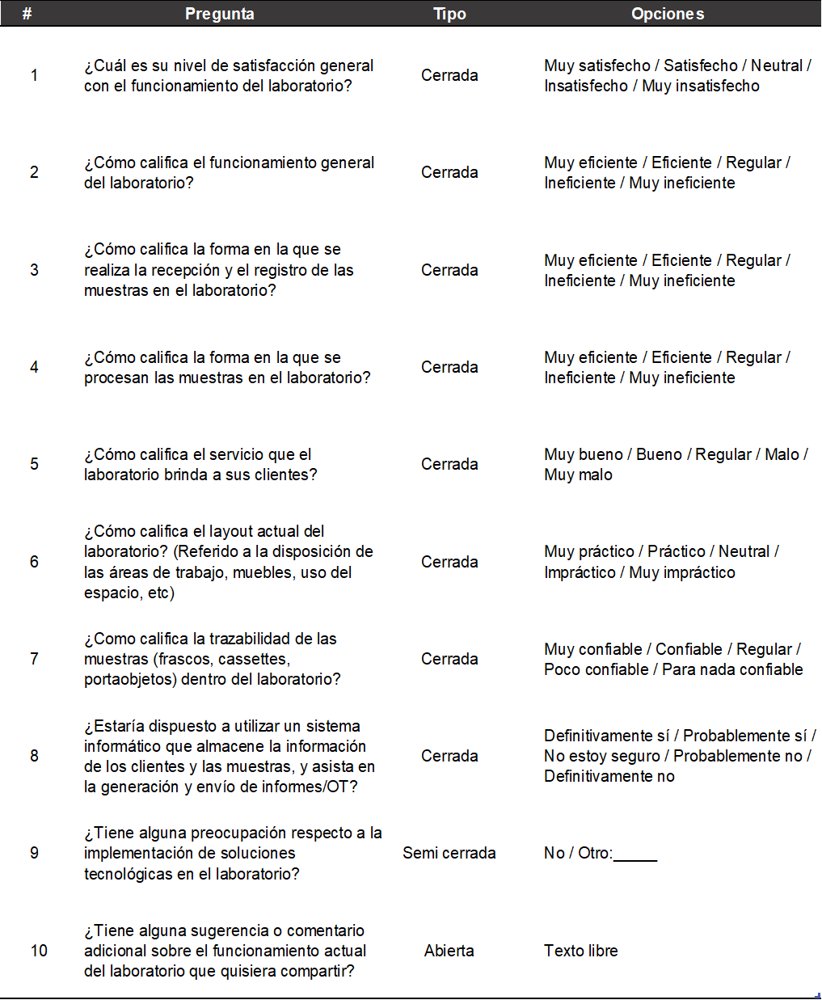

---

## Page 26

Proyecto Final de Ingeniería Industrial 
 
MARÍA SOL KLEIN 
25 
 
➛ La mayoría de los encuestados se mostró “satisfecho” (57,1%) o “muy satisfecho” (28,6%) 
con el funcionamiento general del laboratorio. El 14,3% restante se mostró “neutral”. 
➛ Respecto a la recepción y el registro de muestras, la mayoría (57,1%) de los encuestados 
la encuentra “regular”. El resto de los encuestados la consideran “eficiente” (28,6%) o 
“muy eficiente” (14,3%). 
➛ La mayoría de los encuestados percibe que la forma de procesar las muestras en el 
laboratorio es eficiente (57,1%). El 14,3% percibe que es “muy eficiente” y el 28,6% 
restante, “regular”.  
➛ La mayoría calificó el servicio brindado a los clientes como bueno (57,1%) o muy bueno 
(42,9%). 
➛ Las opiniones sobre el layout del laboratorio presentan la mayor variabilidad, con algunas 
personas encontrándolo “muy práctico” (14,3%) y otras, “impráctico” (28,6%). En la figura 
2.5 se presentan los resultados para esta pregunta. 
 
Fig.2.5. Calificación del layout. 
➛ Respecto a la trazabilidad de las muestras, la mayoría percibe que la misma es “confiable” 
(42,9%) o “muy confiable” (42,9%). El resto la considera “regular”. 
➛ Todos los encuestados manifiestan estar muy dispuestos a utilizar un sistema informático 
que almacene la información de los clientes y las muestras, y asista en la generación y 
envío de informes/OT. 

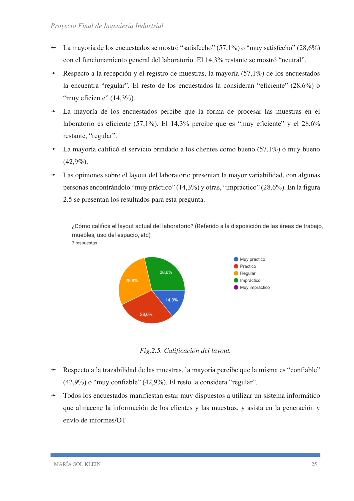

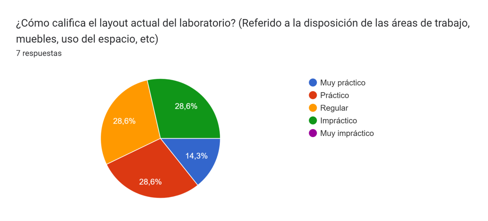

---

## Page 27

Proyecto Final de Ingeniería Industrial 
 
MARÍA SOL KLEIN 
26 
 
El 86% de los encuestados decide dejar una respuesta a la pregunta abierta sobre sugerencias o 
comentarios adicionales. Estas respuestas reflejan una variedad de preocupaciones y 
sugerencias para mejorar algunos aspectos del laboratorio, desde la eficiencia operativa hasta 
la calidad del servicio ofrecido. 
➛ Uno de los encuestados resalta la importancia de mejorar el flujo de muestras entre las 
distintas etapas para reducir los tiempos de envío de informes y evitar errores u omisiones. 
Además, sugiere la eficientización y protocolización del trabajo para optimizar el 
desempeño del personal en futuras incorporaciones. 
➛ Otro participante expresa la necesidad de implementar un programa más eficiente que 
centralice los datos de muestras enviadas e informes realizados. 
➛ Se sugiere la incorporación de personal adicional, incluyendo al menos un técnico 
capacitado y un patólogo/a, para distribuir mejor las tareas y mejorar la eficiencia operativa. 
➛ Se destaca la importancia de mejorar el sistema de cobranza de los análisis. 
➛ Un encuestado enfatiza la necesidad de incorporar más tecnología para mejorar la 
protocolización de las diferentes etapas del proceso y el registro del uso de reactivos y 
materiales. 
➛ Se sugiere mejorar la oferta de servicios del laboratorio, incluyendo la inclusión gradual de 
técnicas de coloración especial y la digitalización del registro de procesos para mejorar la 
trazabilidad de las muestras. 
➛ Una respuesta menciona que la trazabilidad de las muestras es deficiente en ciertos 
aspectos, por ejemplo: la cantidad de portaobjetos que se cortan/tiñen/obtienen por cada 
muestra, y la coloración en particular que se realiza de cada una de ellas. El registro podría 
mejorarse en varios puntos del procesamiento, y de manera digital. 
➛ Un encuestado comenta que la forma de controlar el stock de insumos y reactivos no es 
clara y depende de una sola persona. 
➛ En otra respuesta se menciona que el descarte de frascos colectores vacíos ocupa un espacio 
innecesario en el laboratorio, muchas veces en el piso o en las mesadas. Agrega que los 
armarios en ocasiones están subutilizados o mal utilizados. 
➛ Según otro encuestado, “el laboratorio de patología veterinaria debería poder ser un centro 
de referencia en la formación de nuevos patólogos veterinarios, y nuestro equipo 

---

## Page 28

Proyecto Final de Ingeniería Industrial 
 
MARÍA SOL KLEIN 
27 
 
lamentablemente no dispone de la cantidad de personal adecuada, o con la dedicación 
horaria suficiente para llevar a cabo dicho objetivo”. 
II.3 Recursos humanos 
El equipo estable del laboratorio está compuesto por cuatro funciones: tres histopatólogos y un 
técnico histotecnólogo. También es frecuente contar con estudiantes becarios y la asistencia 
eventual de un ayudante de la cátedra de Patología Veterinaria, pero estos recursos son 
inestables. 
La carga horaria de los histopatólogos es variable, no está definida y no se controla. La cantidad 
de horas que cada uno dedica al laboratorio depende de su cargo (profesor titular, profesor 
asociado, JTP, etc), su dedicación (simple, semi o exclusiva) y el tiempo consumido por las 
otras actividades de su cargo (docencia, docencia de posgrado, investigación, etc). 
Los histopatólogos tienen la formación requerida para realizar análisis histo y citopatológicos. 
Sin embargo, debido a la complejidad de la tarea y preferencias personales, en el equipo actual 
uno se dedica únicamente a las citologías, otro a las histopatologías y otro a ambas. 
El técnico histotecnólogo se encarga del corte histológico, del montaje del corte en un 
portaobjetos y de su posterior proceso de tinción. El cargo contempla una carga horaria de 20 
horas semanales. 
Los estudiantes corresponden a una beca BAPI (Beca de Apoyo a Programas Institucionales) y 
a una beca EVC-CIN (de Estímulo a las Vocaciones Científicas, otorgada por el Consejo 
Interuniversitario Nacional). La beca BAPI se renueva cada dos años y tiene una carga semanal 
de 20 horas. La beca CIN tiene una duración de 12 meses y una carga semanal de 12 horas que 
se distribuyen entre el laboratorio y otras actividades específicas del proyecto. Las tareas de los 
becarios incluyen:  
● 
Recepción e ingreso en programa informático de materiales que llegan al Laboratorio. 
● 
Apoyo técnico para la realización del muestreo, procesamiento y tinciones citológicas e 
histopatológicas de rutina y especiales. 
● 
Apoyo técnico para la realización de necropsias de pequeños animales que se remitan al 
Laboratorio para su diagnóstico macro y microscópico. 
● 
Informatización de los resultados, tanto de estudios citológicos como histopatológicos y 
mantenimiento actualizado de la base de datos. 

---

## Page 29

Proyecto Final de Ingeniería Industrial 
 
MARÍA SOL KLEIN 
28 
 
● 
Mantenimiento ordenado de archivos de tacos de parafina y de preparados en portaobjetos. 
La amplia variabilidad del tiempo de operación del laboratorio semana a semana resalta la 
importancia de contar con procesos y métodos de trabajo más eficientes. En otras palabras, 
debido a que el tiempo disponible para la operación del laboratorio no se encuentra 
correctamente definido y está afectado por numerosos factores externos, es necesario que el 
tiempo que los profesionales pueden dedicar al mismo se aproveche lo máximo posible. 
II.4 Volumen de trabajo 
El volumen de trabajo del laboratorio se mide en la cantidad de protocolos recibidos cada año. 
En la figura 2.6 se presentan los volúmenes de los últimos 10 años. 
 
Fig.2.6. Volúmen de trabajo del laboratorio en los últimos 10 años. 
El volumen de trabajo en dicho período presenta variaciones significativas debido a cambios 
en la composición del equipo y la aparición de competidores privados para el servicio de análisis 
citológico. 
La caída en el volumen de trabajo del año 2020 es consecuencia de la baja disponibilidad del 
laboratorio y sus clientes durante la pandemia de COVID-19. 
A fin de contar con un valor estimado de la capacidad actual del laboratorio, se toma el máximo 
de los años 2021-2023: 1360 protocolos en un año, considerando histopatologías (HP) y 
citologías (CT) 
Este valor corresponde a un equipo de 3 histopatólogos, uno con dedicación full-time y dos con 
dedicación semi-exclusiva. 

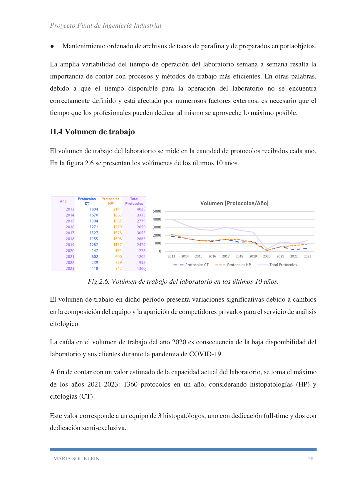

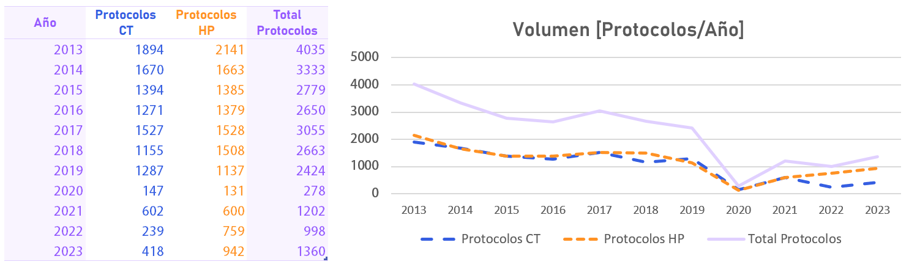

---

## Page 30

Proyecto Final de Ingeniería Industrial 
 
MARÍA SOL KLEIN 
29 
 
Debido a que la proporción de demanda de cada tipo de análisis no es estable y que los tipos de 
análisis no tienen la misma complejidad, se propone crear una unidad agregada. 
Si bien el tiempo requerido para el análisis de cada protocolo es extremadamente variable, la 
complejidad de las histopatologías es consistentemente mayor a la de las citologías. Por esta 
razón, se propone crear una unidad agregada equivalente a una unidad de análisis 
histopatológico o dos unidades de análisis citológico (Ecuación 2.1). 
𝑃𝑟𝑜𝑡𝑜𝑐𝑜𝑙𝑜 𝐴𝑔𝑟𝑒𝑔𝑎𝑑𝑜 =  1 𝑃𝑟𝑜𝑡𝑜𝑐𝑜𝑙𝑜 𝐻𝑃 =  2 𝑃𝑟𝑜𝑡𝑜𝑐𝑜𝑙𝑜𝑠 𝐶𝑇 
Ec.2.1. Equivalencias para la unidad de protocolo agregado. 
Fig. 2.7. Cantidad anual de protocolos agregados procesados en los últimos tres años. 
Considerando que el cargo semi dispone la mitad de las horas que el cargo full-time, se 
consideran un total de 2 histopatólogos para obtener el total de protocolos procesados por 
histopatólogo. 
Finalmente, considerando un año de 46 semanas (por las 6 semanas de receso en las cuales el 
laboratorio permanece cerrado), se obtienen los valores de protocolos procesados por 
histopatólogo por semana de la figura 2.8. 
 
Fig.2.8. Cantidad semanal promedio de protocolos agregados procesados por histopatólogo en los 
últimos tres años. 

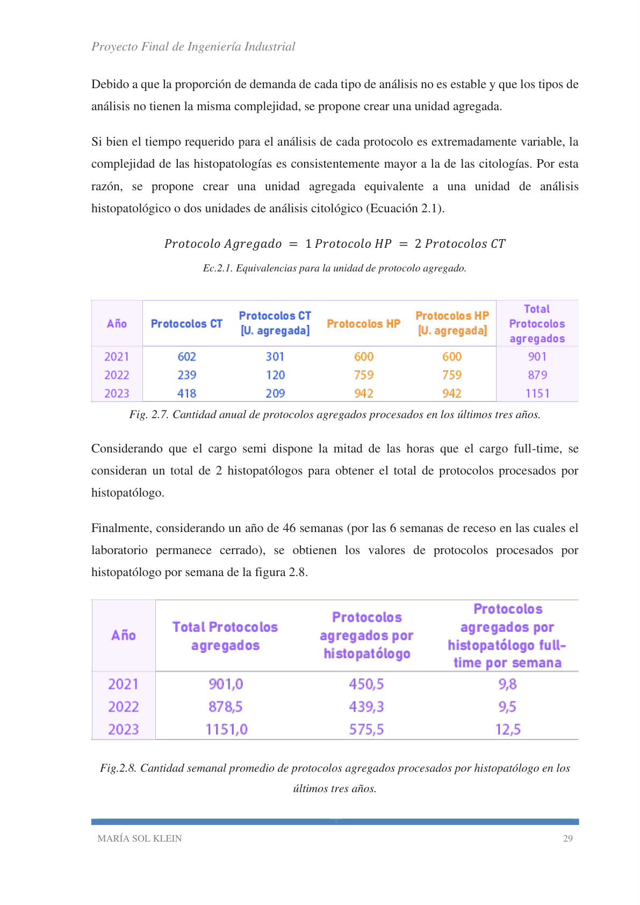

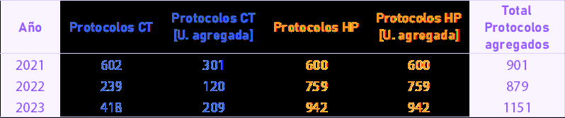

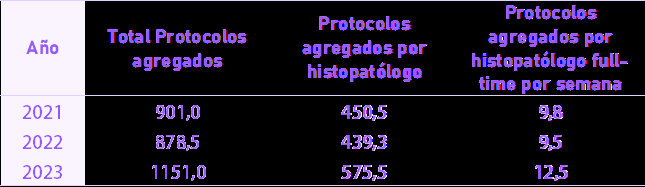

---

## Page 31

Proyecto Final de Ingeniería Industrial 
 
MARÍA SOL KLEIN 
30 
 
De esta manera se obtiene una estimación para la capacidad máxima del laboratorio, 
correspondiente a 12,5 protocolos agregados por histopatólogo full-time por semana y 1151 
protocolos agregados por año. 
II.5 Layout 
El laboratorio está dividido en dos ambientes: el área de oficina y el área de laboratorio. En el 
área de oficina se encuentra la mesa de observación, donde los histopatólogos analizan al 
microscopio las muestras, y la computadora en donde se realiza la transcripción y el envío de 
informes. En el área de laboratorio se encuentran los equipos para el procesamiento de muestras 
y la computadora para registrar el ingreso de una muestra. 
 
Fig.2.9. Área de oficina. 
 
Fig.2.10. Área de laboratorio. 
 
Fig.2.11. Mesa de observación. 
Fig.2.12. Entrada al laboratorio.
 

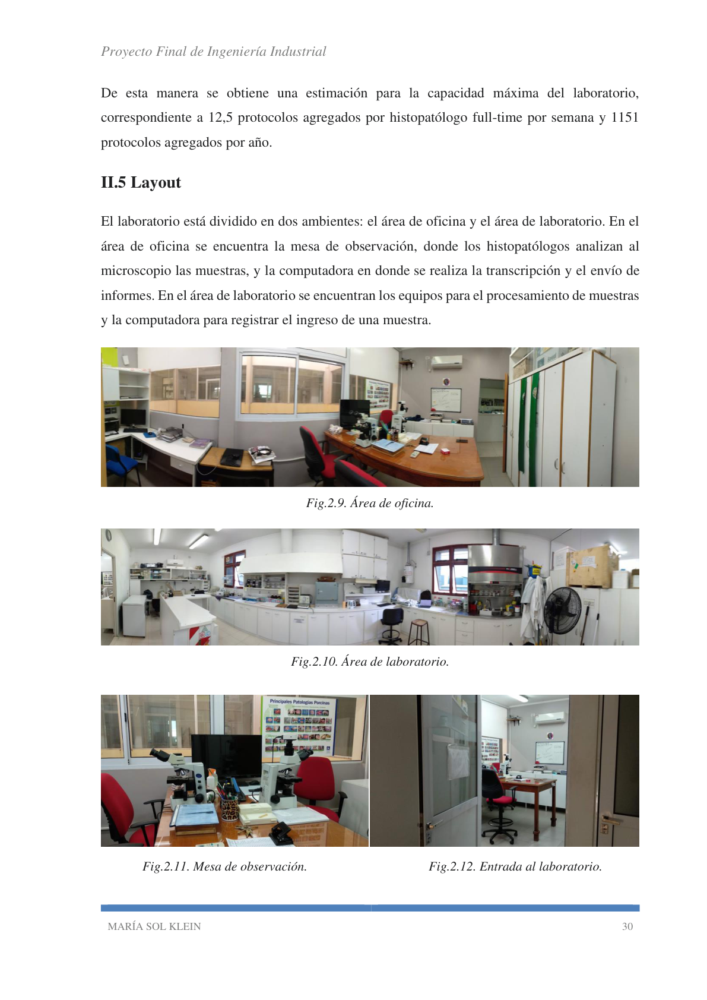

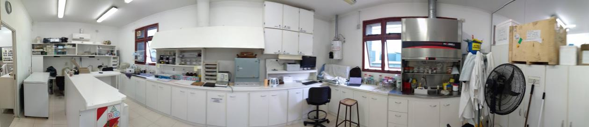

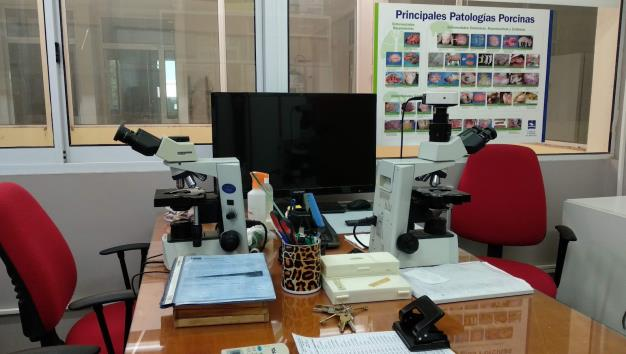

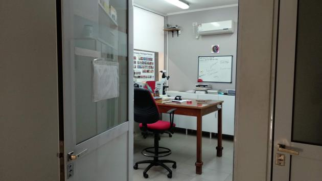

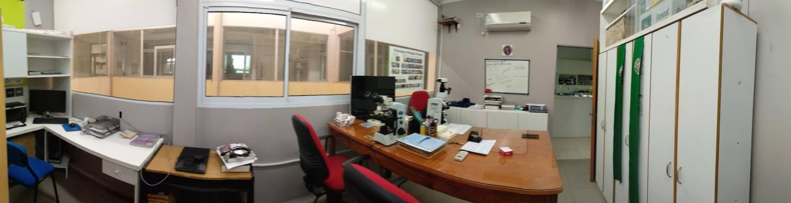

---

## Page 32

Proyecto Final de Ingeniería Industrial 
 
MARÍA SOL KLEIN 
31 
 
La mesa de observación se encuentra al lado de la puerta de ingreso (Figura 2.12), lo que 
provoca interrupciones constantes. Cuando un veterinario trae muestras personalmente, al ver 
a los patólogos en el lugar, busca comentarles las particularidades del caso. Esto, además de 
interrumpir, en algunos casos genera protocolos de remisión de muestra incompletos, ya que se 
considera que comentar verbalmente el caso elimina la necesidad de especificar correctamente 
las particularidades del mismo en el protocolo. 
La mesa de recepción de muestras (figura 2.15) se encuentra lejos de la puerta de ingreso al 
laboratorio y lejos de la computadora donde se realiza el registro, y los frascos se trasladan 
manualmente. Esto ocasiona que quien registra las muestras tenga que desplazarse repetidas 
veces a través del laboratorio cargando frascos y protocolos. 
Fig.2.13. y Fig. 2.14. Área de laboratorio. 
 
Fig.2.15. Mesa de recepción de muestras. 
En la figura 2.17 se presenta un diagrama de la distribución de los espacios en el laboratorio. 
Los flujos de material en el laboratorio se presentan en la figura 2.18. 
 
 

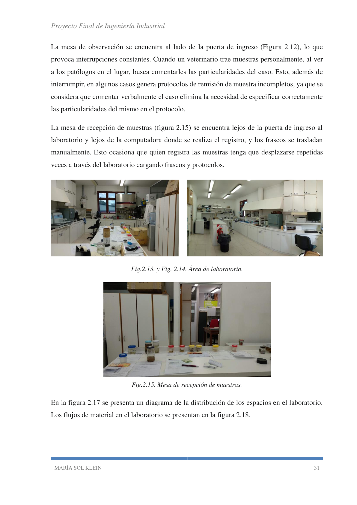


---

## Page 33

Proyecto Final de Ingeniería Industrial 
 
MARÍA SOL KLEIN 
32 
 
Fig.2.17. Layout del laboratorio. 


---

## Page 34

Proyecto Final de Ingeniería Industrial 
 
MARÍA SOL KLEIN 
33 
 
 
Fig.2.18. Flujo de materiales en el laboratorio. 
II.6 Sistemas de información 
La administración de la información en el laboratorio presenta numerosas oportunidades de 
mejora. Actualmente los datos necesarios para la operación se almacenan en diferentes bases 
de datos, digitales y físicas, que no se comunican entre sí y obstaculizan el flujo de trabajo. 
II.6.1 Software 
Las muestras que ingresan al laboratorio se registran en una base de datos local programada en 
lenguaje Clarion, en su versión 2.0. Este programa está en funcionamiento en el laboratorio 
desde 2010, fue desarrollado ad-hoc por el técnico histotecnólogo y se debe acceder al mismo 
desde una máquina virtual que utiliza Windows XP, instalada en la computadora destinada para 
el ingreso de muestras. 


---

## Page 35

Proyecto Final de Ingeniería Industrial 
 
MARÍA SOL KLEIN 
34 
 
El programa posee varias funcionalidades pero sólo es utilizado por los usuarios para seguir la 
numeración de los protocolos y saber cuál es el número que hay que asignarle a una nueva 
muestra. Se ingresan datos sobre el protocolo y su procesamiento, pero sólo con el fin de 
mantener actualizado el registro, toda la información necesaria durante el procesamiento se 
consulta en los registros en papel. 
El programa no permite exportar datos en un formato legible ni realizar consultas, los menúes 
desplegables para cargar la información de las muestras están incompletos, algunos números 
presentados por el sistema están calculados de forma incorrecta. En resumen, la utilización del 
programa es muy poco amigable con el usuario y carece de funciones esenciales. 
 
Fig.2.19. Pantallas del programa informático actual.  
II.6.2 Planilla de ingreso de muestras al laboratorio 
En esta planilla se copia el número de protocolo indicado por el sistema informático, se asigna 
un número de órden de trabajo y se incluye el nombre del remitente, el monto de la orden y el 
pago, en caso de que el veterinario haya enviado el dinero junto a la muestra. 


---

## Page 36

Proyecto Final de Ingeniería Industrial 
 
MARÍA SOL KLEIN 
35 
 
 
Fig.2.20. Planilla de registro de recepción de muestras. 
II.6.2 Planilla de procesamiento de muestras 
En esta planilla se realiza el seguimiento de las etapas de inmersión de cassettes en xilol, 
alcoholes y parafina dentro del proceso total de preparación de muestras. Las muestras deben 
pasar un tiempo determinado en cada solvente, por lo cual es necesario registrar la fecha y hora 
en la cual se realizó el pasaje de un solvente al otro. 
Los pasajes se realizan en lotes no definidos, por lo cual los datos se registran protocolo por 
protocolo. 
Fig.2.21. Planilla de procesamiento de muestras y su ubicación habitual. 
II.6.3 Carpeta de protocolos 
Los protocolos de muestras remitidos por los veterinarios se almacenan en una carpeta de folios. 
Durante la etapa de observación en el microscopio, los histopatólogos extraen el protocolo que 


---

## Page 37

Proyecto Final de Ingeniería Industrial 
 
MARÍA SOL KLEIN 
36 
 
están observando y anotan en el reverso o en una hoja adicional las observaciones que 
posteriormente conformarán el informe de resultados. 
 
Fig.2.22. Carpeta de protocolos de remisión de muestra. 
 
II.6.4 Informes de resultados 
Durante la observación de cada muestra, los histopatólogos toman notas de lo observado sobre 
el protocolo asociado (en la misma hoja) o en hojas adicionales que se adjuntan al mismo. 
Cuando terminan de escribir a mano el informe, lo depositan en una bandeja organizadora de 
papeles con tres niveles: “Para pasar”, “Pasados” y “Para hacer OT”. 
 
Fig.2.23. Protocolo remitido por el veterinario y papel con notas para el informe adjunto. 


---

## Page 38

Proyecto Final de Ingeniería Industrial 
 
MARÍA SOL KLEIN 
37 
 
 
Fig.2.24. Bandeja donde se colocan los informes para pasar, pasados y listos para hacer 
órden de trabajo. 
 
El informe permanece en la sección “Para pasar” de la bandeja hasta que algún miembro del 
equipo lo digitaliza, siguiendo el procedimiento descrito en la sección II.9.6 “Digitalización del 
informe de resultados”. Al finalizar, el informe se transfiere a la sección “Pasados” o “Para 
hacer OT”, según la particularidad del caso. Una vez que el informe y la orden de trabajo son 
enviados al cliente, los dos se archivan nuevamente en la carpeta de protocolos. 
II.7 Orden y limpieza 
Algunos sectores del laboratorio presentan un desorden moderado que dificulta y ralentiza 
ciertos procedimientos. 
Las mesas, mesadas y otras superficies están constantemente ocupadas por cajas, papeles, 
frascos y objetos diversos, lo que dificulta que el personal no docente pueda limpiar de forma 
adecuada. Por esta razón, sólo el piso se limpia con regularidad. El resto del laboratorio es 
limpiado por los patólogos y el técnico cuando consideran que es necesario. 
Hay una gran cantidad de espacio de almacenamiento disponible, pero la gran mayoría se 
encuentra ocupado por elementos que no son útiles para el laboratorio (frascos vacíos, frascos 
de reactivos caducados, cajas, papeles, etc). 
 II.8 Equipamiento y conectividad 
El laboratorio dispone de cuatro computadoras: 
● Una computadora de escritorio utilizada para el ingreso de muestras en la base de datos 
mencionada en la sección II.6.1 “Software”. 


---

## Page 39

Proyecto Final de Ingeniería Industrial 
 
MARÍA SOL KLEIN 
38 
 
● Una computadora de escritorio utilizada para la transcripción y envío por email de 
informes. 
● Una computadora de escritorio conectada a los microscopios, utilizada esporádicamente 
para tomar fotos de las imágenes que se observan. Los patólogos evitan prender esta 
computadora porque hace un ruido molesto. 
● Una computadora portátil para uso general (dar clases, consultar la web, etc). 
En el la tabla 2.1 se detallan las especificaciones de cada equipo. 
Tabla 2.1. Especificaciones de las computadoras del laboratorio. 
 
PC para 
transcripción y 
envío de 
informes 
Notebook ASUS 
PC conectada a 
microscopios 
PC para registrar 
la recepción de 
muestras 
Procesador 
Intel(R) Core(TM) 
i3-7100 CPU @ 
3.90GHz 
Intel(R) Core(TM) 
i3-4005U CPU @ 
1.70GHz 
AMD Athlon(tm) 
64 X2 Dual Core 
Processor 5600+   
2.79 GHz 
Intel(R) Core(TM) 
i3-9100 CPU @ 
3.60GHz 
RAM 
4,00 GB (3,89 GB 
usable) 
8,00 GB 
2,00 GB (1,87 GB 
usable) 
8,00 GB (7,88 GB 
utilizable) 
Acceso y tipo de 
disco 
HDD 
930,9 GB 
HDD 
931,51 GB 
HDD 
232,88 GB 
SSD 
 
Sistema 
operativo 
Sistema 
operativo de 64 
bits, procesador 
basado en x64. 
Windows 10 Pro 
Versión 20H2 
Sistema 
operativo de 64 
bits, procesador 
basado en x64 
Windows 10 Pro 
Versión 22H2 (No 
activo) 
Sistema 
operativo de 64 
bits, procesador 
basado en x64 
Windows 10 Pro 
Versión 21H2 (No 
activo) 
Sistema 
operativo de 64 
bits, procesador 
x64 
Windows 11 Pro 
Versión 21H2 (No 
activo) 
Prueba de 
pérdida de 
paquetes 
0% (0/272) de 
paquetes 
perdidos con 
conexión WiFi. 
25% (165/644)  
de paquetes 
perdidos con 
conexión WiFi. 
0% (1/904) de 
paquetes 
perdidos en 
conexión por 
cable ethernet. 
Esta 
computadora no 
permite la 
conexión WiFi. 
1% (14/1085) de 
paquetes 
perdidos con 
conexión WiFi. 
 

---

## Page 40

Proyecto Final de Ingeniería Industrial 
 
MARÍA SOL KLEIN 
39 
 
II.9 Procesos y flujo de trabajo - Modelo “AS IS” 
Exceptuando los procedimientos propios de las técnicas histopatológicas para el procesamiento 
de muestras, el laboratorio no cuenta con procesos documentados. La estructura del resto del 
proceso  
En la figura 2.25 se presenta el proceso de gestión de muestras para cito e histopatología según 
la operación actual del laboratorio, elaborado a partir del relevamiento de información. A 
continuación se detalla cada etapa del proceso. 
 
Fig.2.25. Proceso de gestión de muestras para cito e histopatología. 
II.9.1: Inicio del proceso 
El proceso inicia con el ingreso de una muestra al laboratorio. Los veterinarios envían las 
muestras por medios diferentes: algunos la traen personalmente a la facultad, dejándola en el 
laboratorio o en la Oficina Única de Atención al Público (OUAP), en caso de que el mismo se 
encuentre cerrado. Otros optan por enviar la muestra con cadetes o servicios de correo. 
En algunos casos, junto a las muestras los veterinarios envían dinero en efectivo, 
correspondiente al pago del servicio solicitado. En ocasiones la cantidad de dinero recibida no 
es correcta. 
Actualmente, la situación ideal para el laboratorio es que los veterinarios envíen de forma 
conjunta la muestra, el respectivo protocolo en papel (siguiendo el formato de protocolo de 
remisión de muestras estándar del laboratorio) y la orden de trabajo completa y firmada. Los 
veterinarios que cumplen estas condiciones son minoría. 
 


---

## Page 41

Proyecto Final de Ingeniería Industrial 
 
MARÍA SOL KLEIN 
40 
 
II.9.2: Recepción de muestra 
La recepción de una muestra implica ingresar sus datos en el programa informático y la planilla 
de ingreso de muestras, e identificar el portaobjetos/frasco y el Protocolo de Remisión de 
Muestra con el número de protocolo correlativo asignado. 
Los portaobjetos para citología se rotulan utilizando un torno para grabar cristales. Los frascos, 
con una etiqueta de cinta de papel escrita a mano. 
En el caso de los frascos con muestras para histopatología es importante colocar el número de 
protocolo no sólo en la tapa del frasco sino también en el cuerpo del mismo, para así evitar la 
pérdida de trazabilidad si se destapan varios frascos a la vez en el momento del fraccionado de 
piezas o “encasetado”. 
En el Protocolo de Remisión de Muestra se escribe el número de protocolo asignado, la fecha 
de recepción y el número de OT correspondiente. 
En las figuras 2.26, 2.27 y 2.28 se pueden observar imágenes de muestras remitidas y la forma 
actual de rotularlas. 
 
 
 
 
 
 
Fig.2.26, 2.27 y 2.28. Muestras rotuladas con su número de protocolo. 
II.9.3: Procesamiento de muestras 
Este subproceso incluye todas las etapas necesarias para que la muestra que ingresa al 
laboratorio pueda ser observada microscópicamente para su análisis. Esto requiere la obtención 
de láminas delgadas y coloreadas con procesos de tinción histológica. 
El procesamiento de las muestras para citología es simple: únicamente incluye una etapa de 


---

## Page 42

Proyecto Final de Ingeniería Industrial 
 
MARÍA SOL KLEIN 
41 
 
tinción citológica. Las muestras para histopatología, en cambio, requieren varias etapas para su 
análisis microscópico. En la figura 2.29 se representa el proceso gráficamente. 
 
Fig.2.29. Diagrama de flujo para el procesamiento de una muestra. 
Las muestras son procesadas comúnmente en lotes, aunque no existe un tamaño de lote 
definido. Debido a su simplicidad, el procesamiento de muestras citológicas se efectúa 
diariamente. Para las muestras de histopatología se espera que se acumule una cantidad 
significativa de muestras sobre la mesa de recepción antes de avanzar hacia la primera fase del 
proceso. 
Tabla 2.2. Descripción de las etapas del procesamiento de una muestra para histopatología. 
Etapa 
Descripción 
Imagen 
Fraccionado de 
piezas y colocación 
en cassettes 
En el laboratorio, este proceso se conoce 
como “achicado”. Las masas de tejido o 
secciones de órganos que el veterinario 
extrae del animal se fraccionan y se 
colocan en cassettes. Para las piezas 
extremadamente pequeñas, esta etapa 
tiene diferencias (1). 
 
Identificación del 
cassette 
Sobre la pestaña del cassette se escribe 
con lápiz el número de protocolo de la 
muestra que contiene. En el caso de que 
el protocolo requiera más de un cassette, 
también se adiciona un número de 
cassette. 
 
Fijación, 
deshidratación y 
aclarado 
Esta etapa involucra el pasaje de los 
cassettes por diferentes reactivos, una 
determinada cantidad de tiempo en cada 
uno. 
 
 


---

## Page 43

Proyecto Final de Ingeniería Industrial 
 
MARÍA SOL KLEIN 
42 
 
Tabla 2.2.(cont.) Descripción de las etapas del procesamiento de una muestra para histopatología. 
Etapa 
Descripción 
Imagen 
Inclusión en parafina 
líquida 
Los cassettes se colocan en un recipiente 
con parafina líquida por un mínimo de 2 
horas. Para que la parafina se mantenga 
líquida, los recipientes se colocan en la 
estufa a 60°. 
Entacado 
En esta etapa el cassette se convierte en 
un “taco” de parafina. 1) Se abre el 
cassette, 2) se extraen las piezas del 
cassette y se colocan dentro de moldes de 
metal, 3) sobre el molde con piezas se 
coloca la tapa del cassette, la cual 
contiene la identificación de la muestra, 
4) se vierte parafina líquida, rellenando el 
molde y adhiriendo la tapa del cassette al 
contenido, 5) se deja enfriar la parafina. 
 
Corte histológico con 
micrótomo 
El técnico histotecnólogo corta el taco 
utilizando un micrótomo, obteniendo 
láminas finas (4μm) que coloca en agua 
tibia para que “se planchen”. 
Montaje en 
portaobjetos y 
rotulado 
Se selecciona la mejor lámina del taco y 
se coloca sobre un portaobjetos, que se 
rotula con el número de protocolo 
correspondiente. Para protocolos que 
poseen más de un taco, pueden montarse 
dos láminas sobre el mismo portaobjetos. 
Posteriormente se lleva los portaobjetos a 
la estufa, para que la lámina se adhiera al 
vidrio. 
 
Coloración 
Para colorear, se colocan los portaobjetos 
en una canasta que permite colorear 20 
vidrios en simultáneo. Esta canasta pasa 
por diferentes reactivos en la batería de 
coloración. 
 
Cuando el material enviado en una muestra es demasiado pequeño, no pueden utilizarse 
cassettes en su procesamiento ya que, por su tamaño, la muestra podría escaparse por una de 
las rendijas. Por esta razón, en estos casos, en lugar de cassettes se utilizan pequeños recipientes 


---

## Page 44

Proyecto Final de Ingeniería Industrial 
 
MARÍA SOL KLEIN 
43 
 
de vidrio rotulados en donde se realiza la fijación, deshidratación y aclarado de la muestra 
ingresando y extrayendo los reactivos (alcohol, xilol) del recipiente con una jeringa.  En la 
figura 2.29 se observan los viales con muestras pequeñas frente a las baterías donde se realiza 
el procesamiento en batch. Luego, cuando se realiza el entacado se utiliza una tapa de cassette 
con el número de protocolo y se retoma el procesamiento habitual. 
Estas excepciones generan una gran ineficiencia en el proceso, ya que el pasaje de un reactivo 
al otro debe hacerse individualmente para cada recipiente, teniendo especial cuidado para no 
retirar el tejido muestral junto con los reactivos. Una mejora para estos casos se aborda en el 
capítulo II.7.3. 
Fig.2.29. viales para muestras pequeñas en la estación de fijación, deshidratación y aclarado. 
Una vez que las muestras han sido procesadas, ingresan al backlog de muestras para 
observación microscópica. Se ubican al final de la cola en una caja histológica para portaobjetos 
(para el caso de muestras de histopatología) o en una bandeja (para citologías). 
Fig.2.30. Bandejas y cajas de portaobjetos. 
II.9.4: Observación al microscopio y diagnóstico 
En esa fase se observan con microscopio las muestras asociadas a cada protocolo, teniendo en 
cuenta la información del caso clínico proporcionada en el Protocolo de Remisión de Muestra. 


---

## Page 45

Proyecto Final de Ingeniería Industrial 
 
MARÍA SOL KLEIN 
44 
 
El histopatólogo observa y evalúa la morfología celular y tisular, apuntando en papel las 
observaciones para el diagnóstico. 
En algunos casos clínicos las patologías se identifican rápidamente. Otros requieren consultas 
a la bibliografía, reprocesamiento de la muestra utilizando otra coloración que permita ver 
diferentes grupos de células o algunos microorganismos en los tejidos, discusión en equipo, 
llamadas al veterinario para que provea más contexto del caso clínico, etc. Por este motivo, la 
duración de esta etapa es la que mayor variabilidad presenta.  
Fig.2.31. Puesto de trabajo para la etapa de observación y análisis. 
II.9.5: Redacción del informe de resultados 
Una vez completada la observación microscópica y realizado el diagnóstico, los histopatólogos 
proceden a redactar el informe de resultados. En este informe se detallan las observaciones 
realizadas, los hallazgos microscópicos y el diagnóstico final. 
La redacción del informe se realiza comúnmente a mano, en el reverso del protocolo de 
remisión de muestra (figura 2.32). Al finalizar, el mismo se agrega a la bandeja de “Informes 
para pasar”. 
II.9.6: Digitalización del informe de resultados 
Se digitaliza el informe escrito a mano para su posterior envío. En el documento digitalizado se 
incluyen los siguientes elementos: el caso clínico, identificado a través del nombre del 
veterinario remitente, el nombre del propietario del animal y la identificación del animal; la 
fecha actual; el informe de resultados propiamente dicho; la firma del histopatólogo; y el 
nombre y logotipo del establecimiento. 


---

## Page 46

Proyecto Final de Ingeniería Industrial 
 
MARÍA SOL KLEIN 
45 
 
Fig.2.32. Informes de resultados manuscritos en el reverso del protocolo de remisión de muestra. 
Para mantener el formato, se utiliza como plantilla un informe anterior. Se busca algún informe 
completo en los archivos locales, se crea una copia del mismo y se ingresan manualmente los 
datos nuevos, los cuales son obtenidos copiando lo que se lee en el protocolo correspondiente. 
Al finalizar se guarda el archivo en formato PDF. 
Si bien el proceso de digitalización de informes se lleva a cabo meticulosamente, su naturaleza 
artesanal y la necesidad de ingreso manual de datos generan un entorno propicio para la 
ocurrencia de errores humanos. Este método, que implica la copia manual de información desde 
el protocolo y el informe redactado a mano, presenta una susceptibilidad inherente a 
imprecisiones y omisiones. A su vez, si el informe es pasado a formato digital por una persona 
diferente a quien lo redactó, ocurren situaciones donde no se comprende la letra manuscrita y 
es necesario consultar o realizar revisiones del informe digitalizado. 
Cuando la digitalización de los informes es realizada por un estudiante adscripto o becario, uno 
de los histopatólogos chequea el informe digitalizado antes de que el mismo sea enviado, lo 
convierte al formato PDF y lo envía. 
La necesidad de borrar y reemplazar datos en cada digitalización requiere un nivel extra de 
concentración que no suma ningún tipo de valor, y favorece la ocurrencia de errores. 


---

## Page 47

Proyecto Final de Ingeniería Industrial 
 
MARÍA SOL KLEIN 
46 
 
 
Fig.2.33. Informe de resultados digitalizado. 
II.9.7: Elaboración de la Orden de Trabajo 
Como último paso se elabora la Orden de Trabajo (OT). En esta orden se detallan los servicios 
prestados y el costo asociado. La OT también se realiza manualmente, copiando uno por uno 
los 
datos 
del 
veterinario, 
los 
estudios 
solicitados, 
el 
monto 
a 
pagar, 
etc. 
Al finalizar se guarda el archivo en formato PDF. 
II.9.8: Envío del informe de resultados y Órden de Trabajo 
Con el informe de resultados y la Orden de Trabajo digitalizados, se procede a su envío al 
médico veterinario solicitante. Ambos se envían en formato pdf por email, de forma manual. 
II.10 Conclusión 
El análisis detallado en este capítulo revela una serie de áreas clave que requieren atención para 
mejorar la eficiencia y funcionalidad del laboratorio. 


---

## Page 48

Proyecto Final de Ingeniería Industrial 
 
MARÍA SOL KLEIN 
47 
 
Las encuestas indican un alto nivel de satisfacción con los servicios técnicos del laboratorio. 
Tanto las personas que trabajan en el laboratorio como sus clientes consideran que el servicio 
brindado es de calidad, con resultados sumamente confiables. No obstante, se detectaron 
numerosas oportunidades de mejora. 
La diversidad de roles y las cargas horarias variables del equipo destacan la necesidad de 
optimizar los procesos para aprovechar al máximo el tiempo dedicado al laboratorio por cada 
colaborador. 
La disposición física del laboratorio actual afecta negativamente la operatividad del laboratorio, 
ya que favorece las interrupciones y provoca desplazamientos ineficientes. 
En el ámbito de los sistemas de información, se evidencia la dependencia de sistemas obsoletos 
e información en papel, lo que limita la accesibilidad y eficacia en la gestión de datos y registros. 
Este hallazgo subraya la urgencia de modernizar y simplificar los sistemas de registro y 
almacenamiento de información para facilitar el flujo de trabajo. 
En resumen, el análisis que se realiza en este capítulo permite comprender de manera integral 
la situación actual del laboratorio. Las áreas de oportunidad y mejora identificadas son el 
puntapié principal para optimizar la eficiencia operativa, mejorar la calidad del servicio y 
garantizar un ambiente de trabajo más propicio. Este diagnóstico "AS IS" sienta las bases para 
el siguiente capítulo, donde se buscan soluciones y estrategias para abordar los desafíos y llevar 
el laboratorio hacia un estado más eficiente y modernizado, en línea con las demandas actuales 
y futuras. 
 

---

## Page 49

Proyecto Final de Ingeniería Industrial 
 
MARÍA SOL KLEIN 
48 
 
Capítulo III 
Propuestas de mejora 
 

---

## Page 50

Proyecto Final de Ingeniería Industrial 
 
MARÍA SOL KLEIN 
49 
 
Capítulo III: Propuestas de mejora 
III.1: Introducción 
En este capítulo se detallan las propuestas de mejora desarrolladas a partir de la evaluación del 
estado de situación actual. Estas soluciones se enfocan en reducir las tareas que no aportan valor 
al producto final, mejorar la calidad del servicio, y fomentar un ambiente laboral más eficiente 
y agradable. 
Luego de describir las propuestas, se describe el nuevo flujo de trabajo resultante de su 
aplicación. 
III.2: 5S 
Como se detalló en la sección II.6, el laboratorio presenta grandes oportunidades de mejora en 
lo que concierne a orden y limpieza. Para abordar este problema de manera sistemática y 
efectiva se propone la implementación de la metodología 5S, uno de los principios de la 
filosofía kaizen, también conocida como mejora continua. 
La metodología 5S, originaria de Japón y ampliamente utilizada en entornos industriales y de 
servicios, se enfoca en cinco principios fundamentales: Seiri (clasificación), Seiton (orden), 
Seiso (limpieza), Seiketsu (estandarización) y Shitsuke (disciplina) (Imai, 2012). Aplicar estos 
principios en el laboratorio de anatomía patológica veterinaria permite reorganizar el espacio 
de trabajo, eliminar elementos innecesarios, establecer estándares de limpieza y promover una 
cultura de orden y disciplina entre el personal. 
III.2.1 Seiri (clasificación) 
El primer paso, Seiri, consiste en separar los elementos necesarios de los innecesarios en el 
laboratorio y descartar los últimos. Se lleva a cabo un proceso de identificación y eliminación 
de objetos no utilizados o que no aporten valor al proceso de trabajo. 
Este paso es crucial en la aplicación de la metodología en el laboratorio, debido a que el 
volumen que ocupan los objetos y documentos innecesarios en los espacios de guardado es 
significativo, con muebles y estantes dedicados al almacenamiento de los mismos. 
 En la tabla 3.1 se presentan las tareas a realizar en esta etapa. 

---

## Page 51

Proyecto Final de Ingeniería Industrial 
 
MARÍA SOL KLEIN 
50 
 
Tabla 3.1: Tareas a realizar durante la etapa Seiri. 
Tarea 
Situación actual 
Expectativa 
Desechar 
frascos 
vacíos. 
 
+ Mesa libre. Mayor 
comodidad. 
Desechar 
frascos 
de 
muestras que 
ya 
fueron 
procesadas y 
analizadas. 
 
+ Sólo se conservan las 
muestras que aún no han sido 
analizadas (en caso de que sea 
necesario un procesamiento 
adicional). 
Desechar 
reactivos 
caducados y 
artefactos 
rotos. 
 
+ Espacio de guardado libre. 
 
+ Mayor seguridad en el 
laboratorio, ya que muchos de 
estos frascos contienen 
reactivos inflamables o 
peligrosos para la salud. 
Desechar 
documentos 
obsoletos 
 
 
+ Espacio de guardado libre. 
Reubicar 
la 
bibliografía y 
los 
documentos 
que son de 
interés para la 
cátedra 
de 
patología 
pero no para 
el laboratorio. 
 
+ Espacios de guardado libre. 
III.2.2 Seiton (orden) 
Una vez realizada la clasificación y la eliminación de objetos innecesarios, se procede con el 
segundo principio: Seiton. Se organizan todos los elementos necesarios en el laboratorio, 


---

## Page 52

Proyecto Final de Ingeniería Industrial 
 
MARÍA SOL KLEIN 
51 
 
asignando ubicaciones específicas para cada insumo, herramienta o equipo, y se las rotula para 
que cualquiera pueda saber dónde guardar cada cosa. 
Para esta etapa, se realizan cambios en cada estación de procesamiento, buscando un 
funcionamiento más eficiente y con menos riesgos. 
Estación de fijación y coloración 
Fig.3.1. Estación de fijación y coloración 
En esta estación se realizan 3 tareas: la tinción de muestras para análisis citológico (figura 3.1), 
la fijación de muestras encasetadas (figura 3.2) y la fijación y coloración de muestras en 
portaobjetos (figura 3.3). 
Los cambios propuestos para esta estación son los siguientes: 
● Dividir la estación en tres subestaciones, una para cada tarea. Las tres subestaciones 
deben estar correctamente delimitadas y cada una debe contar con todos los insumos 
necesarios para no tomar prestado de las otras. 
● Ubicar las baterías de reactivos sobre la mesada, en una posición fija que estará 
correctamente rotulada, para evitar tener que subirlas y bajarlas del estante en cada 
pasaje. Esto evita riesgos innecesarios y pérdidas de tiempo. 


---

## Page 53

Proyecto Final de Ingeniería Industrial 
 
MARÍA SOL KLEIN 
52 
 
● Retirar las botellas grandes de colorantes y reactivos de las mesadas y los estantes. 
Almacenarlas en el mueble bajo mesada, y devolverlas a su lugar luego de rellenar los 
envases pequeños de uso diario y las canastas de tinción histológica.
 
Fig.3.2. Tinción de muestras para análisis 
citológico. 
 
 
Fig.3.3. Fijación de muestras encasetadas en 
baterías de reactivos.
 
Fig.3.4. Fijación y tinción de muestras en portaobjetos. 
III.2.3 Seiso (limpieza) 
La tercera ese, Seiso, implica mantener limpios todos los espacios de trabajo y equipos del 
laboratorio. Se establecen rutinas de limpieza, promoviendo un entorno seguro y saludable para 
el personal. 
Esta etapa depende fuertemente de las dos primeras, ya que actualmente la limpieza del 
laboratorio es dificultosa por la gran cantidad de objetos que ocupan las superficies. 


---

## Page 54

Proyecto Final de Ingeniería Industrial 
 
MARÍA SOL KLEIN 
53 
 
III.2.3 Seiketsu (sistematización) 
El cuarto principio a aplicar es Seiketsu, la sistematización de las buenas prácticas. Se 
desarrollan procedimientos estandarizados para mantener el orden y la limpieza en el 
laboratorio a lo largo del tiempo. Se establecen normas claras que definan responsabilidades, 
frecuencias de limpieza y criterios de mantenimiento, garantizando así la sostenibilidad de los 
cambios implementados. 
III.2.3 Shitsuke (estandarización) 
Finalmente, el principio Shitsuke fomenta una cultura de disciplina y compromiso entre el 
personal para mantener los estándares de organización y limpieza en el laboratorio. Se capacita 
a todo el equipo para promover la participación activa y consolidar los hábitos de orden y 
limpieza en el día a día. 
III.3: Estandarización del proceso de recepción de muestras y protocolo de 
remisión 
Como se menciona en la sección II.8.2 “Recepción de muestra”, actualmente se observan 
inconsistencias y falta de estandarización en los protocolos. Para optimizar este subproceso y 
garantizar la información correcta a la hora de analizar los resultados del caso, se propone 
implementar un nuevo protocolo de remisión estandarizado y establecer procedimientos claros 
para su recepción. 
El proceso de recepción de muestras se inicia con el ingreso de las mismas al laboratorio, ya 
sea entregadas personalmente por los veterinarios, o mediante cadetes o servicios de correo. La 
mayoría de los clientes externos no utilizan el protocolo modelo proporcionado por el 
laboratorio, lo que dificulta la adecuada documentación y registro de las muestras recibidas.  La 
falta de uniformidad en la presentación de la documentación asociada, así como la inclusión 
ocasional de pagos en efectivo sin una correspondencia exacta, generan dificultades extra para 
quien se encarga de dar ingreso a la muestra en el sistema de información del laboratorio. 
Se propone que todas las muestras ingresen acompañadas por un protocolo de remisión de 
muestra completo, según los estándares establecidos por el laboratorio. Este protocolo debe 
contener información detallada sobre el animal del cual proviene la muestra, el tipo de tejido 
enviado, el diagnóstico presuntivo, entre otros datos relevantes. Además, se requiere que los 

---

## Page 55

Proyecto Final de Ingeniería Industrial 
 
MARÍA SOL KLEIN 
54 
 
veterinarios incluyan la orden de trabajo completa y firmada junto con la muestra y el protocolo. 
Para lograrlo, es necesario promover activamente el uso del protocolo estandarizado, brindando 
orientación y capacitación sobre su importancia y correcto llenado. 
Internamente, para garantizar la trazabilidad y correcta asignación de los análisis solicitados, 
debe establecerse como criterio que a cada análisis realizado para un mismo animal se le asigne 
un número particular de protocolo. Esto permitirá una identificación clara y precisa de cada 
muestra y su correspondiente análisis, facilitando así la interpretación de los resultados y la 
comunicación con los clientes. 
III.4: Implementación del encassettado de especímenes muy pequeños 
Como se menciona en la sección II.8.3, el procesamiento de piezas muy pequeñas 
(generalmente provenientes de biopsias) presenta dificultades y genera ineficiencias en el 
proceso, ya que no es posible utilizar cassettes regulares (la muestra, al ser tan pequeña, puede 
salirse por una de las rendijas durante el procesamiento). En lugar de cassettes se utilizan viales, 
que no permiten el procesamiento en batch para la etapa de fijación, deshidratación y aclarado. 
Una solución a este problema utilizada en muchos laboratorios es utilizar papel para lentes para 
envolver la muestra, y colocar el bulto dentro de un cassette regular como se muestra en las 
figuras 3.5 y 3.6. El papel para lentes se utiliza para limpiar las lentes de los microscopios, por 
lo cual ya es un insumo presente en los laboratorios. El envoltorio permite que las muestras 
pequeñas se procesen en batch junto con las demás. 
 
Fig.3.5: envoltorio utilizando papel para lentes. 
Fuente: video de youtube “Grossing Biopsies | 
How to fold your biopsy paper” de Canadian 
Path Assistant [Link]. 
 
Fig.3.6: Colocación de envoltorio en cassette. 
Fuente: video de youtube Kidney biopsy - 
grossing de Ben Farmer [Link] 
 


---

## Page 56

Proyecto Final de Ingeniería Industrial 
 
MARÍA SOL KLEIN 
55 
 
III.5: Rediseño del layout 
Como se describe en la sección II.4, el layout actual dificulta la limpieza y el flujo de trabajo 
en el laboratorio. Favorece las interrupciones a los histopatólogos y genera traslados 
redundantes. 
Las limitaciones para el layout es la ubicación de las campanas extractoras y bachas de lavado. 
Se proponen los siguientes cambios: 
● Ubicar la estación de recepción y etiquetado de muestras en el área de oficina, próxima 
a la puerta de entrada al laboratorio. 
● Posicionar la estación de observación y diagnóstico en el área de laboratorio. 
● Reubicar la computadora para el ingreso de muestras dentro de la estación para 
recepción y etiquetado. 
● Reubicar las dos computadoras para digitalización y envío de documentos en la mesa 
de observación y diagnóstico. 
● Eliminar muebles de guardado ociosos a fin de tener mayor espacio para moverse de 
forma segura en las instalaciones. 
● Utilizar carros organizadores con ruedas como el de la figura 3.7 para el movimiento de 
frascos de muestras. 
Fig.3.7. Carro propuesto para el traslado de muestras dentro del laboratorio. 
El layout resultante aplicando todos los cambios se presenta en la figura 3.8. 


---

## Page 57

Proyecto Final de Ingeniería Industrial 
 
MARÍA SOL KLEIN 
56 
 
 
Fig.3.8. Nueva distribución propuesta. 
En las figuras 3.9 y 3.10 se presentan la distribución actual y la nueva respectivamente, ambas 
con sus movimientos de material. 
 
 
 
 
 


---

## Page 58

Proyecto Final de Ingeniería Industrial 
 
MARÍA SOL KLEIN 
57 
 
Fig.3.9. Layout actual y flujos de material entre las estaciones. 
 
 
 
 


---

## Page 59

Proyecto Final de Ingeniería Industrial 
 
MARÍA SOL KLEIN 
58 
 
Fig.3.10. Layout propuesto y flujos de material entre las estaciones. 
 
 


---

## Page 60

Proyecto Final de Ingeniería Industrial 
 
MARÍA SOL KLEIN 
59 
 
III.6: Rediseño del sistema de información 
El sistema de información actual del laboratorio, detallado en la sección II.5, comprende 
carpetas físicas de documentación y una base de datos digital no normalizada que opera de 
forma independiente y presenta ciertas limitaciones. El mismo dato se registra numerosas veces 
durante el procesamiento y muchos registros se completan manualmente con lápiz y papel, lo 
que dificulta enormemente la obtención de datos históricos o de volumen de trabajo. 
Este enfoque produce que el recurso limitante del laboratorio, los histopatólogos, ocupe mucho 
tiempo en actividades que pueden automatizarse fácilmente con una base de datos normalizada, 
en la cual los datos de la muestra y el cliente se registren una única vez y puedan consultarse 
de forma sencilla. Puede generarse un importante ahorro de tiempo utilizando una solución 
tecnológica que, a partir de esa base, genere un pre-informe con los datos del caso y del cliente 
que permita al histopatólogo redactar el informe de resultados y diagnóstico propiamente dicho 
y enviarlo al email del cliente haciendo un solo click al finalizar. 
En el capítulo IV se estructura la información que el laboratorio utiliza y genera, detallando el 
esquema de una base de datos normalizada y sus casos de uso. Este capítulo servirá de input 
para el desarrollo de la solución tecnológica a aplicar. 
III.7 Equipamiento y conectividad 
En primera instancia se considera necesaria una actualización del hardware, ya que la capacidad 
de procesamiento del equipamiento actual es muy baja y genera demoras. Para mejorar la 
velocidad de las computadoras y la experiencia del personal al utilizarlas, se proponen las 
siguientes mejoras en el equipamiento: 
● Reemplazar la PC conectada a microscopios. 
● Reemplazar los discos rígidos por discos de estado sólido de 480GB. 
● Expandir la memoria de las 4 computadoras a 8,00 GB. 
● Colocar un punto de acceso doble banda  
También es necesario considerar una actualización del sistema operativo. 
En la tabla 3.2 se presentan las modificaciones a realizar en cada equipo. 
 

---

## Page 61

Proyecto Final de Ingeniería Industrial 
 
MARÍA SOL KLEIN 
60 
 
Tabla 3.2: Actualizaciones de hardware a realizar. 
 
III.8 Nuevo flujo de trabajo propuesto - Modelo “To Be”  
El rediseño del sistema de información presentado en la sección III.6 permite un nuevo flujo de 
trabajo que elimina varias etapas del proceso global y permite optimizar el tiempo de los 
histopatólogos, el recurso limitante del laboratorio. Este nuevo modelo, basado en una base de 
datos normalizada y una solución tecnológica integrada, tiene como objetivo reducir la 
redundancia de la información, agilizar la generación de informes y órdenes de trabajo y 
facilitar las tareas en el laboratorio. A continuación se describen las etapas del nuevo flujo de 
trabajo propuesto. 
III.8.1: Inicio del proceso 
El proceso inicia cuando un veterinario remite un protocolo completando el formulario 
estandarizado de forma online. Al finalizar, obtiene un código con el cual rotula las muestras 
asociadas al protocolo y procede a enviarlas al laboratorio. 
III.8.2: Registro de protocolo y recepción de muestra 
Cuando la muestra arriba al laboratorio, la misma se registra en el sistema asignándole un 
número de protocolo único que reemplaza el código anterior. Este número respeta el órden de 
llegada de muestras al laboratorio y cumple el rol de identificador en todas las etapas 


---

## Page 62

Proyecto Final de Ingeniería Industrial 
 
MARÍA SOL KLEIN 
61 
 
subsiguientes del proceso. Mantiene el formato utilizado por el laboratorio históricamente, 
“AA-NRO” explicado en la sección I.4.1 “Protocolo”. 
III.8.3: Procesamiento de muestra 
El procesamiento de las muestras mantiene el orden dado por las técnicas cito e 
histopatológicas, indicado en la sección II.8.3. Sin embargo, se proponen algunos cambios. 
Registro de datos durante el procesamiento. Se reemplaza la utilización de planillas sueltas 
y anotaciones en papel por el registro en el sistema informático. En la tabla 3.3, se indican los 
datos a registrar en cada subetapa. 
Desde el fraccionado de piezas hasta la coloración de las láminas, cada acción queda 
documentada y asociada al número de protocolo correspondiente. Esto garantiza la trazabilidad 
completa de las muestras y facilita la supervisión del progreso del trabajo. 
Tabla 3.3: registro de datos durante el procesamiento de la muestra. 
Etapa 
Datos a registrar 
Imagen 
Fraccionado de 
piezas y 
colocación en 
cassettes 
Se registran todos los cassettes asociados 
al protocolo. 
Se indica, para cada cassette, el material 
incluido, es decir, los tejidos que contiene. 
Se utilizarán cassettes amarillos para los 
tacos que requieran multicorte y cassettes 
naranjas para los casos que requieran una 
coloración especial. 
 
Identificación 
del cassette 
Sobre la pestaña del cassette se escribe 
con lápiz el código identificador dado por 
el sistema. Este código combina el 
número de protocolo con el número de 
cassette. 
Corte 
histológico con 
micrótomo y 
montaje en 
portaobjetos y 
rotulado 
Al montar las láminas de parafina en el 
portaobjetos, el técnico registra el nuevo 
portaobjetos en el sistema, indicando los 
cassettes que contiene. El vidrio se rotula 
con el identificador dado por el sistema 
utilizando un cortavidrios. 
 


---

## Page 63

Proyecto Final de Ingeniería Industrial 
 
MARÍA SOL KLEIN 
62 
 
III.8.4: Observación al microscopio y diagnóstico 
Una vez procesadas, las muestras son observadas al microscopio por los histopatólogos, quienes 
acceden a la información del caso y del cliente directamente desde el sistema, ingresando el ID 
del protocolo. 
Al ingresar este código, se presenta en pantalla un formulario que genera una plantilla de 
informe de resultados que incluye: 
● datos del protocolo: especie, raza, edad, diagnóstico presuntivo, etc. 
● datos del procesamiento: cantidad de portaobjetos para el protocolo, cassettes que 
contiene cada portaobjetos, material incluido en cada cassette 
● datos del cliente 
● datos del histopatólogo (nombre y apellido, número de matrícula, firma) 
Esto permite que los histopatólogos se enfoquen en el análisis y diagnóstico sin perder tiempo 
en la búsqueda de información asociada al protocolo. 
III.8.5: Redacción y envío de informe de resultados y OT 
El formulario divide el informe en cassettes, permitiendo que el histopatólogo redacte las 
observaciones para cada uno. 
Una vez completado, el informe se envía al cliente por correo electrónico con un solo clic, junto 
con la Orden de Trabajo correspondiente. 
III.9 Tablero de gestión visual 
Para mejorar la gestión y el control de los procesos dentro del laboratorio, se propone la 
implementación de un tablero de gestión visual que se encuentre siempre disponible en una de 
las pantallas del laboratorio. Este tablero permite monitorear indicadores clave, especialmente 
para la planificación y asignación de recursos. 
El indicador principal en este tablero es la cantidad de protocolos en cada etapa del flujo de 
trabajo (Work In Progress, “WIP”), separando en primer nivel según el tipo de análisis 
(citopatológico o histopatológico). Monitoreando el WIP, los encargados de cada etapa pueden 
conocer el número de protocolos pendientes y conocer el estado de las etapas aguas arriba y 
aguas abajo, priorizando sus tareas conforme a ello. 

---

## Page 64

Proyecto Final de Ingeniería Industrial 
 
MARÍA SOL KLEIN 
63 
 
El tablero también provee el seguimiento de la cantidad de protocolos procesados en unidad de 
tiempo (semana, mes, año) para cada tipo de análisis. 
La implementación de este tablero de gestión visual ofrece numerosos beneficios. Mejora la 
visibilidad y el control sobre los procesos, facilita la identificación y resolución de problemas, 
y apoya la toma de decisiones basada en datos. Además, promueve una cultura de transparencia 
y responsabilidad, ya que todos los miembros del equipo pueden acceder a información 
actualizada sobre el estado y rendimiento del laboratorio. 
Una idea visual de cómo podría ser este tablero se presenta en la figura 3.11. 
 
Fig.3.11. Tablero de gestión visual. 
III.10 Conclusión 
En este capítulo se presentaron las propuestas de mejora enfocadas en optimizar los procesos 
dentro del laboratorio. 
La implementación de la metodología 5S permite mejorar significativamente el orden y la 
limpieza del laboratorio. Aplicando los cinco principios fundamentales, se propone reducir 
elementos innecesarios, una mejor organización de los materiales y equipos, y se plantea un 
diseño de entorno de trabajo más seguro y eficiente. Estos cambios aumentan la productividad 
y mejoran la calidad del trabajo realizado. 


---

## Page 65

Proyecto Final de Ingeniería Industrial 
 
MARÍA SOL KLEIN 
64 
 
La introducción de un protocolo de remisión estandarizado logra una mayor uniformidad y 
precisión en la documentación y registro de las muestras. Esto permite una trazabilidad más 
efectiva, facilitando la correcta asignación de análisis y mejorando la comunicación con los 
clientes, reduciendo errores e inconsistencias y aumentando la eficiencia operativa del 
laboratorio. 
El rediseño del layout optimiza el flujo de trabajo al minimizar las interrupciones y los traslados 
innecesarios. La eliminación de muebles ociosos y la utilización de carros organizadores 
proporcionan un entorno más seguro y funcional, permitiendo a los histopatólogos centrarse en 
sus tareas principales sin distracciones. 
El rediseño del sistema de información mediante la implementación de una base de datos 
normalizada reduce la redundancia en el registro de datos y facilita la generación de informes 
y órdenes de trabajo. Este sistema automatizado permite a los histopatólogos dedicar más 
tiempo al análisis y diagnóstico, mejorando la eficiencia y la calidad del servicio ofrecido. 
Las mejoras en el equipamiento y la conectividad también juegan un papel crucial en esta 
optimización. Las actualizaciones de hardware proponen mejorar la capacidad de 
procesamiento y la velocidad de las computadoras, reduciendo las demoras y aumentando la 
eficiencia operativa. La modernización del sistema operativo y la mejora de la conectividad 
contribuyen a un entorno de trabajo más eficiente y productivo. 
El nuevo flujo de trabajo propuesto, basado en el rediseño del sistema de información, permite 
una gestión más efectiva de las muestras y un uso más eficiente del tiempo de los 
histopatólogos. Este modelo optimizado reduce la redundancia de información, agiliza los 
procesos y mejora la trazabilidad y supervisión de las muestras. También se proponen pequeñas 
modificaciones  
Finalmente, la implementación de un tablero de gestión visual permite un seguimiento en 
tiempo real del estado de los protocolos y el flujo de trabajo en el laboratorio. Esto facilita la 
toma de decisiones informadas y la identificación oportuna de áreas que requieran atención, 
contribuyendo a una gestión más efectiva y proactiva del laboratorio. 
En conclusión, las propuestas de mejora detalladas en este capítulo abordan de manera integral 
los desafíos identificados en el estado actual del laboratorio. Su implementación no solo 
optimiza los procesos y la eficiencia operativa, sino que también mejora la calidad del servicio 

---

## Page 66

Proyecto Final de Ingeniería Industrial 
 
MARÍA SOL KLEIN 
65 
 
y la satisfacción de los clientes. Estas mejoras sientan las bases para un entorno de trabajo más 
organizado, seguro y productivo, posicionando al laboratorio para enfrentar con éxito los retos 
futuros y continuar brindando un servicio de excelencia. 
 
 
 

---

## Page 67

Proyecto Final de Ingeniería Industrial 
 
MARÍA SOL KLEIN 
66 
 
Capítulo IV 
Estructuración de la información 


---

## Page 68

Proyecto Final de Ingeniería Industrial 
 
MARÍA SOL KLEIN 
67 
 
Capítulo 
IV: 
Estructuración 
de 
la 
información 
IV.1 Introducción 
En este capítulo se aborda la estructuración de la información dentro del laboratorio mediante 
la utilización de elementos de UML (Lenguaje Unificado de Modelado), un lenguaje visual de 
propósito general para modelado de sistemas (Arlow, 2005). El objetivo es especificar los 
requisitos para el desarrollo de un sistema informático que optimice los métodos y procesos del 
laboratorio. La estructuración de la información se realiza a través de un diagrama de casos de 
uso y un diagrama entidad-relación. Finalmente, se realiza el pasaje del modelo entidad-relación 
al esquema relacional, estructura fundamental de la nueva base de datos del laboratorio. 
En la figura 4.1 se presenta la “vista” o pantalla de inicio del sistema a desarrollar. Las demás 
vistas se presentan en el Anexo I. 
 
Fig.4.1. Vista de la página de inicio del sistema informático a desarrollar. 
 


---

## Page 69

Proyecto Final de Ingeniería Industrial 
 
MARÍA SOL KLEIN 
68 
 
IV.2 Diagrama de casos de uso 
Los casos de uso son una herramienta fundamental para describir cómo los usuarios interactúan 
con el sistema. En esta sección se modelan los principales casos de uso del sistema informático 
del laboratorio, detallando las interacciones entre los usuarios y el sistema para llevar a cabo 
tareas específicas. En la figura 4.2 se presenta el diagrama de casos de uso para el sistema 
informático a desarrollar. 
 
Fig.4.2. Diagrama de casos de uso para el sistema informático del laboratorio. 
 
En la tabla 4.1 se listan los casos de uso presentados en el diagrama. Las especificaciones de 
todos ellos pueden encontrarse en el Anexo II. 
Tabla 4.1. Casos de uso del sistema informático para el laboratorio. 
N° 
Título del caso de uso 
Actor 
CU IV.2.1 
Registrarse en el sistema 
Veterinario cliente 
CU IV.2.2 
Completar protocolo de remisión de muestra 
Veterinario cliente 
CU IV.2.3 
Consultar estado de protocolos 
Veterinario cliente 
CU IV.2.4 
Registrar recepción de muestra 
Personal del laboratorio 
CU IV.2.5 
Ingresar datos de procesamiento 
Personal del laboratorio 
CU IV.2.6 
Consultar protocolo 
Personal del laboratorio 
CU IV.2.7 
Generar informe de resultados 
Histopatólogo 


---

## Page 70

Proyecto Final de Ingeniería Industrial 
 
MARÍA SOL KLEIN 
69 
 
A modo de ejemplo, se presenta a continuación la especificación del CU IV.2.5 “Ingresar datos 
de procesamiento” (Tabla 4.2). 
Tabla 4.2. Especificación del caso de uso CU IV.2.5 “Ingresar datos de procesamiento”. 
 
CU IV.2.5: “Ingresar datos de procesamiento” 
Fuentes 
Personal del laboratorio 
Actor 
Act.#1 Técnico de laboratorio - Principal 
Descripción 
Este caso de uso describe el proceso mediante el cual el laboratorio registra 
información sobre la cantidad y el contenido de cassettes utilizados, la cantidad 
y contenido de los portaobjetos para cada protocolo, etc., durante el 
procesamiento histopatológico. 
Flujo básico 
1. Iniciar sesión: El técnico inicia sesión en el sistema del laboratorio. 
2. Seleccionar protocolo: Selecciona el protocolo de la muestra que se está 
procesando. 
3. Ingresar detalles de cassettes: Ingresa la cantidad y el contenido de los 
cassettes utilizados. 
4. Ingresar detalles de portaobjetos: Ingresa la cantidad y el contenido de los 
portaobjetos preparados. 
5. Guardar información: Guarda la información registrada en el sistema. 
6. Notificar actualización: Se notifica que la información ha sido actualizada. 
Flujos 
alternativos 
1. FA1 - Error en el ingreso de datos: Si hay un error en los datos ingresados, 
el sistema alerta al técnico y permite la corrección de los mismos. 
Pre-condiciones 
1. PRC1 - Protocolo activo: Debe existir un protocolo activo y la muestra debe 
estar en proceso de análisis. 
Post-condiciones 
1. PTC1 - Datos registrados: La información sobre el procesamiento de la 
muestra se guarda correctamente en el sistema. 
Requerimientos 
Adicionales 
1. RA1 - Interfaz amigable: El sistema debe tener una interfaz amigable para 
facilitar el ingreso de datos por parte del técnico. 
 
IV.3 Diagrama entidad relación 
El diagrama entidad-relación (DER) es una representación gráfica que muestra las entidades, 
sus atributos y las relaciones que existen entre ellas dentro del sistema del laboratorio. Este 

---

## Page 71

Proyecto Final de Ingeniería Industrial 
 
MARÍA SOL KLEIN 
70 
 
diagrama es clave para la estructuración de la nueva base de datos, ya que proporciona una 
visión clara de cómo interactúan los elementos del sistema. Además, facilita la identificación 
de posibles mejoras en la gestión de datos y en los flujos de trabajo. 
En la Figura 4.3 se presenta el diagrama entidad-relación propuesto, que refleja las principales 
entidades del laboratorio (rectángulos) y las conexiones entre ellas (rombos y flechas). En las 
secciones IV.3.1 y IV.3.2 se detallan las entidades y relaciones del modelo respectivamente. 
IV.3.1 Entidades del modelo 
En este apartado se presentan las entidades del modelo, es decir, los elementos del sistema de 
los cuales se desea almacenar información. Cada entidad cuenta con atributos que definen sus 
características más importantes. Estos atributos son los datos de dicha entidad que son de interés 
para el sistema. En la tabla 4.3 se listan todas las entidades del modelo, con su correspondiente 
descripción y sus atributos. Los atributos en negrita son los atributos claves, es decir, aquellos 
que permiten distinguir inequívocamente cada elemento de dicha entidad. 

---

## Page 72

Proyecto Final de Ingeniería Industrial 
 
MARÍA SOL KLEIN 
71 
 
 
Fig.4.3. Diagrama de Entidad-Relación.  
 
 


---

## Page 73

Proyecto Final de Ingeniería Industrial 
 
MARÍA SOL KLEIN 
72 
 
Tabla 4.3. Entidades del modelo, su descripción y atributos. 
Nombre de 
la entidad 
Descripción 
Atributos 
Veterinario 
Representa a los profesionales 
veterinarios que interactúan con el 
laboratorio para enviar muestras y 
recibir informes de resultados. 
Id_Veterinario 
Apellido 
Nombre 
Teléfono 
Email 
Nro_Matrícula 
Orden de 
trabajo (OT) 
Es el documento que detalla los análisis 
solicitados por el veterinario para un 
paciente en particular. 
Id_OT 
Monto_total 
Pago_adelantado 
Protocolo 
Es el documento que acompaña a la 
muestra y proporciona información 
detallada sobre la misma, incluyendo 
datos del paciente, tipo de muestra, 
diagnóstico presuntivo, entre otros. 
Id_Protocolo 
Fecha_remisión 
Especie 
Raza 
Sexo 
Edad 
Diagnóstico_presuntivo 
Apellido_propietario 
Nombre_propietario 
Identificación_animal 
Interés_académico 
Historia_clínica 
Muestra 
para 
citología 
Refiere a las muestras remitidas para 
análisis citológico. 
Id_MuestraCT 
Técnica_utilizada 
Fecha_recepción 
Sitio_muestreo 
 
Muestra 
para 
histopatolog
ía 
Refiere a las muestras remitidas para 
análisis histopatológico. 
Id_MuestraHP 
Material_remitido 
Fecha_recepción 
Cassette 
Representa el recipiente utilizado para 
contener muestras procesadas para 
análisis histopatológicos. 
Id_Cassette 
Material_incluido (ver figura 4.4) 
 
Portaobjetos 
Se refiere a los dispositivos donde se 
colocan las muestras para su 
observación microscópica. 
Id_Portaobjetos 
Campo 
Técnica 
 
Histopatólo
go 
Representa al profesional encargado de 
interpretar y diagnosticar los resultados 
de los análisis histopatológicos. 
Id_Histopatólogo 
Apellido 
Nombre 
Nro Matrícula 
Cargo 
Firma 

---

## Page 74

Proyecto Final de Ingeniería Industrial 
 
MARÍA SOL KLEIN 
73 
 
Tabla 4.3. (Cont.) Entidades del modelo, su descripción y atributos. 
Nombre de 
la entidad 
Descripción 
Atributos 
Informe de 
resultados 
Es el documento que contiene los 
resultados y diagnósticos generados por 
el laboratorio a partir del análisis de las 
muestras. 
Id_Informe 
Fecha 
Observaciones 
Resultados 
Domicilio 
Refiere al domicilio del veterinario. 
Id 
Provincia 
Localidad 
Calle 
Número 
Código Postal 
 
 
Fig.4.4. En la imagen se observan 4 portaobjetos para el protocolo “23/445”, conteniendo 2 cassettes cada uno. 
Cada cassette contiene diferentes tejidos, denominados “material incluido”. Ej: el cassette 1 “C1”, ubicado en el 
sector superior del portaobjetos de la izquierda, contiene fragmentos de hígado y bazo. 


---

## Page 75

Proyecto Final de Ingeniería Industrial 
 
MARÍA SOL KLEIN 
74 
 
IV.3.2 Relaciones del modelo 
Tabla 4.4: Relaciones del modelo 
Entidad 1 
Entidad 2 
Cardinalidad 
Acción 
Veterinario 
Muestra 
Citología 
1:N 
Veterinario remite Muestra 
Citología. 
Veterinario 
Muestra 
Histopatología 
1:N 
Veterinario remite Muestra 
Histopatología. 
Veterinario 
Informe de 
resultados 
1:N 
Veterinario recibe Informe de 
Resultados. 
Veterinario 
Domicilio 
1:1 
Veterinario reside en Domicilio. 
Orden de 
trabajo 
Protocolo 
1:N 
Una orden de trabajo se asocia a 
uno o varios protocolos. 
Protocolo 
Citología 
Muestra 
Citología 
1:N 
Protocolo Citología brinda 
información de Muestra Citología 
Protocolo 
Histopatología 
Muestra 
Histopatología 
 
1:N 
Protocolo Histopatología 
 brinda información de Muestra 
Histopatología 
Muestra 
Citología 
Portaobjetos 
1:N 
Muestra Citología se convierte en 
Portaobjetos 
Muestra 
Histopatología 
Cassette 
1:N 
Muestra Histopatología se convierte 
en Cassette 
Cassette 
Portaobjetos 
N:M 
Un cassette puede convertirse en 
varios portaobjetos (caso multicorte 
/ coloraciones diferentes) y un 
portaobjetos puede contener varios 
cassettes. 
Histopatólogo 
Portaobjetos 
1:N 
Un histopatólogo analiza 
portaobjetos 
Histopatólogo 
Informe de 
Resultados 
1:N 
Un histopatólogo redacta informes 
de resultados 
IV.3.3 Decisiones de diseño 
A diferencia de los pacientes humanos, los pacientes veterinarios no cuentan con un documento 
de identidad que los identifique de forma unívoca. Por este motivo, se decide no definir 
“animal” o “paciente” como entidad, ya que hacerlo presentaría dificultades para identificar 

---

## Page 76

Proyecto Final de Ingeniería Industrial 
 
MARÍA SOL KLEIN 
75 
 
correctamente cada registro y no implicaría una mejora en el modelo. Tampoco tiene sentido 
para el laboratorio contar con una entidad “propietario del animal”. 
Por esta razón, se decide incluir los datos de interés del animal y del propietario como atributos 
de la entidad “protocolo”. Al registrar cada protocolo se incluye el nombre y el apellido del 
propietario, y los siguientes datos del animal del cual se extrajo la muestra: 
● Especie: perro, gato, vaca, caballo, gallina, etc. 
● Raza: según la especie. 
● Sexo. 
● Edad. 
● Diagnóstico presuntivo: patología a confirmar o refutar por el análisis. 
● Identificación del animal: nombre de la mascota, número de caravana del ganado, 
identificador utilizado por el veterinario, etc. 
● Historia clínica: enfermedades preexistentes o detalles de interés para el caso. 
IV.4 Pasaje al esquema relacional 
Tabla 4.5. Pasaje al esquema relacional 
Nombre de la 
Tabla 
Campo Clave 
Atributos 
Claves 
Propagadas 
Veterinario 
Id_Veterinario 
Apellido, Nombre, Teléfono, Email, 
Nro_Matrícula 
- 
Orden de Trabajo 
(OT) 
Id_OT 
Monto_total, Pago_adelantado 
- 
Protocolo 
Id_Protocolo 
Fecha_remisión, Especie, Raza, Sexo, 
Edad, Diagnóstico_presuntivo, 
Apellido_propietario, 
Nombre_propietario, 
Identificación_animal, 
Interés_académico, Historia_clínica 
Id_OT 
Muestra 
para 
Citología 
Id_MuestraCT 
Técnica_utilizada, Fecha_recepción, 
Sitio_muestreo 
Id_Veterinario, 
Id_Protocolo 
 

---

## Page 77

Proyecto Final de Ingeniería Industrial 
 
MARÍA SOL KLEIN 
76 
 
Tabla 4.5. (Cont.): Pasaje al esquema relacional 
Nombre de la 
Tabla 
Campo Clave 
Atributos 
Claves 
Propagadas 
Muestra 
para 
Histopatología 
Id_MuestraHP 
Material_remitido, Fecha_recepción 
Id_Veterinario, 
Id_Protocolo 
Cassette 
Id_Cassette 
Material_incluido 
Id_MuestraHP 
Portaobjetos 
Id_Portaobjetos 
Campo, Técnica 
Id_MuestraCT, 
Id_Cassette 
Histopatólogo 
Id_Histopatólogo Apellido, Nombre, Nro_Matrícula, 
Cargo, Firma 
- 
Informe 
de 
Resultados 
Id_Informe 
Fecha, Observaciones, Resultados 
Id_Veterinario, 
Id_Histopatólogo 
Domicilio 
Id_Domicilio 
Provincia, Localidad, Calle, Número, 
Código_Postal 
Id_Veterinario 
Cassette_Portaob
jetos 
Id_Cassette_Port
aobjetos 
Coloración, Multicorte 
Id_Veterinario, 
Id_MuestraHP 
Este formato de tabla organiza la información de cada tabla en términos de sus campos clave, 
atributos y claves foráneas, facilitando la implementación y comprensión del esquema 
relacional en una base de datos. 
IV.5 Conclusiones 
La estructuración de la información mediante UML y el diagrama entidad-relación proporciona 
una base sólida para el desarrollo del sistema informático del laboratorio de anatomía patológica 
veterinaria. La claridad en la definición de los casos de uso, así como en la identificación de las 
entidades y sus relaciones, asegura que el sistema será capaz de manejar eficientemente los 
datos y procesos del laboratorio. El paso al esquema relacional facilita la implementación 
práctica en una base de datos, garantizando que el sistema sea robusto y escalable para futuras 
necesidades del laboratorio. 
 

---

## Page 78

Proyecto Final de Ingeniería Industrial 
 
MARÍA SOL KLEIN 
77 
 
Capítulo V 
Impacto de las propuestas 
 
 

---

## Page 79

Proyecto Final de Ingeniería Industrial 
 
MARÍA SOL KLEIN 
78 
 
Capítulo V: Impacto de las propuestas 
V.1 Introducción 
El presente capítulo tiene como objetivo analizar el impacto esperado de las soluciones 
propuestas en el Capítulo III, enfocándose en tres áreas clave: la capacidad de atención de la 
demanda, la calidad del servicio y el ambiente laboral. Las mejoras sugeridas buscan optimizar 
los procesos dentro del laboratorio, lo que se traduce en beneficios tangibles e intangibles tanto 
para el personal como para los clientes. 
V.2 Aumento del la capacidad de atención de demanda 
La mayoría de las soluciones propuestas en el capítulo III se enfocan en ampliar la capacidad 
del principal cuello de botella del laboratorio: la etapa de observación y análisis. En el análisis 
de la situación actual del laboratorio se descubre que los histopatólogos, actores clave de dicha 
etapa, ocupan mucho tiempo en tareas que no suman valor al producto final que se entrega al 
cliente. 
Cualquier mejora que aumente la productividad de los histopatólogos implica un incremento de 
la capacidad del laboratorio para atender la demanda. Las propuestas realizadas buscar reducir 
el tiempo que los mismos emplean realizando actividades que no suman valor al producto final, 
a las cuales la filosofía lean denomina muda o desperdicios. 
Al reducir la muda el laboratorio puede manejar un mayor volumen de muestras con los mismos 
recursos humanos. Este enfoque no solo permite atender una mayor demanda en el corto plazo, 
sino que también posiciona al laboratorio para escalar sus operaciones de manera efectiva en el 
futuro, sin necesidad de expandir significativamente su equipo de histopatólogos. 
En la sección II.4 “Volumen de trabajo” se calcula el valor de capacidad máxima del laboratorio 
en 1151 protocolos agregados por año. 
Adoptando una postura conservadora, podría inferirse que la reducción de los desperdicios 
permitiría que cada unidad de histopatólogo full-time procese dos unidades de protocolo 
agregado adicionales por semana, pasando de 12,5 a 14,5 protocolos agregados por semana. De 
esta manera, la capacidad máxima del laboratorio sería de 1334 protocolos agregados por año, 

---

## Page 80

Proyecto Final de Ingeniería Industrial 
 
MARÍA SOL KLEIN 
79 
 
reflejando un aumento de la capacidad del 15,9% (+183 protocolos agregados por año). 
(Ecuación 5.1) 
14.5 𝑃𝑟𝑜𝑡𝑜𝑐𝑜𝑙𝑜𝑠 𝑎𝑔𝑟𝑒𝑔𝑎𝑑𝑜𝑠
𝑆𝑒𝑚× 𝐻𝑖𝑠𝑡𝑜𝑝𝑎𝑡ó𝑙𝑜𝑔𝑜𝐹𝑇×  2 𝐻𝑖𝑠𝑡𝑜𝑝𝑎𝑡ó𝑙𝑜𝑔𝑜𝑠𝐹𝑇 ×  46 𝑆𝑒𝑚
𝐴ñ𝑜 
=  1334 𝑃𝑟𝑜𝑡𝑜𝑐𝑜𝑙𝑜𝑠 𝑎𝑔𝑟𝑒𝑔𝑎𝑑𝑜𝑠
𝐴ñ𝑜
  
Ec.5.1. Nueva capacidad de atención de la demanda del laboratorio. 
V.3 Aumento en la calidad del servicio 
La implementación de las mejoras propuestas en el laboratorio tendrá un impacto directo y 
significativo en la calidad del servicio ofrecido. Cada una de las iniciativas descritas en el 
capítulo anterior no solo está orientada a optimizar los procesos internos, sino también a mejorar 
la interacción con los clientes. 
La introducción de un protocolo de remisión de muestra estandarizado permite lograr una 
mayor uniformidad en la documentación y el registro de las muestras, lo que mejora la 
trazabilidad y la correcta asignación de análisis. Al reducir los errores y las inconsistencias en 
la documentación, se mejora la comunicación tanto interna como con los clientes, lo que resulta 
en un servicio más confiable y transparente. La estandarización de estos procesos es esencial 
para asegurar que todos los análisis se realicen de manera precisa y oportuna, manteniendo la 
integridad de los resultados. 
A través del rediseño del sistema de información se minimizan las redundancias y se agilizan 
los procesos de generación de informes y órdenes de trabajo, lo que reduce el tiempo de espera 
y mejora la exactitud de los informes emitidos. Al liberar a los histopatólogos de tareas 
administrativas, se les permite dedicar más tiempo y atención al análisis y diagnóstico, lo que 
eleva la calidad de los resultados. 
Por último, las mejoras en el equipamiento y la conectividad tecnológica incrementan la 
capacidad operativa del laboratorio, permitiendo un procesamiento de datos más rápido y 
eficiente. Con equipos más modernos y un sistema operativo actualizado, las demoras en el 
análisis de muestras se reducen, lo que se traduce en una mayor rapidez en la entrega de 
resultados sin comprometer la precisión. 

---

## Page 81

Proyecto Final de Ingeniería Industrial 
 
MARÍA SOL KLEIN 
80 
 
El nuevo flujo de trabajo optimizado no sólo mejora la eficiencia, sino que también refuerza la 
calidad del servicio al asegurar que cada muestra siga un proceso claramente definido y 
supervisado. Este enfoque proactivo en la gestión de muestras no solo eleva la calidad del 
servicio, sino que también aumenta la confianza de los clientes en el laboratorio. Este aumento 
de la calidad percibida permite un aumento del precio de los servicios ofrecidos. Inicialmente 
se propone un aumento del 5%. 
V.4 Mejora del ambiente laboral 
La implementación de las propuestas de mejora tiene un impacto profundo en el ambiente 
laboral del laboratorio, un aspecto crucial para asegurar un equipo comprometido y satisfecho, 
lo que se refleja en la calidad del servicio y apoya la continuidad del laboratorio a largo plazo. 
La metodología 5S y el rediseño del layout crean un entorno de trabajo más estructurado y 
organizado, donde los empleados pueden realizar sus tareas cómodamente. Al eliminar tareas 
repetitivas y redundantes que no aportan valor al producto final, los empleados pueden 
enfocarse en actividades más significativas y desafiantes, lo que incrementa la satisfacción 
laboral y mejora la eficiencia. 
Un ambiente de trabajo con procesos claramente definidos y sistematizados genera estabilidad 
y confianza entre los empleados, ya que saben exactamente qué se espera de ellos y cómo 
cumplir con esos estándares. 
Finalmente, la modernización del equipamiento y la mejora de la conectividad contribuyen a 
un mejor ambiente de trabajo. La actualización de hardware y sistemas operativos no solo 
incrementa la eficiencia operativa, sino que también reduce la frustración y el estrés asociados 
con el uso de tecnología obsoleta. Un entorno tecnológico actualizado permite a los empleados 
realizar su trabajo con mayor facilidad y rapidez, mejorando su satisfacción y sensación de 
logro. 
V.5 Conclusión 
Las soluciones propuestas en este proyecto apuntan a impactar positivamente en tres áreas clave 
del laboratorio: la capacidad de atención de la demanda, la calidad del servicio y el ambiente 
laboral. 

---

## Page 82

Proyecto Final de Ingeniería Industrial 
 
MARÍA SOL KLEIN 
81 
 
Al optimizar los procesos, especialmente aquellos que afectan el cuello de botella en la etapa 
de observación y análisis, se logrará un aumento significativo en la capacidad operativa, 
permitiendo al laboratorio manejar un mayor volumen de muestras sin necesidad de expandir 
su equipo de histopatólogos. 
La mejora en la calidad del servicio, reflejada en una mayor precisión, consistencia y rapidez 
en la entrega de resultados, aumenta la percepción de la calidad percibida por el cliente, lo que 
permite un incremento en los precios de los servicios ofrecidos. 
Por último, el ambiente laboral se beneficia de un entorno más organizado y tecnológicamente 
actualizado, promoviendo la motivación y el compromiso del equipo, contribuyendo a la 
sostenibilidad y éxito del laboratorio a largo plazo. 
 
 
 
 

---

## Page 83

Proyecto Final de Ingeniería Industrial 
 
MARÍA SOL KLEIN 
82 
 
Capítulo VI 
Estudio económico 
 

---

## Page 84

Proyecto Final de Ingeniería Industrial 
 
MARÍA SOL KLEIN 
83 
 
Capítulo VI: Estudio económico 
VI.1 Introducción 
Este capítulo se enfoca en evaluar la viabilidad económica del proyecto a 5 años. En primer 
lugar se detallan las inversiones, costos y beneficios requeridas para su aplicación, a modo de 
crear el flujo de caja correspondiente. Luego se define la tasa de descuento utilizada para el 
proyecto. Finalmente se evalúa el proyecto con los métodos de Valor Actual Neto y Tasa Interna 
de Retorno para la tasa de descuento definida. 
VI.2 Inversiones 
Las inversiones requeridas para el proyecto corresponden principalmente a la actualización del 
hardware, detallada en la sección III.6 “Equipamiento y conectividad” y al desarrollo, 
implantación y mantenimiento del nuevo sistema informático.  
 
Fig.6.1. Inversiones para la actualización del hardware. 
Para estimar la inversión de desarrollo del sistema informático se requiere un estimado del 
tiempo y los recursos necesarios. Con el input de expertos en el desarrollo e implementación de 
software para pequeñas y medianas empresas en Argentina, que fueron consultados 
informalmente para la realización de este capítulo, un sistema con las especificaciones 
detalladas en el capítulo IV “Estructuración de la información” podría ser desarrollado por un 
programador semi-senior en un mes. 
Tomando como referencia la remuneración mensual para un desarrollador Full-Stack developer 
dada en la tabla de honorarios recomendados del Consejo Profesional de Ciencias Informáticas 
de la provincia de Córdoba (CPCIPC) y el honorario mensual para un programador de páginas 
web de la tabla de referencia de honorarios del Consejo Profesional de Ciencias Informáticas 
de Buenos Aires (CPCIBA), se obtiene que la inversión ronda los 2000 USD. 


---

## Page 85

Proyecto Final de Ingeniería Industrial 
 
MARÍA SOL KLEIN 
84 
 
En la inversión inicial también se incluye la compra de artículos de organización, limpieza y 
señalética para poder llevar a cabo la implementación de la metodología 5S y el rediseño del 
layout, tratados en las secciones III.2 y III.4 respectivamente. Este gasto pre-operativo se estima 
en 300USD. 
Finalmente, las inversiones requeridas para la realización del proyecto se presentan en la figura 
6.2.  
Fig.6.2. Inversiones requeridas para el proyecto. 
VI.3 Costos 
Los costos requeridos para la realización del proyecto son el mantenimiento del sistema y las 
licencias de software necesarias para que el mismo se encuentre operativo. 
 
Fig.6.3. Costos anuales del proyecto. 


---

## Page 86

Proyecto Final de Ingeniería Industrial 
 
MARÍA SOL KLEIN 
85 
 
VI.4 Beneficios del proyecto 
En el capítulo VI “Impacto de las soluciones propuestas” se describen los efectos que el 
proyecto tiene en el laboratorio y se realizan estimaciones conservadoras para cuantificarlos. 
En dicho capítulo se detalla que la aplicación del proyecto puede lograr un aumento de la 
capacidad del 15,9% (+183 protocolos agregados por año) y propone un aumento de precios 
del 5% con base en el aumento de la calidad del servicio. 
Para estimar el beneficio económico que implican dichos impactos es necesario calcular el 
precio actual del protocolo agregado. Recordando que un protocolo agregado es equivalente a 
un análisis histopatológico o dos análisis citológicos, y con los datos de precios de la figura 6.4, 
se toma como precio del protocolo agregado el promedio entre el precio de un análisis 
histopatológico de 2 a 5 piezas (14,04 USD) y el de dos análisis citopatológicos (10,80 USD). 
Luego, se obtiene un importe de 12,42 USD para el protocolo agregado. (Ecuación 6.1) 
 
Fig.6.4. Precios de los servicios del laboratorio en Agosto 2024. Dolarizados al cambio oficial 
utilizado en este capítulo. 
𝐼𝑚𝑝𝑜𝑟𝑡𝑒 𝑃𝑟𝑜𝑡𝑜𝑐𝑜𝑙𝑜 𝐴𝑔𝑟𝑒𝑔𝑎𝑑𝑜 =  0,5 (𝐼𝑚𝑝𝑜𝑟𝑡𝑒 𝐻𝑃 2𝑎5 𝑝𝑖𝑒𝑧𝑎𝑠) +  0,5 (2 ×  𝐼𝑚𝑝𝑜𝑟𝑡𝑒 𝐶𝑇) 
𝐼𝑚𝑝𝑜𝑟𝑡𝑒 𝑃𝑟𝑜𝑡𝑜𝑐𝑜𝑙𝑜 𝐴𝑔𝑟𝑒𝑔𝑎𝑑𝑜 =  0,5 (14,04 𝑈𝑆𝐷) +  0,5 (2 ×  5,40 𝑈𝑆𝐷) =  12.42 𝑈𝑆𝐷 
Ec.6.1. Cálculo del valor de desecho por método económico, donde k es el último año de evaluación. 
Se contemplan por separado los dos beneficios mencionados anteriormente: 
● El beneficio por aumento de la capacidad de atención de demanda es equivalente a los 
183 protocolos adicionales por año al precio actual (12,42 USD). Este beneficio es de 
2273,86 USD por año. (Ecuación 6.2) 


---

## Page 87

Proyecto Final de Ingeniería Industrial 
 
MARÍA SOL KLEIN 
86 
 
183 𝑃𝑟𝑜𝑡𝑜𝑐𝑜𝑙𝑜𝑠 𝑎𝑔𝑟𝑒𝑔𝑎𝑑𝑜𝑠
𝐴ñ𝑜
× 12.42
𝑈𝑆𝐷
𝑃𝑟𝑜𝑡𝑜𝑐𝑜𝑙𝑜 𝑎𝑔𝑟𝑒𝑔𝑎𝑑𝑜=  2273.86 𝑈𝑆𝐷
𝐴ñ𝑜 
Ec.6.2. Cálculo del beneficio por aumento de la capacidad de atención de demanda. 
● El beneficio por aumento en la calidad de servicio es equivalente al 5% de la nueva 
capacidad (1334 protocolos agregados / año) por el precio actual del protocolo agregado 
(12,42 USD), lo que equivale a un total de 828,41 USD por año. 
 5% × 1334 
𝑃𝑟𝑜𝑡𝑜𝑐𝑜𝑙𝑜𝑠 𝑎𝑔𝑟𝑒𝑔𝑎𝑑𝑜𝑠
𝐴ñ𝑜
× 12.42
𝑈𝑆𝐷
𝑃𝑟𝑜𝑡𝑜𝑐𝑜𝑙𝑜 𝑎𝑔𝑟𝑒𝑔𝑎𝑑𝑜=  828.41
𝑈𝑆𝐷
𝐴ñ𝑜 
Ec.6.3. Cálculo del beneficio por aumento en la calidad de servicio. 
Finalmente se calcula el valor de desecho, es decir, el valor residual del proyecto al término del 
período de evaluación. Si bien este beneficio no se traduce en un recurso líquido inmediato, es 
necesario para evaluar la rentabilidad del proyecto. 
El método seleccionado para este cálculo es el método económico, que determina el valor de 
desecho calculando la capacidad del proyecto de generar ingresos luego del período de 
evaluación. Se elige este método dado que el proyecto busca modificar permanentemente el 
funcionamiento del laboratorio. 
Según este método, el valor de desecho del proyecto es igual a las utilidades netas del último 
año de evaluación divididas por la tasa de descuento de ese período. 
La tasa de descuento “i” definida para el proyecto en la sección VI.6 es del 12% y las utilidades 
netas del último año de evaluación son 2478 USD. Por lo cual el valor de desecho a utilizar es 
20650 USD. (Ecuación 6.4) 
𝑉𝐷 = 𝑈𝑡𝑖𝑙𝑖𝑑𝑎𝑑𝑒𝑠 𝑁𝑒𝑡𝑎𝑠𝑘
𝑇𝑎𝑠𝑎 𝑑𝑒 𝑑𝑒𝑠𝑐𝑢𝑒𝑛𝑡𝑜 = 2478 𝑈𝑆𝐷
0.12
 =  20650 𝑈𝑆𝐷 
Ec.6.4. Cálculo del valor de desecho por método económico, donde k es el último año de evaluación. 
VI.5 Flujo de caja del proyecto 
Se realiza la proyección del flujo de caja a 5 años, reflejando los ingresos y egresos de dinero 
correspondientes exclusivamente a la realización del proyecto. Se consideran las inversiones, 
costos y beneficios detallados en las secciones previas de este capítulo. 

---

## Page 88

Proyecto Final de Ingeniería Industrial 
 
MARÍA SOL KLEIN 
87 
 
Al pertenecer a una institución pública el laboratorio no paga impuestos a las ganancias, por lo 
cual no se consideran gastos contables en el cálculo. 
A fin de mitigar los efectos de la inflación, todos los elementos del flujo de caja son dolarizados 
al tipo de cambio oficial al momento de la realización de este capítulo ($926).  
Fig.6.5. Proyección del flujo de caja del proyecto a 5 años. 
VI.6 Tasa de descuento 
Dado que este es un proyecto financiado por el estado, la tasa de descuento aplicable es una 
tasa de descuento social. Esta tasa refleja el costo de oportunidad que enfrenta el estado al optar 
por invertir en mejoras para la gestión del laboratorio en lugar de destinar esos recursos a otros 
proyectos. Debido a la complejidad de su cálculo, la tasa de descuento social suele ser publicada 
por diversos organismos. En este caso, se ha seleccionado una tasa de descuento social para la 
evaluación de proyectos de inversión pública utilizada por organismos internacionales de 
financiamiento como el Banco Mundial, el Banco Interamericano de Desarrollo y la 
Corporación Andina de Fomento, la cual es del 12% (Villena, 2021). 
VI.7 Métodos de evaluación 
VI.7.1 Valor Actual Neto (VAN) 
El Valor Actual Neto (VAN) calcula el valor equivalente, en el tiempo presente, de los flujos 
de caja futuros generados por un proyecto, comparándolos con la inversión inicial realizada.  


---

## Page 89

Proyecto Final de Ingeniería Industrial 
 
MARÍA SOL KLEIN 
88 
 
El VAN se calcula identificando los flujos de caja netos que el proyecto generará en cada 
período futuro y descontándolos al presente utilizando la tasa de descuento calculada para el 
proyecto. Para cada período, se calcula el valor presente de los beneficios netos (ingresos menos 
costos) dividiendo cada flujo de caja futuro por (1+i)ᵗ , donde i es la tasa de descuento y t es el 
número del período. Luego, se suman todos los valores presentes descontados y se resta la 
inversión inicial realizada en el momento 0. El resultado del VAN muestra si el proyecto es 
rentable: un VAN positivo indica rentabilidad, mientras que un VAN negativo sugiere que no 
se cubrirán los costos de inversión. 
Utilizando la tasa de descuento del 12%, los flujos descontados al presente de cada período son 
los siguientes: 
Fig.6.6. Flujos de caja descontados al presente. 
Restando la inversión inicial de 2926 USD, se obtiene un VAN de 17725 USD (Ecuación 6.5). 
Este valor superior a 0 indica que el proyecto es rentable para la tasa de descuento establecida. 
𝑉𝐴𝑁= ∑𝐹𝐶[𝑡]
5
𝑡=1
−𝐼𝑛𝑣. 𝐼𝑛𝑖𝑐𝑖𝑎𝑙 =  20651 𝑈𝑆𝐷 −2926 𝑈𝑆𝐷 = 17725 𝑈𝑆𝐷  
Ec.6.4. Cálculo del Valor Actual Neto (VAN) del proyecto. 
VI.7.2 Tasa Interna de Retorno (TIR) 
La Tasa Interna de Retorno (TIR) se calcula encontrando la tasa de descuento que hace que el 
Valor Actual Neto (VAN) del proyecto sea igual a cero, es decir, el punto en el que los flujos 
de caja netos futuros, descontados al presente, son exactamente iguales al desembolso inicial 
de la inversión. La TIR representa la tasa de rendimiento esperada del proyecto; si la TIR es 
mayor que la tasa de descuento requerida, el proyecto es considerado rentable. 
Para este proyecto, la tasa de descuento que hace que el VAN sea igual a cero es de 103,265%. 
Esta tasa es superior a la tasa del 12% establecida para el proyecto, por lo cual el método de 
evaluación de la TIR también determina que el proyecto es rentable. 


---

## Page 90

Proyecto Final de Ingeniería Industrial 
 
MARÍA SOL KLEIN 
89 
 
VI.8 Conclusión 
El análisis económico presentado en este capítulo proporciona una visión de la viabilidad 
financiera del proyecto a cinco años. 
Se utilizan dos métodos para evaluar la rentabilidad económica del proyecto, VAN y TIR. 
Ambos métodos determinan que el proyecto es rentable con un VAN positivo de 17725 USD y 
una TIR de 103,265%, que supera la tasa de descuento social del 12% determinada para el 
proyecto. Estos resultados sugieren que el proyecto no solo cubre los costos de inversión, sino 
que también ofrece un retorno significativo, consolidando su viabilidad económica y su 
potencial para generar valor a largo plazo. 
 

---

## Page 91

Proyecto Final de Ingeniería Industrial 
 
MARÍA SOL KLEIN 
90 
 
Capítulo VII 
Conclusiones 
 

---

## Page 92

Proyecto Final de Ingeniería Industrial 
 
MARÍA SOL KLEIN 
91 
 
Capítulo VII: Conclusiones 
Este proyecto final de carrera ofrece una solución integral a los desafíos identificados en el 
laboratorio bajo estudio. Las mejoras propuestas se alinean con las necesidades actuales y 
buscan generar un impacto positivo duradero en la capacidad de atención de la demanda, la 
calidad del servicio ofrecido y el ambiente laboral. En conjunto, estos cambios refuerzan el 
papel del laboratorio en la universidad y en la región, asegurando su capacidad para brindar un 
servicio de alta calidad y permitiendo diagnósticos veterinarios más precisos. 
La viabilidad económica del proyecto destaca su potencial para generar un retorno significativo 
sobre la inversión.  
La implementación exitosa de las mejoras propuestas posiciona al laboratorio para continuar 
brindando un servicio de excelencia y contribuye positivamente a la salud animal y humana en 
la región. 
 
 
 

---

## Page 93

Proyecto Final de Ingeniería Industrial 
 
MARÍA SOL KLEIN 
92 
 
Anexo I 
Vistas del sistema 
 
 


---

## Page 94

Proyecto Final de Ingeniería Industrial 
 
MARÍA SOL KLEIN 
93 
 
Anexo I: Vistas del sistema 
En este anexo se presentan algunas de las vistas del sistema informático a desarrollar para el 
laboratorio. 
Tabla AI.I: Vistas del sistema informático 
Nombre de la vista 
Quiénes pueden acceder 
Página de inicio y login clientes 
Todos 
Formulario de registro en sistema informático 
Todos 
Formulario de registro de protocolo de remisión de muestra 
Veterinarios 
Consulta de listado de protocolos remitidos 
Veterinarios 
Login patólogos y personal del laboratorio 
Todos 
Consulta datos de protocolo 
Personal del laboratorio 
Registrar datos de procesamiento 
Personal del laboratorio 
Formulario de redacción de informe de resultados 
Personal del laboratorio 
A1.1 Página de inicio y login clientes 
Pantalla principal del sistema (Figura A1.1), donde los usuarios registrados seleccionan el 
acceso correspondiente (veterinarios clientes o personal de laboratorio). 
El login se realiza con usuario y contraseña. En la figura A1.2 se observa la página de login 
para clientes. Al ingresar correctamente ambos campos, el usuario observa la figura A1.3, 
donde puede seleccionar las opciones de solicitar un servicio o consultar sus solicitudes. 
Los usuarios no registrados tienen la opción de registrarse, descrita en la siguiente sección. 

---

## Page 95

Proyecto Final de Ingeniería Industrial 
 
MARÍA SOL KLEIN 
94 
 
 
Fig.A1.1. Página de inicio. 
 
 
Fig.A1.2. Login para veterinarios clientes. 


---

## Page 96

Proyecto Final de Ingeniería Industrial 
 
MARÍA SOL KLEIN 
95 
 
 
Fig.A1.3. Selección de servicio a solicitar o consulta de solicitudes. 
A1.2 Formulario de registro en el Sistema Informático 
Los veterinarios no registrados en el sistema del laboratorio pueden obtener un usuario y 
contraseña completando el formulario de registro de la figura A1.4. 
 
Fig.A1.4. Formulario de registro de usuarios. 


---

## Page 97

Proyecto Final de Ingeniería Industrial 
 
MARÍA SOL KLEIN 
96 
 
A1.3 Formulario de registro de protocolo de remisión de muestra 
Al clickear en “Solicitar análisis citológico” o “Solicitar análisis histopatológico” se accede a 
las páginas de las figuras A1.6 y A1.7 respectivamente. Estos formularios recopilan la 
información del protocolo de remisión de muestra para el análisis correspondiente. 
 
Fig.A1.6. Formulario para registrar un protocolo de Análisis Citológico. 
 
Fig.A1.7. Formulario para registrar un protocolo de Análisis Histopatológico. 


---

## Page 98

Proyecto Final de Ingeniería Industrial 
 
MARÍA SOL KLEIN 
97 
 
A1.4 Consulta listado de protocolos remitidos 
Al clickear en “Mis solicitudes” (figura A1.3), el usuario observa un listado con sus solicitudes 
y su estado. También puede consultar los informes de resultados disponibles. 
 
Fig.A1.8. Consulta de solicitudes realizadas por el usuario. 
A1.5 Login patólogos y personal del laboratorio 
Fig.A1.9. Login para personal del laboratorio. 


---

## Page 99

Proyecto Final de Ingeniería Industrial 
 
MARÍA SOL KLEIN 
98 
 
Fig.A1.10. Selección de opciones para el personal del laboratorio. 
A1.6 Consulta datos de protocolo 
Al clickear la opción “buscar protocolo” en la vista de la figura A1.10, el usuario ingresa el ID 
del protocolo buscado y accede a la vista de la figura A1.11, que presenta los datos del mismo. 
Fig.A1.11. Consulta de datos de protocolo. 


---

## Page 100

Proyecto Final de Ingeniería Industrial 
 
MARÍA SOL KLEIN 
99 
 
A1.7 Registrar datos de procesamiento 
En las figuras A1.12 a A1.15 se presentan vistas ejemplo de un protocolo en distintos niveles 
del procesamiento. 
Fig.A1.12. Consulta de estado de procesamiento. Pendiente el registro de cassettes y slides. 
 
Fig.A1.13. Formulario de registro de cassettes. 


---

## Page 101

Proyecto Final de Ingeniería Industrial 
 
MARÍA SOL KLEIN 
100 
 
 
Fig.A1.14. Formulario de registro de slides. 
Fig.A1.15. Vista de un protocolo con su procesamiento completo registrado, listo para observación y 
análisis. 
 
 


---

## Page 102

Proyecto Final de Ingeniería Industrial 
 
MARÍA SOL KLEIN 
101 
 
A1.8 Formulario de redacción de informe de resultados 
En la figura A1.16 se presenta el formulario de redacción de informe de resultados, a ser 
utilizado por los histopatólogos para registrar las particularidades del caso durante la etapa de 
observación y análisis. 
 
Fig.A1.16. Formulario de redacción de informe de resultados. 
 


---

## Page 103

Proyecto Final de Ingeniería Industrial 
 
MARÍA SOL KLEIN 
102 
 
Anexo 
II 
Especificación de casos de uso 
 


---

## Page 104

Proyecto Final de Ingeniería Industrial 
 
MARÍA SOL KLEIN 
103 
 
Anexo II: Especificación de casos de uso 
En este anexo se especifican los casos de uso del sistema informático para el laboratorio, 
listados en la tabla A2.1. 
Tabla A2.1. Casos de uso del sistema informático para el laboratorio. 
N° 
Título del caso de uso 
Actor 
CU IV.2.1 
Registrarse en el sistema 
Veterinario cliente 
CU IV.2.2 
Completar protocolo de remisión de 
muestra 
Veterinario cliente 
CU IV.2.3 
Consultar estado de protocolos 
Veterinario cliente 
CU IV.2.4 
Registrar recepción de muestra 
Personal del laboratorio 
CU IV.2.5 
Ingresar datos de procesamiento 
Personal del laboratorio 
CU IV.2.6 
Consultar protocolo 
Personal del laboratorio 
CU IV.2.1.7 
Generar informe de resultados 
Histopatólogo 
 
 
 

---

## Page 105

Proyecto Final de Ingeniería Industrial 
 
MARÍA SOL KLEIN 
104 
 
A2.1 Registrarse en el sistema 
 
 
 
 
CU IV.2.1: “Registrarse en el sistema” 
Fuentes 
Veterinario 
Actor 
Act.#1 Veterinario cliente - Principal 
Descripción 
Este caso de uso describe el proceso mediante el cual un veterinario cliente 
se registra en el sistema del laboratorio para poder ingresar protocolos de 
remisión de muestra y acceder a otros servicios del laboratorio. 
Flujo básico 
1. Acceder a la página de registro: El veterinario accede a la página de 
registro del sistema del laboratorio. 
2. Llenar formulario de registro: El veterinario completa el formulario 
de registro con su información personal y profesional, como nombre, 
dirección, número de teléfono, correo electrónico y datos de la clínica. 
3. Enviar formulario: El veterinario envía el formulario de registro. 
4. Validar información: El sistema verifica que toda la información 
requerida esté completa y correcta. 
5. Crear cuenta: El sistema crea una cuenta para el veterinario y le asigna 
un identificador único. 
6. Notificar confirmación: El sistema envía un correo electrónico de 
confirmación al veterinario con los detalles de su nueva cuenta. 
Flujos alternativos 
1. FA1 - Error en el formulario: Si el veterinario no completa todos los 
campos requeridos o ingresa información incorrecta, el sistema muestra un 
mensaje de error y solicita la corrección de los datos. 
Pre-condiciones 
1. PRC1 - Acceso a internet: El veterinario debe tener acceso a internet 
para poder registrarse en el sistema. 
Post-condiciones 
1. PTC1 - Cuenta creada: La cuenta del veterinario se crea en el sistema y 
está lista para ser utilizada. 
Requerimientos 
Adicionales 
1. RA1 - Seguridad de datos: El sistema debe asegurar que los datos 
personales y profesionales del veterinario estén protegidos y almacenados 
de manera segura. 

---

## Page 106

Proyecto Final de Ingeniería Industrial 
 
MARÍA SOL KLEIN 
105 
 
A2.2 Ingresar protocolo de remisión de muestra 
 
 
 
CU IV.2.2: “Completar protocolo de remisión de muestra” 
Fuentes 
Veterinario 
Actor 
Act.#1 Veterinario 
Descripción 
Este caso de uso describe el proceso mediante el cual un veterinario cliente 
ingresa los datos sobre el análisis que va a solicitar y la muestra que va a 
remitir al laboratorio. 
Flujo básico 
1. Iniciar sesión: El veterinario inicia sesión en el sistema del laboratorio. 
2. Seleccionar opción: El sistema muestra la opción para ingresar un nuevo 
protocolo de remisión de muestra. 
3. Ingresar datos de muestra: El veterinario selecciona la opción y el 
sistema muestra un formulario para ingresar los datos de la muestra. 
4. Rellenar formulario: El veterinario ingresa los detalles de la muestra, 
tipo de análisis solicitado, y cualquier observación adicional. 
5. Confirmar ingreso: El veterinario revisa y confirma la información 
ingresada. 
6. Generar número de protocolo: El sistema genera un número de 
protocolo único para la remisión de la muestra. 
7. Notificar confirmación: El sistema notifica al veterinario y al laboratorio 
la creación del nuevo protocolo. 
Flujos alternativos 
1. FA1 - Error en el ingreso de datos: Si el veterinario ingresa datos 
incorrectos o incompletos, el sistema muestra un mensaje de error y solicita 
la corrección de los mismos. 
Pre-condiciones 
1. PRC1 - Autorización: El veterinario debe estar registrado y autorizado 
para acceder al sistema. 
Post-condiciones 
1. PTC1 - Protocolo registrado: El protocolo de remisión de muestra se 
registra en el sistema con un número de protocolo único. 
Requerimientos 
Adicionales 
1. RA1 - Validación de datos: El sistema debe validar los datos ingresados 
para asegurar que sean completos y correctos. 

---

## Page 107

Proyecto Final de Ingeniería Industrial 
 
MARÍA SOL KLEIN 
106 
 
A2.3 Consultar estado de protocolos remitidos 
Caso de Uso 
IV.2.3 CU “Consultar estado de protocolos remitidos” 
Fuentes 
Veterinarios, personal del laboratorio 
Actor 
Act.#1 Veterinario - Principal 
Descripción 
Este caso de uso describe el proceso mediante el cual un veterinario cliente 
consulta el estado de los protocolos de remisión de muestra que ha enviado 
al laboratorio. 
Flujo básico 
1. Acceder al sistema: El veterinario inicia sesión en el sistema del 
laboratorio. 
2. Seleccionar consulta de estado: El veterinario navega hasta la opción 
para consultar el estado de los protocolos remitidos. 
3. Ingresar criterios de búsqueda: El veterinario ingresa criterios de 
búsqueda, como el número de protocolo o la fecha de envío. 
4. Visualizar resultados: El sistema muestra una lista de protocolos que 
coinciden con los criterios de búsqueda, incluyendo su estado actual. 
5. Seleccionar protocolo: El veterinario selecciona un protocolo 
específico para ver detalles adicionales. 
6. Visualizar detalles del protocolo: El sistema muestra detalles 
adicionales sobre el protocolo seleccionado, como el estado de 
procesamiento y cualquier observación relevante. 
Flujos alternativos 
1. FA1 - No hay protocolos coincidentes: Si no hay protocolos que 
coincidan con los criterios de búsqueda, el sistema muestra un mensaje 
indicando que no se encontraron resultados. 
Pre-condiciones 
1. PRC1 - Registro en el sistema: El veterinario debe estar registrado en 
el sistema y haber iniciado sesión. 
Post-condiciones 
1. PTC1 - Información consultada: El veterinario ha consultado el estado 
de los protocolos remitidos y ha visualizado los detalles necesarios. 
Requerimientos 
Adicionales 
1. RA1 - Seguridad de datos: El sistema debe asegurar que los datos del 
veterinario y los protocolos consultados estén protegidos y accesibles solo 
al veterinario correspondiente. 
Notas 
1. Nota 1 - Actualización de estado: El sistema debe actualizar el estado 
de los protocolos de manera oportuna para reflejar el progreso en tiempo 
real. 
 
 

---

## Page 108

Proyecto Final de Ingeniería Industrial 
 
MARÍA SOL KLEIN 
107 
 
A2.4 Registrar recepción de muestra 
 
CU IV.2.4: “Registrar recepción de muestra” 
Fuentes 
Personal del laboratorio 
Actor 
Act.#1 Técnico de laboratorio - Principal 
Descripción 
Este caso de uso describe el proceso mediante el cual el personal del 
laboratorio registra la muestra recibida en el sistema, asegurándose de que 
coincida con uno de los protocolos remitidos por los veterinarios clientes. 
Flujo básico 
1. Recepción de la muestra: El técnico recibe la muestra en el laboratorio. 
2. Verificación de protocolo: El técnico verifica que la muestra coincide con 
un protocolo remitido. 
3. Ingresar datos en el sistema: El técnico ingresa los detalles de la muestra 
en el sistema, vinculándolos al protocolo correspondiente. 
4. Confirmar registro: El técnico confirma el registro de la muestra. 
5. Generar etiqueta: El sistema genera una etiqueta con el número de 
protocolo para la muestra. 
6. Notificar registro: El sistema notifica al veterinario que la muestra ha sido 
registrada. 
Flujos alternativos 
1. FA1 - Protocolo no encontrado: Si no se encuentra un protocolo 
asociado, el sistema alerta al técnico y solicita que se contacte al veterinario 
para aclarar la situación. 
Pre-condiciones 
1. PRC1 - Protocolo remitido: Debe existir un protocolo de remisión 
ingresado en el sistema por el veterinario. 
Post-condiciones 
1. PTC1 - Muestra registrada: La muestra queda registrada en el sistema y 
vinculada al protocolo correspondiente. 
Requerimientos 
Adicionales 
1. RA1 - Validación de muestra: El sistema debe permitir la validación de 
que la muestra corresponde al protocolo remitido. 
 
 
 

---

## Page 109

Proyecto Final de Ingeniería Industrial 
 
MARÍA SOL KLEIN 
108 
 
A2.5 Ingresar datos de procesamiento 
 
CU IV.2.5: “Ingresar datos de procesamiento” 
Fuentes 
Personal del laboratorio 
Actor 
Act.#1 Técnico de laboratorio - Principal 
Descripción 
Este caso de uso describe el proceso mediante el cual el laboratorio registra 
información sobre la cantidad y el contenido de cassettes utilizados, la 
cantidad y contenido de los portaobjetos para cada protocolo, etc., durante el 
procesamiento histopatológico. 
Flujo básico 
1. Iniciar sesión: El técnico inicia sesión en el sistema del laboratorio. 
2. Seleccionar protocolo: El técnico selecciona el protocolo de la muestra 
que se está procesando. 
3. Ingresar detalles de cassettes: El técnico ingresa la cantidad y el 
contenido de los cassettes utilizados. 
4. Ingresar detalles de portaobjetos: El técnico ingresa la cantidad y el 
contenido de los portaobjetos preparados. 
5. Guardar información: El técnico guarda la información registrada en el 
sistema. 
6. Notificar actualización: El sistema notifica que la información del 
procesamiento ha sido actualizada. 
Flujos alternativos 
1. FA1 - Error en el ingreso de datos: Si hay un error en los datos 
ingresados, el sistema alerta al técnico y permite la corrección de los mismos. 
Pre-condiciones 
1. PRC1 - Protocolo activo: Debe existir un protocolo activo y la muestra 
debe estar en proceso de análisis. 
Post-condiciones 
1. PTC1 - Datos registrados: La información sobre el procesamiento de la 
muestra se guarda correctamente en el sistema. 
Requerimientos 
Adicionales 
1. RA1 - Interfaz amigable: El sistema debe tener una interfaz amigable para 
facilitar el ingreso de datos por parte del técnico. 

---

## Page 110

Proyecto Final de Ingeniería Industrial 
 
MARÍA SOL KLEIN 
109 
 
A2.6 Consultar protocolo 
Caso de Uso 
IV.2.6 CU “Consultar protocolo” 
Fuentes 
Personal del laboratorio 
Actor 
Act.#1 Personal del laboratorio - Principal 
Descripción 
Este caso de uso describe el proceso mediante el cual los empleados del 
laboratorio consultan los datos de un protocolo específico durante el 
procesamiento. 
Flujo básico 
1. Acceder al sistema: El personal del laboratorio inicia sesión en el sistema 
del laboratorio. 
2. Seleccionar opción de consulta: El personal navega hasta la opción para 
consultar protocolos. 
3. Ingresar criterios de búsqueda: El personal ingresa el número de 
protocolo o algún otro criterio de búsqueda. 
4. Visualizar datos del protocolo: El sistema muestra los datos detallados 
del protocolo especificado, incluyendo la información remitida por el 
veterinario y el estado de procesamiento actual. 
Flujos alternativos 
1. FA1 - No hay protocolos coincidentes: Si no hay protocolos que 
coincidan con los criterios de búsqueda, el sistema muestra un mensaje 
indicando que no se encontraron resultados. 
Pre-condiciones 
1. PRC1 - Registro en el sistema: El personal del laboratorio debe estar 
registrado en el sistema y haber iniciado sesión. 
Post-condiciones 
1. PTC1 - Información consultada: El personal del laboratorio ha 
consultado los datos del protocolo necesario para continuar con el 
procesamiento adecuado. 
Requerimientos 
Adicionales 
1. RA1 - Seguridad de datos: El sistema debe asegurar que los datos del 
protocolo estén protegidos y accesibles solo al personal autorizado del 
laboratorio. 
 
 
 

---

## Page 111

Proyecto Final de Ingeniería Industrial 
 
MARÍA SOL KLEIN 
110 
 
A2.7 Redactar Informe de Resultados 
 
CU IV.2.7: “Redactar Informe de Resultados” 
Fuentes 
Personal del laboratorio 
Actor 
Act.#1 Histopatólogo - Principal 
Descripción 
Este caso de uso describe el proceso mediante el cual el histopatólogo del 
laboratorio redacta un informe de resultados para el protocolo especificado, 
ingresando el número de protocolo y observando en pantalla un formulario 
donde tiene que rellenar, para cada cassette asociado, las observaciones 
pertinentes y el diagnóstico. Al finalizar, firma y envía el informe junto a la 
orden de trabajo. 
Flujo básico 
1. Iniciar sesión: El histopatólogo inicia sesión en el sistema del laboratorio. 
2. Seleccionar protocolo: El histopatólogo selecciona el protocolo para el 
cual va a redactar el informe. 
3. Ingresar observaciones: El sistema muestra un formulario y el 
histopatólogo ingresa las observaciones pertinentes para cada cassette 
asociado. 
4. Redactar diagnóstico: El histopatólogo ingresa el diagnóstico basado en 
sus observaciones. 
5. Revisar y firmar: El histopatólogo revisa el informe completo y lo firma 
digitalmente. 
6. Enviar informe: El sistema envía el informe junto a la orden de trabajo 
al veterinario remitente. 
7. Notificar envío: El sistema notifica al veterinario que el informe ha sido 
enviado. 
Flujos alternativos 
1. FA1 - Modificación del informe: Si se necesita modificar el informe 
antes de enviarlo, el histopatólogo puede editarlo. 
Pre-condiciones 
1. PRC1 - Protocolo activo: Debe existir un protocolo activo y la muestra 
debe haber sido procesada y observada. 
Post-condiciones 
1. PTC1 - Informe enviado: El informe de resultados se envía 
correctamente al veterinario. 
Requerimientos 
Adicionales 
1. RA1 - Seguridad de firma digital: El sistema debe garantizar la 
seguridad de la firma digital del histopatólogo. 

---

## Page 112

Proyecto Final de Ingeniería Industrial 
 
MARÍA SOL KLEIN 
111 
 
Bibliografía 
1. Documentos provistos por el laboratorio. 
2. Apuntes de las cátedras “Gestión de Proyectos”, “Sistemas de Información para 
Manufactura”, “Administración de Operaciones”, “Administración de Cadenas de 
Suministro”, “Gestión de Calidad”, “Sistemas de Evaluación de Desempeño para la Gestión 
de Operaciones”. 
3. Apostu, S., et al. (2021). Externalities of Lean Implementation in Medical Laboratories: 
Process Optimization vs. Adaptation and Flexibility for the Future. International Journal of 
Environmental Research and Public Health. 
4. Arlow, J., & Neustadt, I. (2005). UML 2 and the Unified Process: Practical Object-Oriented 
Analysis and Design. Pearson Education. 
5. Blaha, J., & White, M. (2010). Power of Lean in the Laboratory: A Clinical Application. 
6. Brown, L. (2004). Improving histopathology turnaround time: A process management 
approach. Current Diagnostic Pathology, 10(6). 
7. Buesa, R. (2009). Adapting lean to histology laboratories. Annals of Diagnostic Pathology, 
13(5). 
8. Caruana, R. J., & Cheung, A. T. (1991). Impact of computerized laboratory management on 
hospital 
operations. 
Journal 
of 
Clinical 
Pathology, 
44(7), 
553-559. 
https://pubmed.ncbi.nlm.nih.gov/2069216/ 
9. Champy, J. (1995). Reengineering Management. Harper Business Books. 
10. 
Consejo Profesional de Ciencias Informáticas de Buenos Aires. (2024, septiembre). 
Honorarios 
profesionales. 
CPCIBA. 
https://plataforma.cpciba.org.ar/autogestion/honorarios 
11. 
Consejo Profesional de Ciencias Informáticas de la Provincia de Córdoba. (2024, agosto). 
Honorarios recomendados. CPCIPC. https://cpcipc.org.ar/honorarios-recomendados/ 

---

## Page 113

Proyecto Final de Ingeniería Industrial 
 
MARÍA SOL KLEIN 
112 
 
12. 
Dawande, P., et al. (2022). Turnaround Time: An Efficacy Measure for Medical 
Laboratories. Cureus Journal of Medical Science. 
13. 
Freund, J., et al. (2017). BPMN Manual de Referencia y Guía Práctica (5ª ed.). 
BMPNCenter. 
14. 
Imai, M. (1997). Gemba Kaizen: A Commonsense, Low-Cost Approach to Management. 
McGraw-Hill. 
15. 
Laudon, K., & Laudon, J. (2008). Sistemas de Información Gerencial (10ª ed.). Prentice 
Hall. 
16. 
Maximiliano, L., & Aguirre, G. (2011). Evaluación social de proyectos de inversión. 
17. 
Ministerio de Salud de la Nación, Argentina. (2022, noviembre). Recomendaciones para 
el 
mejoramiento 
de 
la 
calidad 
en 
los 
servicios 
de 
anatomía 
patológica. 
https://bancos.salud.gob.ar/sites/default/files/2022-11/2022-11-recomendaciones-
mejoramiento-calidad-servicios-anatomia-patologica.pdf 
18. 
Mohapatra, S. (2013). Business Process Reengineering: A Consolidated Approach to 
Different Models. Springer. 
19. 
Napoles, L., & Quintana, M. (2006). Developing a lean culture in the laboratory. Clinical 
Leadership & Management Review, 20(4). 
20. 
NextLab. (s.f.-a). Sistema de Información de Laboratorio (LIS). NextLab. 
https://www.nextlab.com.ar/prodLIS.php 
21. 
NextLab. (s.f.-b). Sistema de Trazabilidad y Gestión de Muestras (STM). NextLab. 
https://www.nextlab.com.ar/prodSTM.php 
22. 
Pantanowitz, L., et al. (2013). Tracking in Anatomic Pathology. Archives of Pathology & 
Laboratory Medicine, 1. 
23. 
Villena, M. J., & Osorio, H. (2021). On the social discount rate for South American 
Countries. Applied Economics Letters, 30(4), 429–434. 
24. 
White, B., et al. (2015). Applying Lean methodologies reduces ED laboratory turnaround 
times. The American Journal of Emergency Medicine. 

---

